# 20 Class Diagrams - Sistem TA2025
## Modular Architecture & Component Breakdown

---

## 1️⃣ Authentication & User Management

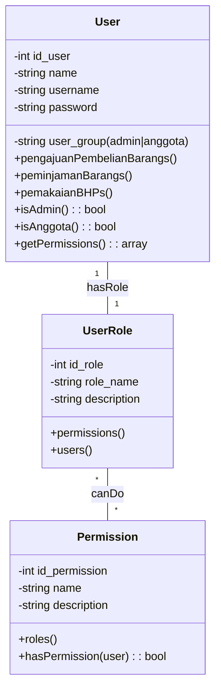
```mermaid
classDiagram
    class User {
        -int id_user
        -string name
        -string username
        -string password
        -string user_group (admin|anggota)
        +pengajuanPembelianBarangs()
        +peminjamanBarangs()
        +pemakaianBHPs()
        +isAdmin(): bool
        +isAnggota(): bool
        +getPermissions(): array
    }

    class UserRole {
        -int id_role
        -string role_name
        -string description
        +permissions()
        +users()
    }

    class Permission {
        -int id_permission
        -string name
        -string description
        +roles()
        +hasPermission(user): bool
    }

    User "1" -- "1" UserRole : hasRole
    UserRole "*" -- "*" Permission : canDo
```

---

## 2️⃣ Master Data - BarangKantor (Inventory)

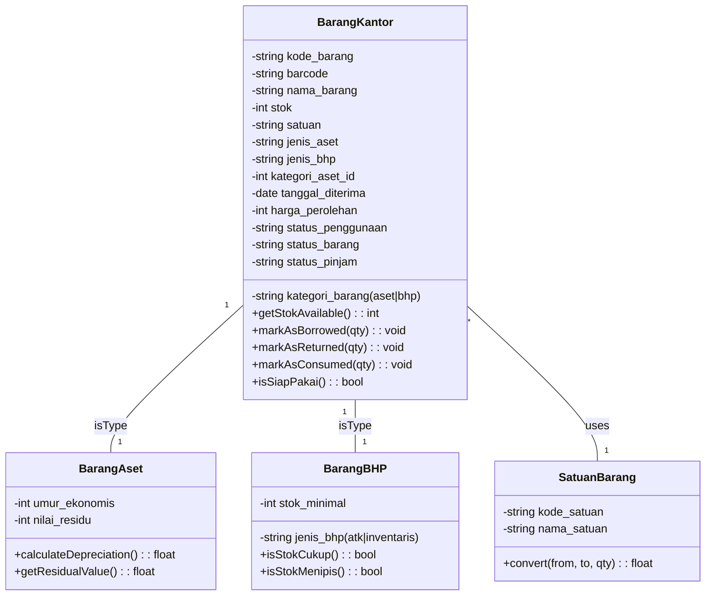
```mermaid
classDiagram
    class BarangKantor {
        -string kode_barang
        -string kategori_barang (aset|bhp)
        -string barcode
        -string nama_barang
        -int stok
        -string satuan
        -string jenis_aset
        -string jenis_bhp
        -int kategori_aset_id
        -date tanggal_diterima
        -int harga_perolehan
        -string status_penggunaan
        -string status_barang
        -string status_pinjam
        +getStokAvailable(): int
        +markAsBorrowed(qty): void
        +markAsReturned(qty): void
        +markAsConsumed(qty): void
        +isSiapPakai(): bool
    }

    class BarangAset {
        -int umur_ekonomis
        -int nilai_residu
        +calculateDepreciation(): float
        +getResidualValue(): float
    }

    class BarangBHP {
        -string jenis_bhp (atk|inventaris)
        -int stok_minimal
        +isStokCukup(): bool
        +isStokMenipis(): bool
    }

    class SatuanBarang {
        -string kode_satuan
        -string nama_satuan
        +convert(from, to, qty): float
    }

    BarangKantor "1" -- "1" BarangAset : isType
    BarangKantor "1" -- "1" BarangBHP : isType
    BarangKantor "*" -- "1" SatuanBarang : uses
```

---

## 3️⃣ Master Data - COA (Chart of Accounts)

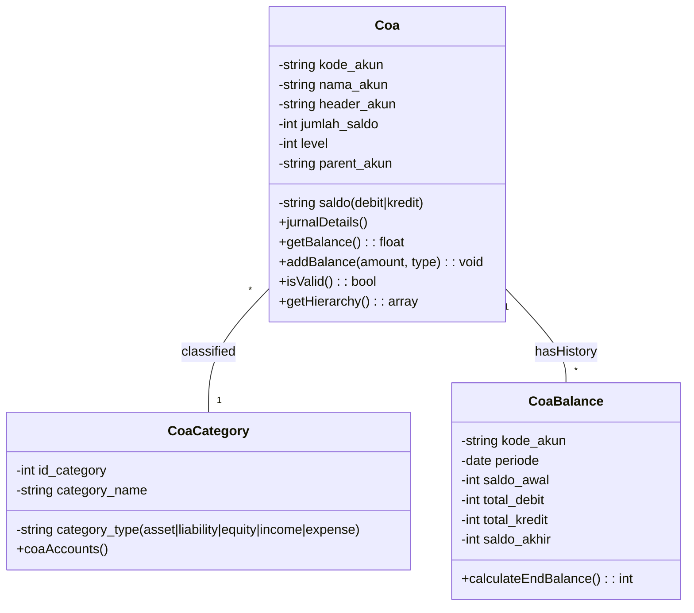
```mermaid
classDiagram
    class Coa {
        -string kode_akun
        -string nama_akun
        -string header_akun
        -string saldo (debit|kredit)
        -int jumlah_saldo
        -int level
        -string parent_akun
        +jurnalDetails()
        +getBalance(): float
        +addBalance(amount, type): void
        +isValid(): bool
        +getHierarchy(): array
    }

    class CoaCategory {
        -int id_category
        -string category_name
        -string category_type (asset|liability|equity|income|expense)
        +coaAccounts()
    }

    class CoaBalance {
        -string kode_akun
        -date periode
        -int saldo_awal
        -int total_debit
        -int total_kredit
        -int saldo_akhir
        +calculateEndBalance(): int
    }

    Coa "*" -- "1" CoaCategory : classified
    Coa "1" -- "*" CoaBalance : hasHistory
```

---

## 4️⃣ Master Data - KategoriAsetTetap

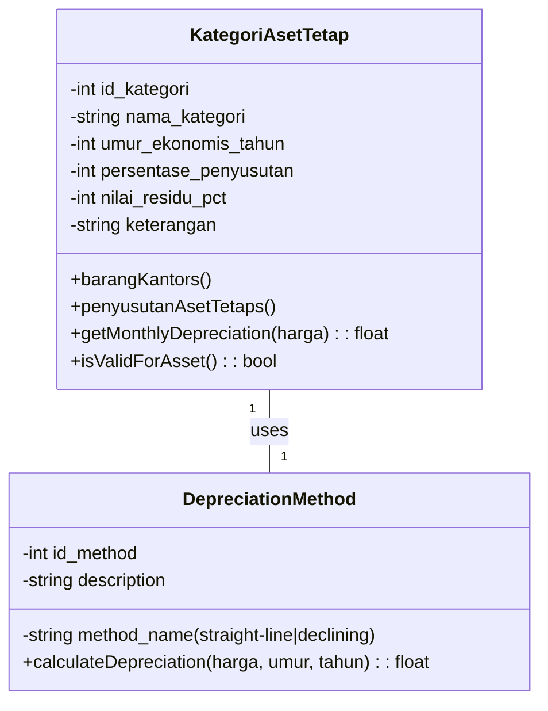
```mermaid
classDiagram
    class KategoriAsetTetap {
        -int id_kategori
        -string nama_kategori
        -int umur_ekonomis_tahun
        -int persentase_penyusutan
        -int nilai_residu_pct
        -string keterangan
        +barangKantors()
        +penyusutanAsetTetaps()
        +getMonthlyDepreciation(harga): float
        +isValidForAsset(): bool
    }

    class DepreciationMethod {
        -int id_method
        -string method_name (straight-line|declining)
        -string description
        +calculateDepreciation(harga, umur, tahun): float
    }

    KategoriAsetTetap "1" -- "1" DepreciationMethod : uses
```

---

## 5️⃣ Procurement - PerolehanBarang (Main)

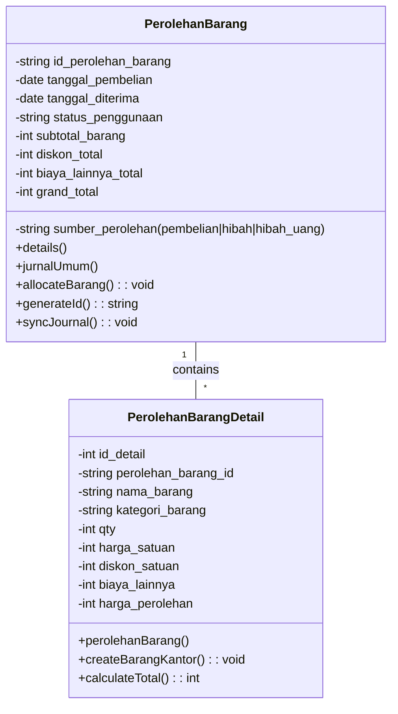
```mermaid
classDiagram
    class PerolehanBarang {
        -string id_perolehan_barang
        -string sumber_perolehan (pembelian|hibah|hibah_uang)
        -date tanggal_pembelian
        -date tanggal_diterima
        -string status_penggunaan
        -int subtotal_barang
        -int diskon_total
        -int biaya_lainnya_total
        -int grand_total
        +details()
        +jurnalUmum()
        +allocateBarang(): void
        +generateId(): string
        +syncJournal(): void
    }

    class PerolehanBarangDetail {
        -int id_detail
        -string perolehan_barang_id
        -string nama_barang
        -string kategori_barang
        -int qty
        -int harga_satuan
        -int diskon_satuan
        -int biaya_lainnya
        -int harga_perolehan
        +perolehanBarang()
        +createBarangKantor(): void
        +calculateTotal(): int
    }

    PerolehanBarang "1" -- "*" PerolehanBarangDetail : contains
```

---

## 6️⃣ Procurement - PerolehanAllocator (Logic)

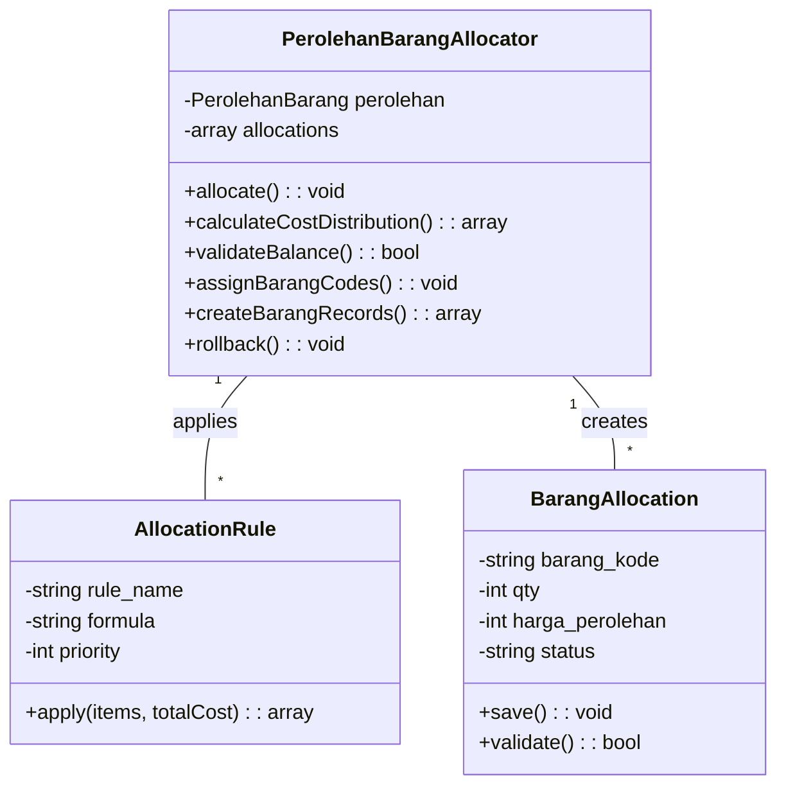
```mermaid
classDiagram
    class PerolehanBarangAllocator {
        -PerolehanBarang perolehan
        -array allocations
        +allocate(): void
        +calculateCostDistribution(): array
        +validateBalance(): bool
        +assignBarangCodes(): void
        +createBarangRecords(): array
        +rollback(): void
    }

    class AllocationRule {
        -string rule_name
        -string formula
        -int priority
        +apply(items, totalCost): array
    }

    class BarangAllocation {
        -string barang_kode
        -int qty
        -int harga_perolehan
        -string status
        +save(): void
        +validate(): bool
    }

    PerolehanBarangAllocator "1" -- "*" AllocationRule : applies
    PerolehanBarangAllocator "1" -- "*" BarangAllocation : creates
```

---

## 7️⃣ Borrowing System - PeminjamanBarang

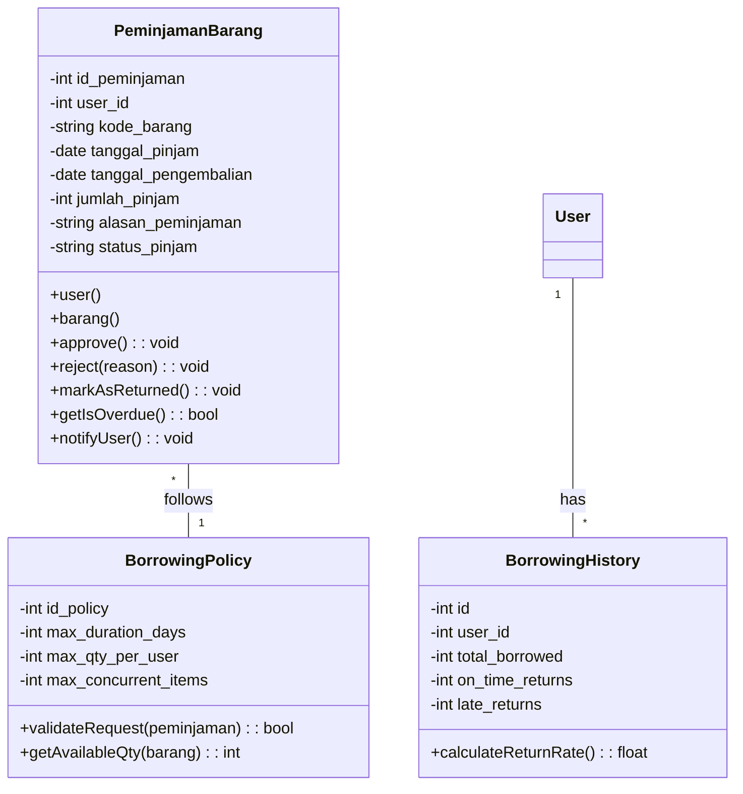
```mermaid
classDiagram
    class PeminjamanBarang {
        -int id_peminjaman
        -int user_id
        -string kode_barang
        -date tanggal_pinjam
        -date tanggal_pengembalian
        -int jumlah_pinjam
        -string alasan_peminjaman
        -string status_pinjam
        +user()
        +barang()
        +approve(): void
        +reject(reason): void
        +markAsReturned(): void
        +getIsOverdue(): bool
        +notifyUser(): void
    }

    class BorrowingPolicy {
        -int id_policy
        -int max_duration_days
        -int max_qty_per_user
        -int max_concurrent_items
        +validateRequest(peminjaman): bool
        +getAvailableQty(barang): int
    }

    class BorrowingHistory {
        -int id
        -int user_id
        -int total_borrowed
        -int on_time_returns
        -int late_returns
        +calculateReturnRate(): float
    }

    PeminjamanBarang "*" -- "1" BorrowingPolicy : follows
    User "1" -- "*" BorrowingHistory : has
```

---

## 8️⃣ Consumption System - PemakaianBHP

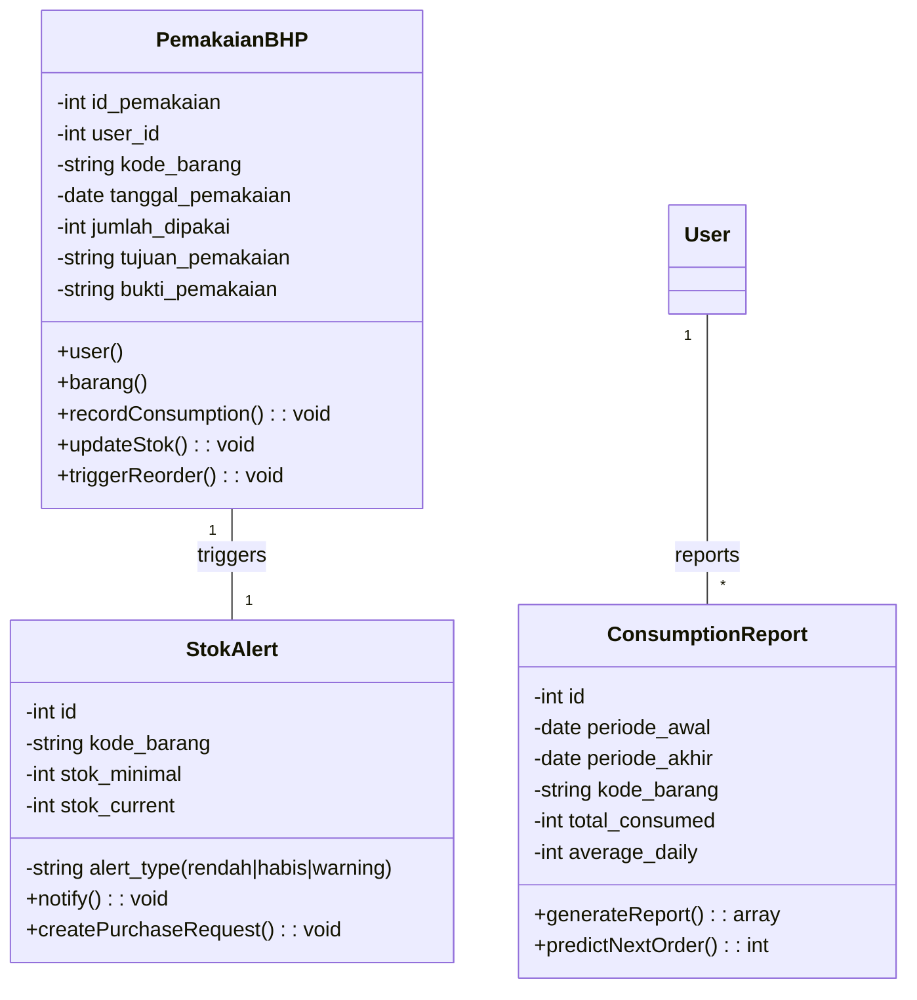
```mermaid
classDiagram
    class PemakaianBHP {
        -int id_pemakaian
        -int user_id
        -string kode_barang
        -date tanggal_pemakaian
        -int jumlah_dipakai
        -string tujuan_pemakaian
        -string bukti_pemakaian
        +user()
        +barang()
        +recordConsumption(): void
        +updateStok(): void
        +triggerReorder(): void
    }

    class ConsumptionReport {
        -int id
        -date periode_awal
        -date periode_akhir
        -string kode_barang
        -int total_consumed
        -int average_daily
        +generateReport(): array
        +predictNextOrder(): int
    }

    class StokAlert {
        -int id
        -string kode_barang
        -int stok_minimal
        -int stok_current
        -string alert_type (rendah|habis|warning)
        +notify(): void
        +createPurchaseRequest(): void
    }

    PemakaianBHP "1" -- "1" StokAlert : triggers
    User "1" -- "*" ConsumptionReport : reports
```

---

## 9️⃣ Purchase Request - PengajuanPembelianBarang

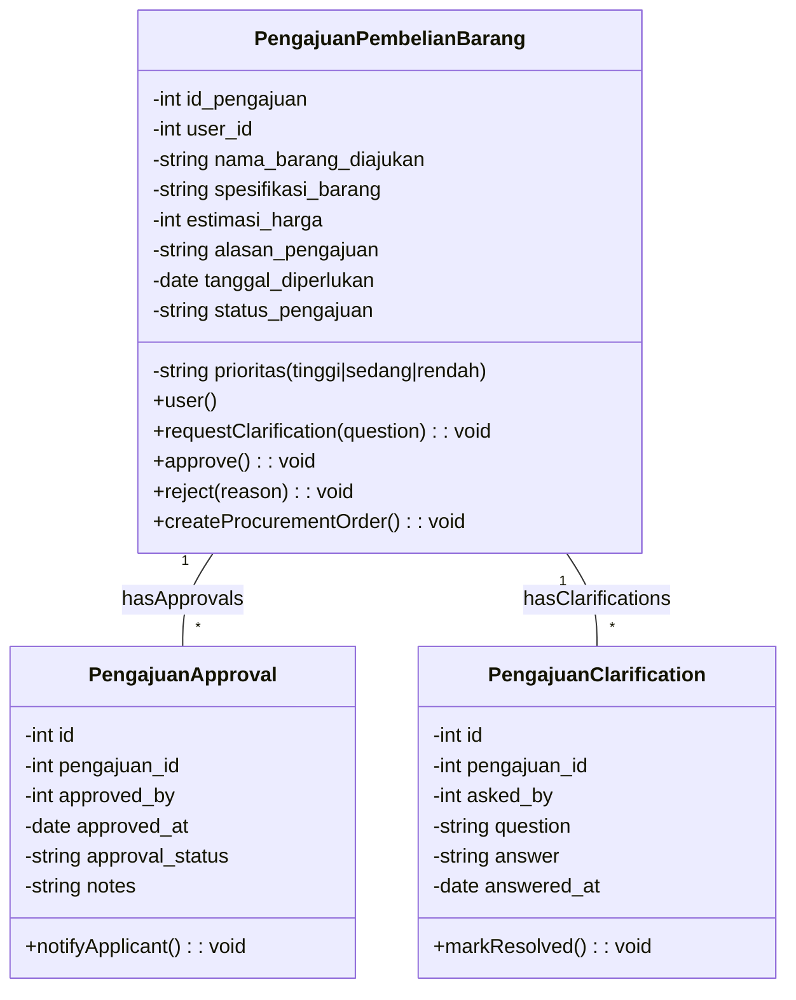
```mermaid
classDiagram
    class PengajuanPembelianBarang {
        -int id_pengajuan
        -int user_id
        -string nama_barang_diajukan
        -string spesifikasi_barang
        -int estimasi_harga
        -string alasan_pengajuan
        -string prioritas (tinggi|sedang|rendah)
        -date tanggal_diperlukan
        -string status_pengajuan
        +user()
        +requestClarification(question): void
        +approve(): void
        +reject(reason): void
        +createProcurementOrder(): void
    }

    class PengajuanApproval {
        -int id
        -int pengajuan_id
        -int approved_by
        -date approved_at
        -string approval_status
        -string notes
        +notifyApplicant(): void
    }

    class PengajuanClarification {
        -int id
        -int pengajuan_id
        -int asked_by
        -string question
        -string answer
        -date answered_at
        +markResolved(): void
    }

    PengajuanPembelianBarang "1" -- "*" PengajuanApproval : hasApprovals
    PengajuanPembelianBarang "1" -- "*" PengajuanClarification : hasClarifications
```

---

## 🔟 Cash Management - PengisianKasKecil

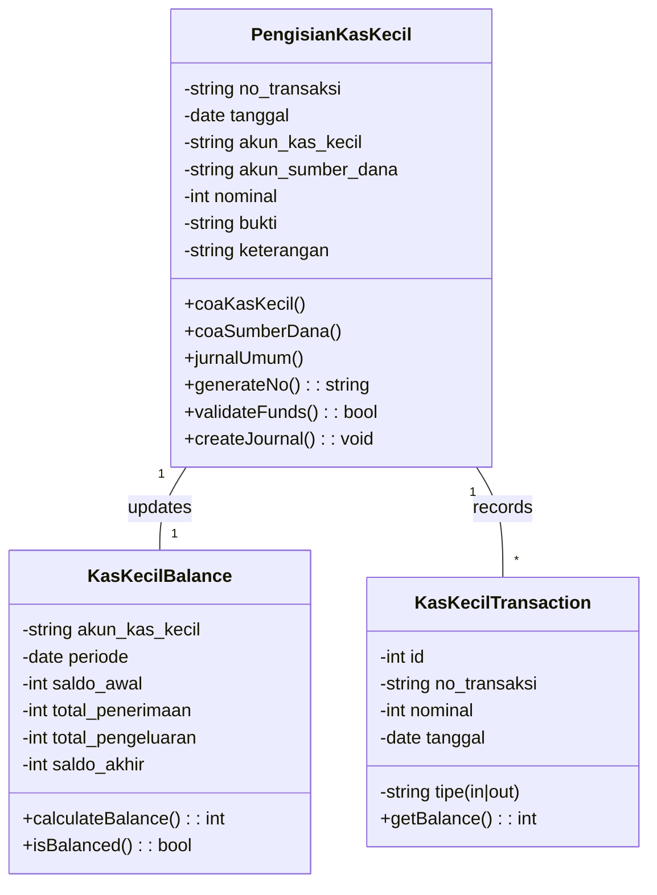
```mermaid
classDiagram
    class PengisianKasKecil {
        -string no_transaksi
        -date tanggal
        -string akun_kas_kecil
        -string akun_sumber_dana
        -int nominal
        -string bukti
        -string keterangan
        +coaKasKecil()
        +coaSumberDana()
        +jurnalUmum()
        +generateNo(): string
        +validateFunds(): bool
        +createJournal(): void
    }

    class KasKecilBalance {
        -string akun_kas_kecil
        -date periode
        -int saldo_awal
        -int total_penerimaan
        -int total_pengeluaran
        -int saldo_akhir
        +calculateBalance(): int
        +isBalanced(): bool
    }

    class KasKecilTransaction {
        -int id
        -string no_transaksi
        -string tipe (in|out)
        -int nominal
        -date tanggal
        +getBalance(): int
    }

    PengisianKasKecil "1" -- "1" KasKecilBalance : updates
    PengisianKasKecil "1" -- "*" KasKecilTransaction : records
```

---

## 1️⃣1️⃣ Donation System - PendapatanHibah

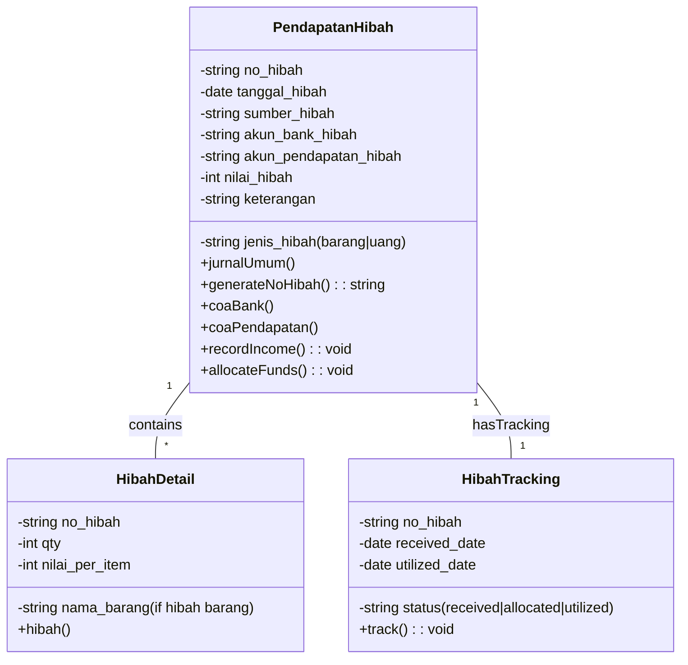
```mermaid
classDiagram
    class PendapatanHibah {
        -string no_hibah
        -date tanggal_hibah
        -string sumber_hibah
        -string jenis_hibah (barang|uang)
        -string akun_bank_hibah
        -string akun_pendapatan_hibah
        -int nilai_hibah
        -string keterangan
        +jurnalUmum()
        +generateNoHibah(): string
        +coaBank()
        +coaPendapatan()
        +recordIncome(): void
        +allocateFunds(): void
    }

    class HibahDetail {
        -string no_hibah
        -string nama_barang (if hibah barang)
        -int qty
        -int nilai_per_item
        +hibah()
    }

    class HibahTracking {
        -string no_hibah
        -string status (received|allocated|utilized)
        -date received_date
        -date utilized_date
        +track(): void
    }

    PendapatanHibah "1" -- "*" HibahDetail : contains
    PendapatanHibah "1" -- "1" HibahTracking : hasTracking
```

---

## 1️⃣2️⃣ Journal System - JurnalUmum & JurnalDetail

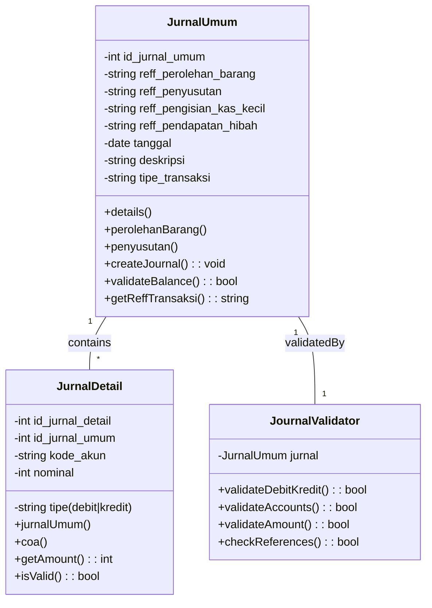
```mermaid
classDiagram
    class JurnalUmum {
        -int id_jurnal_umum
        -string reff_perolehan_barang
        -string reff_penyusutan
        -string reff_pengisian_kas_kecil
        -string reff_pendapatan_hibah
        -date tanggal
        -string deskripsi
        -string tipe_transaksi
        +details()
        +perolehanBarang()
        +penyusutan()
        +createJournal(): void
        +validateBalance(): bool
        +getReffTransaksi(): string
    }

    class JurnalDetail {
        -int id_jurnal_detail
        -int id_jurnal_umum
        -string kode_akun
        -string tipe (debit|kredit)
        -int nominal
        +jurnalUmum()
        +coa()
        +getAmount(): int
        +isValid(): bool
    }

    class JournalValidator {
        -JurnalUmum jurnal
        +validateDebitKredit(): bool
        +validateAccounts(): bool
        +validateAmount(): bool
        +checkReferences(): bool
    }

    JurnalUmum "1" -- "*" JurnalDetail : contains
    JurnalUmum "1" -- "1" JournalValidator : validatedBy
```

---

## 1️⃣3️⃣ Depreciation System - Penyusutan

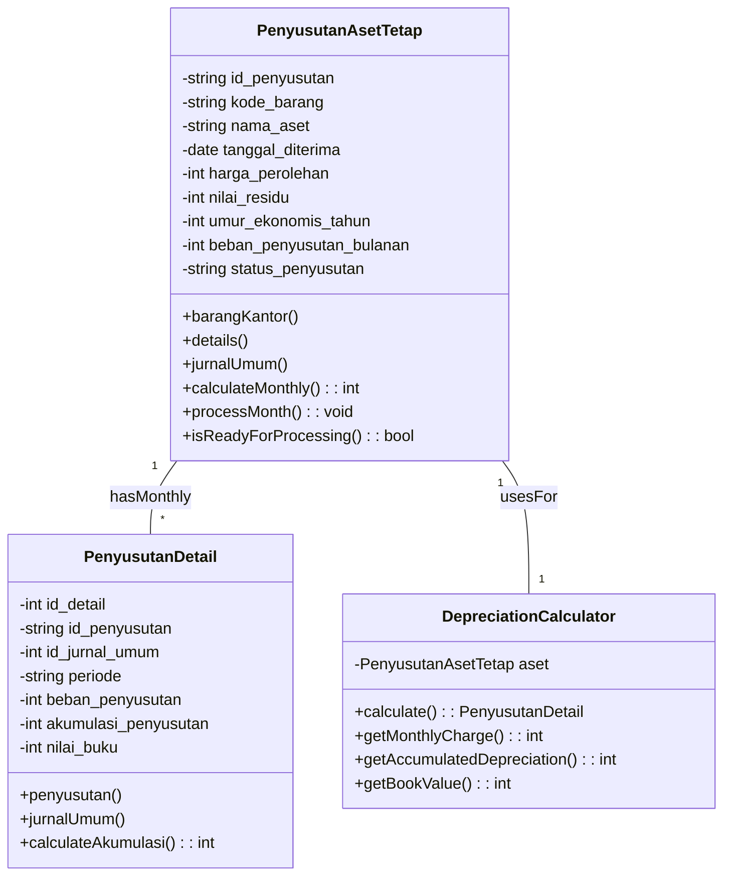
```mermaid
classDiagram
    class PenyusutanAsetTetap {
        -string id_penyusutan
        -string kode_barang
        -string nama_aset
        -date tanggal_diterima
        -int harga_perolehan
        -int nilai_residu
        -int umur_ekonomis_tahun
        -int beban_penyusutan_bulanan
        -string status_penyusutan
        +barangKantor()
        +details()
        +jurnalUmum()
        +calculateMonthly(): int
        +processMonth(): void
        +isReadyForProcessing(): bool
    }

    class PenyusutanDetail {
        -int id_detail
        -string id_penyusutan
        -int id_jurnal_umum
        -string periode
        -int beban_penyusutan
        -int akumulasi_penyusutan
        -int nilai_buku
        +penyusutan()
        +jurnalUmum()
        +calculateAkumulasi(): int
    }

    class DepreciationCalculator {
        -PenyusutanAsetTetap aset
        +calculate(): PenyusutanDetail
        +getMonthlyCharge(): int
        +getAccumulatedDepreciation(): int
        +getBookValue(): int
    }

    PenyusutanAsetTetap "1" -- "*" PenyusutanDetail : hasMonthly
    PenyusutanAsetTetap "1" -- "1" DepreciationCalculator : usesFor
```

---

## 1️⃣4️⃣ Reporting - BukuBesar (General Ledger)

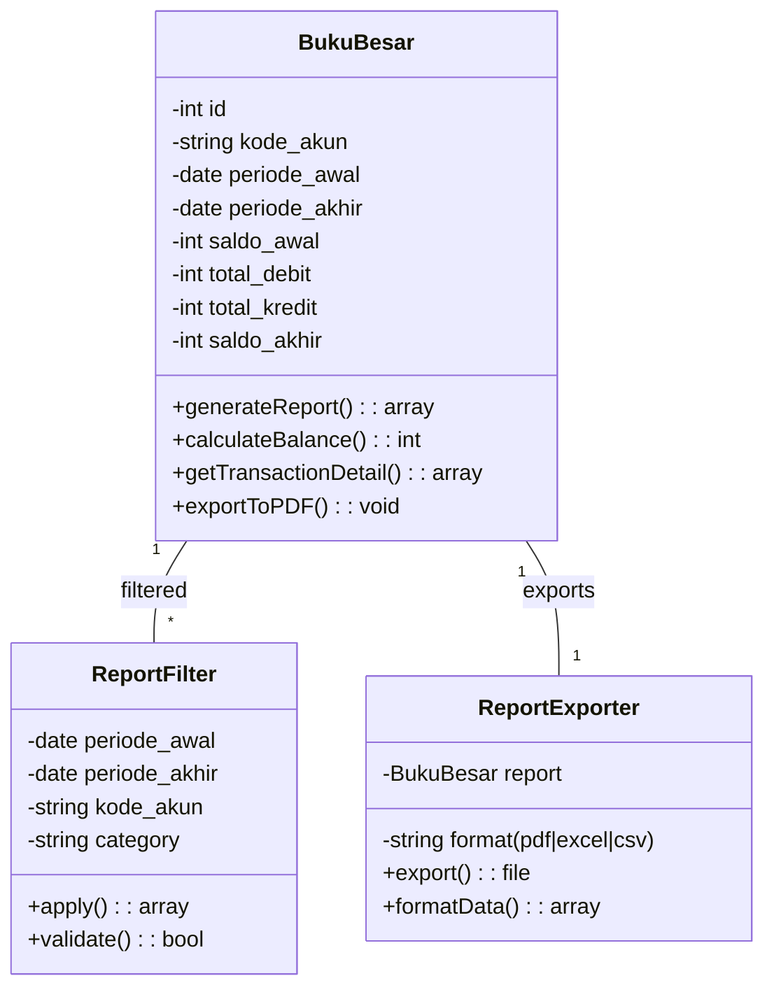
```mermaid
classDiagram
    class BukuBesar {
        -int id
        -string kode_akun
        -date periode_awal
        -date periode_akhir
        -int saldo_awal
        -int total_debit
        -int total_kredit
        -int saldo_akhir
        +generateReport(): array
        +calculateBalance(): int
        +getTransactionDetail(): array
        +exportToPDF(): void
    }

    class ReportFilter {
        -date periode_awal
        -date periode_akhir
        -string kode_akun
        -string category
        +apply(): array
        +validate(): bool
    }

    class ReportExporter {
        -string format (pdf|excel|csv)
        -BukuBesar report
        +export(): file
        +formatData(): array
    }

    BukuBesar "1" -- "*" ReportFilter : filtered
    BukuBesar "1" -- "1" ReportExporter : exports
```

---

## 1️⃣5️⃣ Reporting - Dashboard & Metrics

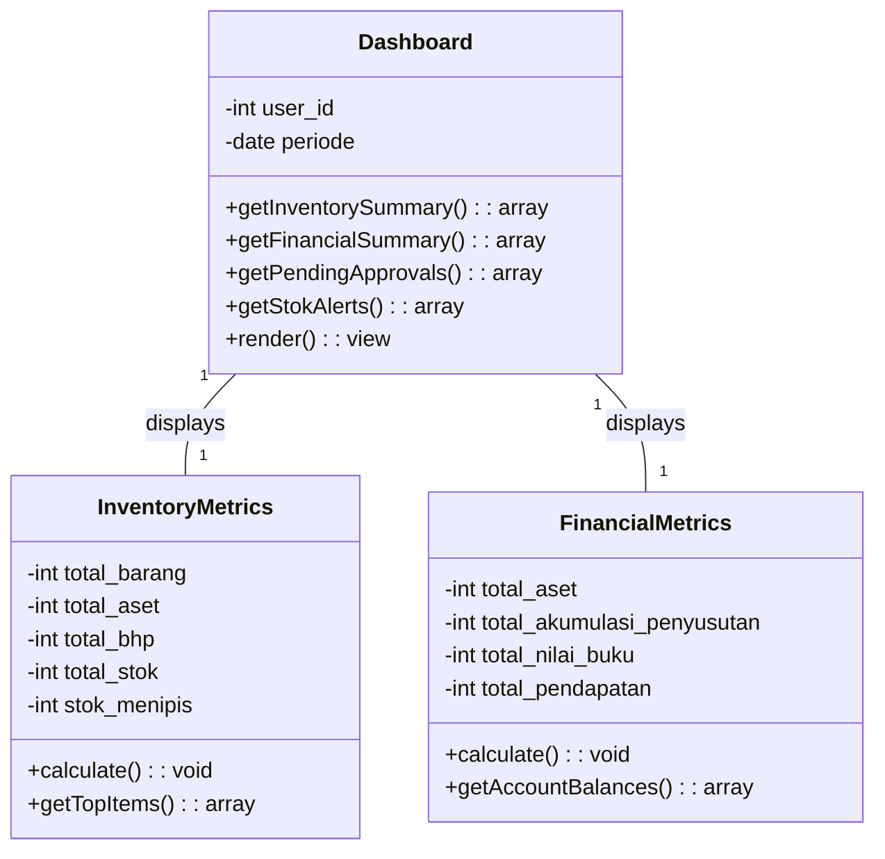
```mermaid
classDiagram
    class Dashboard {
        -int user_id
        -date periode
        +getInventorySummary(): array
        +getFinancialSummary(): array
        +getPendingApprovals(): array
        +getStokAlerts(): array
        +render(): view
    }

    class InventoryMetrics {
        -int total_barang
        -int total_aset
        -int total_bhp
        -int total_stok
        -int stok_menipis
        +calculate(): void
        +getTopItems(): array
    }

    class FinancialMetrics {
        -int total_aset
        -int total_akumulasi_penyusutan
        -int total_nilai_buku
        -int total_pendapatan
        +calculate(): void
        +getAccountBalances(): array
    }

    Dashboard "1" -- "1" InventoryMetrics : displays
    Dashboard "1" -- "1" FinancialMetrics : displays
```

---

## 1️⃣6️⃣ Validation & Business Rules

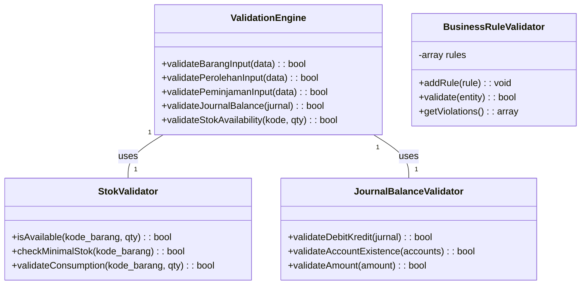
```mermaid
classDiagram
    class ValidationEngine {
        +validateBarangInput(data): bool
        +validatePerolehanInput(data): bool
        +validatePeminjamanInput(data): bool
        +validateJournalBalance(jurnal): bool
        +validateStokAvailability(kode, qty): bool
    }

    class BusinessRuleValidator {
        -array rules
        +addRule(rule): void
        +validate(entity): bool
        +getViolations(): array
    }

    class StokValidator {
        +isAvailable(kode_barang, qty): bool
        +checkMinimalStok(kode_barang): bool
        +validateConsumption(kode_barang, qty): bool
    }

    class JournalBalanceValidator {
        +validateDebitKredit(jurnal): bool
        +validateAccountExistence(accounts): bool
        +validateAmount(amount): bool
    }

    ValidationEngine "1" -- "1" StokValidator : uses
    ValidationEngine "1" -- "1" JournalBalanceValidator : uses
```

---

## 1️⃣7️⃣ Notification & Event System

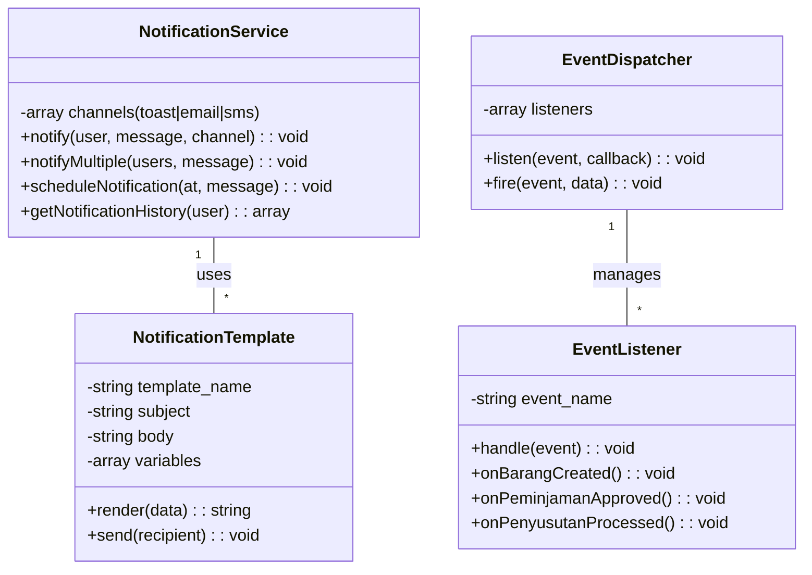
```mermaid
classDiagram
    class NotificationService {
        -array channels (toast|email|sms)
        +notify(user, message, channel): void
        +notifyMultiple(users, message): void
        +scheduleNotification(at, message): void
        +getNotificationHistory(user): array
    }

    class NotificationTemplate {
        -string template_name
        -string subject
        -string body
        -array variables
        +render(data): string
        +send(recipient): void
    }

    class EventListener {
        -string event_name
        +handle(event): void
        +onBarangCreated(): void
        +onPeminjamanApproved(): void
        +onPenyusutanProcessed(): void
    }

    class EventDispatcher {
        -array listeners
        +listen(event, callback): void
        +fire(event, data): void
    }

    NotificationService "1" -- "*" NotificationTemplate : uses
    EventDispatcher "1" -- "*" EventListener : manages
```

---

## 1️⃣8️⃣ Authorization & Policy

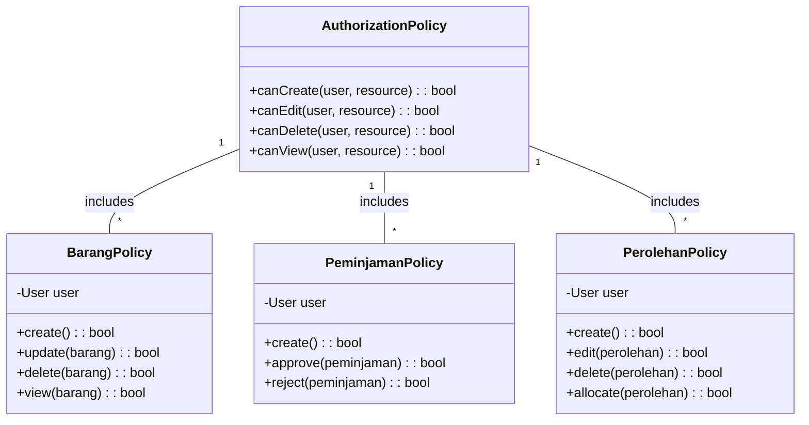
```mermaid
classDiagram
    class AuthorizationPolicy {
        +canCreate(user, resource): bool
        +canEdit(user, resource): bool
        +canDelete(user, resource): bool
        +canView(user, resource): bool
    }

    class BarangPolicy {
        -User user
        +create(): bool
        +update(barang): bool
        +delete(barang): bool
        +view(barang): bool
    }

    class PeminjamanPolicy {
        -User user
        +create(): bool
        +approve(peminjaman): bool
        +reject(peminjaman): bool
    }

    class PerolehanPolicy {
        -User user
        +create(): bool
        +edit(perolehan): bool
        +delete(perolehan): bool
        +allocate(perolehan): bool
    }

    AuthorizationPolicy "1" -- "*" BarangPolicy : includes
    AuthorizationPolicy "1" -- "*" PeminjamanPolicy : includes
    AuthorizationPolicy "1" -- "*" PerolehanPolicy : includes
```

---

## 1️⃣9️⃣ Repository & Data Access Pattern

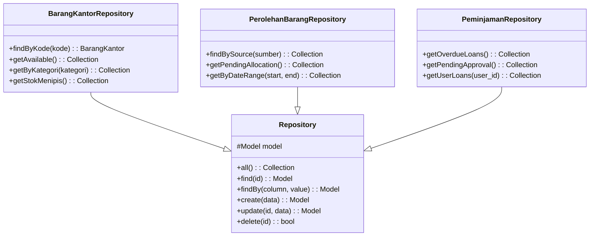
```mermaid
classDiagram
    class Repository {
        #Model model
        +all(): Collection
        +find(id): Model
        +findBy(column, value): Model
        +create(data): Model
        +update(id, data): Model
        +delete(id): bool
    }

    class BarangKantorRepository {
        +findByKode(kode): BarangKantor
        +getAvailable(): Collection
        +getByKategori(kategori): Collection
        +getStokMenipis(): Collection
    }

    class PerolehanBarangRepository {
        +findBySource(sumber): Collection
        +getPendingAllocation(): Collection
        +getByDateRange(start, end): Collection
    }

    class PeminjamanRepository {
        +getOverdueLoans(): Collection
        +getPendingApproval(): Collection
        +getUserLoans(user_id): Collection
    }

    BarangKantorRepository --|> Repository
    PerolehanBarangRepository --|> Repository
    PeminjamanRepository --|> Repository
```

---

## 2️⃣0️⃣ Service Layer & Business Logic

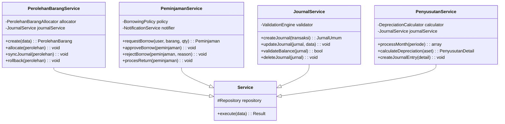
```mermaid
classDiagram
    class Service {
        #Repository repository
        +execute(data): Result
    }

    class PerolehanBarangService {
        -PerolehanBarangAllocator allocator
        -JournalService journalService
        +create(data): PerolehanBarang
        +allocate(perolehan): void
        +syncJournal(perolehan): void
        +rollback(perolehan): void
    }

    class PeminjamanService {
        -BorrowingPolicy policy
        -NotificationService notifier
        +requestBorrow(user, barang, qty): Peminjaman
        +approveBorrow(peminjaman): void
        +rejectBorrow(peminjaman, reason): void
        +procesReturn(peminjaman): void
    }

    class JournalService {
        -ValidationEngine validator
        +createJournal(transaksi): JurnalUmum
        +updateJournal(jurnal, data): void
        +validateBalance(jurnal): bool
        +deleteJournal(jurnal): void
    }

    class PenyusutanService {
        -DepreciationCalculator calculator
        -JournalService journalService
        +processMonth(periode): array
        +calculateDepreciation(aset): PenyusutanDetail
        +createJournalEntry(detail): void
    }

    PerolehanBarangService --|> Service
    PeminjamanService --|> Service
    JournalService --|> Service
    PenyusutanService --|> Service
```

---

## 📊 Summary - 20 Class Diagrams

| # | Diagram | Focus | Key Classes |
|---|---------|-------|------------|
| 1️⃣ | Authentication | User Management | User, UserRole, Permission |
| 2️⃣ | BarangKantor | Inventory Master | BarangKantor, BarangAset, BarangBHP |
| 3️⃣ | COA | Chart of Accounts | Coa, CoaCategory, CoaBalance |
| 4️⃣ | KategoriAset | Asset Categories | KategoriAsetTetap, DepreciationMethod |
| 5️⃣ | Perolehan Main | Procurement Header | PerolehanBarang, PerolehanBarangDetail |
| 6️⃣ | Perolehan Logic | Allocator Pattern | PerolehanBarangAllocator, AllocationRule |
| 7️⃣ | Borrowing | Loan Management | PeminjamanBarang, BorrowingPolicy, History |
| 8️⃣ | Consumption | BHP Usage | PemakaianBHP, ConsumptionReport, StokAlert |
| 9️⃣ | Pengajuan | Purchase Requests | PengajuanPembelianBarang, Approval, Clarification |
| 🔟 | Kas Kecil | Petty Cash | PengisianKasKecil, KasKecilBalance, Transaction |
| 1️⃣1️⃣ | Hibah | Donation System | PendapatanHibah, HibahDetail, HibahTracking |
| 1️⃣2️⃣ | Journal | General Journal | JurnalUmum, JurnalDetail, JournalValidator |
| 1️⃣3️⃣ | Penyusutan | Depreciation | PenyusutanAsetTetap, PenyusutanDetail, Calculator |
| 1️⃣4️⃣ | BukuBesar | Ledger Report | BukuBesar, ReportFilter, ReportExporter |
| 1️⃣5️⃣ | Dashboard | Metrics & KPI | Dashboard, InventoryMetrics, FinancialMetrics |
| 1️⃣6️⃣ | Validation | Business Rules | ValidationEngine, StokValidator, JournalBalanceValidator |
| 1️⃣7️⃣ | Notification | Event System | NotificationService, NotificationTemplate, EventDispatcher |
| 1️⃣8️⃣ | Authorization | Access Control | AuthorizationPolicy, BarangPolicy, PeminjamanPolicy |
| 1️⃣9️⃣ | Repository | Data Access | Repository, BarangKantorRepository, PerolehanBarangRepository |
| 2️⃣0️⃣ | Service | Business Logic | Service, PerolehanBarangService, PeminjamanService |

---

## 🔗 Dependencies Flow

```
User Layer (Auth, Policy, Authorization)
    ↓
Service Layer (Business Logic)
    ├─ PerolehanBarangService
    ├─ PeminjamanService
    ├─ JournalService
    └─ PenyusutanService
    ↓
Repository Layer (Data Access)
    ├─ BarangKantorRepository
    ├─ PerolehanBarangRepository
    └─ PeminjamanRepository
    ↓
Model Layer (Entities)
    ├─ BarangKantor
    ├─ PerolehanBarang
    ├─ PeminjamanBarang
    ├─ JurnalUmum
    └─ PenyusutanAsetTetap
    ↓
Infrastructure (Validation, Notification, Events)
    ├─ ValidationEngine
    ├─ NotificationService
    └─ EventDispatcher
```

---

## 🎯 How to Use These Diagrams

1. **For Development**: Reference each diagram when implementing modules
2. **For Documentation**: Include diagrams in API docs & architecture guides
3. **For Testing**: Use diagrams to identify test cases & edge cases
4. **For Onboarding**: Show diagrams to new developers to explain architecture
5. **For System Design**: Reference when planning database schema & APIs

All 20 diagrams are ready for VS Code preview or export to images!

