# 31 Use Case Sequence Diagrams - Sistem TA2025

Dokumentasi lengkap untuk **31 Use Case** dengan Mermaid Sequence Diagrams.

---

## UC-AUTH-001: User Login

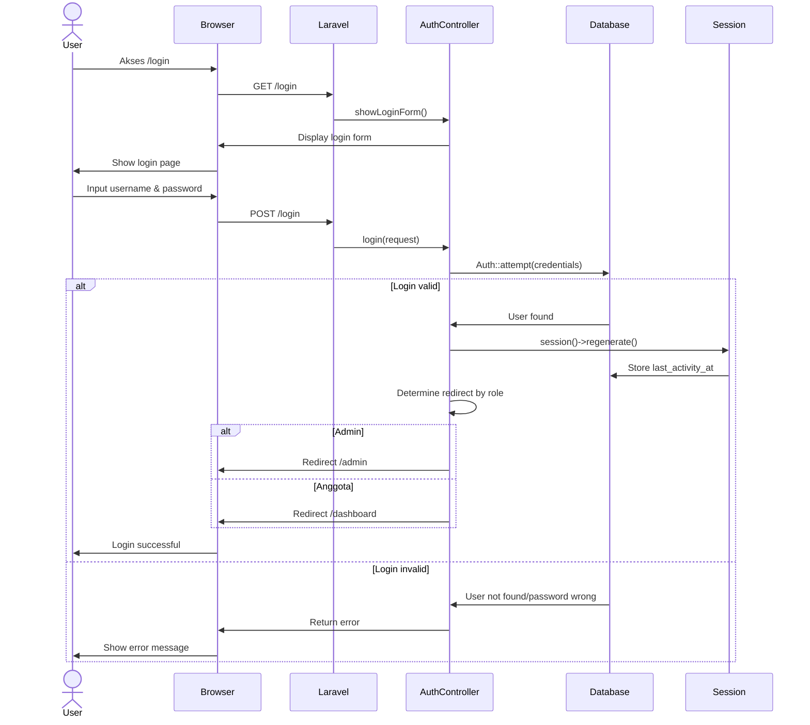
```mermaid
sequenceDiagram
    actor User
    participant Browser
    participant Laravel
    participant AuthCtrl as AuthController
    participant DB as Database
    participant Session

    User->>Browser: Akses /login
    Browser->>Laravel: GET /login
    Laravel->>AuthCtrl: showLoginForm()
    AuthCtrl->>Browser: Display login form
    Browser->>User: Show login page

    User->>Browser: Input username & password
    Browser->>Laravel: POST /login
    Laravel->>AuthCtrl: login(request)
    
    AuthCtrl->>DB: Auth::attempt(credentials)
    alt Login valid
        DB->>AuthCtrl: User found
        AuthCtrl->>Session: session()->regenerate()
        Session->>DB: Store last_activity_at
        AuthCtrl->>AuthCtrl: Determine redirect by role
        alt Admin
            AuthCtrl->>Browser: Redirect /admin
        else Anggota
            AuthCtrl->>Browser: Redirect /dashboard
        end
        Browser->>User: Login successful
    else Login invalid
        DB->>AuthCtrl: User not found/password wrong
        AuthCtrl->>Browser: Return error
        Browser->>User: Show error message
    end
```

---

## UC-AUTH-002: User Logout

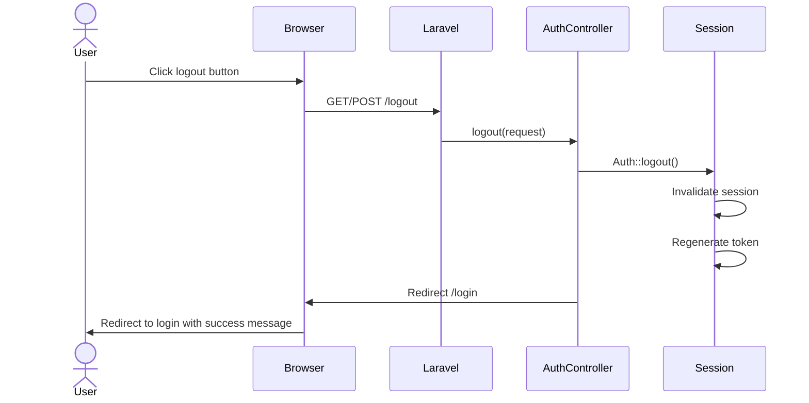
```mermaid
sequenceDiagram
    actor User
    participant Browser
    participant Laravel
    participant AuthCtrl as AuthController
    participant Session

    User->>Browser: Click logout button
    Browser->>Laravel: GET/POST /logout
    Laravel->>AuthCtrl: logout(request)
    
    AuthCtrl->>Session: Auth::logout()
    Session->>Session: Invalidate session
    Session->>Session: Regenerate token
    
    AuthCtrl->>Browser: Redirect /login
    Browser->>User: Redirect to login with success message
```

---

## UC-AUTH-003: Change Password

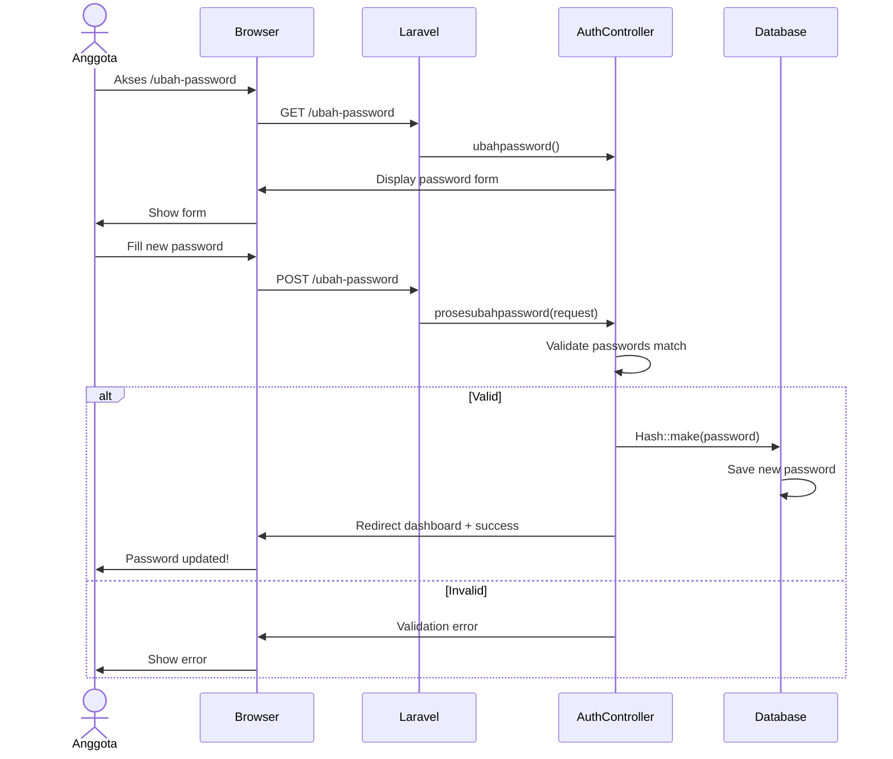
```mermaid
sequenceDiagram
    actor User as Anggota
    participant Browser
    participant Laravel
    participant AuthCtrl as AuthController
    participant DB as Database

    User->>Browser: Akses /ubah-password
    Browser->>Laravel: GET /ubah-password
    Laravel->>AuthCtrl: ubahpassword()
    AuthCtrl->>Browser: Display password form
    Browser->>User: Show form

    User->>Browser: Fill new password
    Browser->>Laravel: POST /ubah-password
    Laravel->>AuthCtrl: prosesubahpassword(request)
    
    AuthCtrl->>AuthCtrl: Validate passwords match
    alt Valid
        AuthCtrl->>DB: Hash::make(password)
        DB->>DB: Save new password
        AuthCtrl->>Browser: Redirect dashboard + success
        Browser->>User: Password updated!
    else Invalid
        AuthCtrl->>Browser: Validation error
        Browser->>User: Show error
    end
```

---

## UC-AUTH-004: Multi-tab Session Management

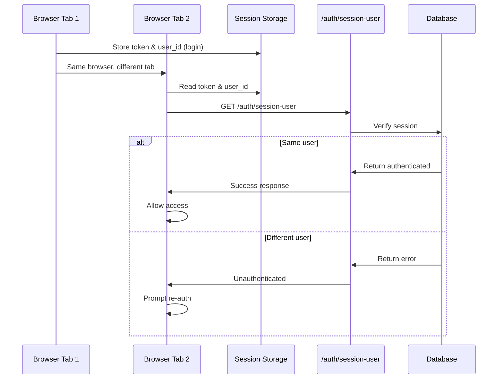
```mermaid
sequenceDiagram
    participant Tab1 as Browser Tab 1
    participant Tab2 as Browser Tab 2
    participant SessionStorage as Session Storage
    participant Laravel as /auth/session-user
    participant DB as Database

    Tab1->>SessionStorage: Store token & user_id (login)
    Tab1->>Tab2: Same browser, different tab
    
    Tab2->>SessionStorage: Read token & user_id
    Tab2->>Laravel: GET /auth/session-user
    Laravel->>DB: Verify session
    
    alt Same user
        DB->>Laravel: Return authenticated
        Laravel->>Tab2: Success response
        Tab2->>Tab2: Allow access
    else Different user
        DB->>Laravel: Return error
        Laravel->>Tab2: Unauthenticated
        Tab2->>Tab2: Prompt re-auth
    end
```

---

## UC-MASTER-USER-001: Admin Create/Edit User

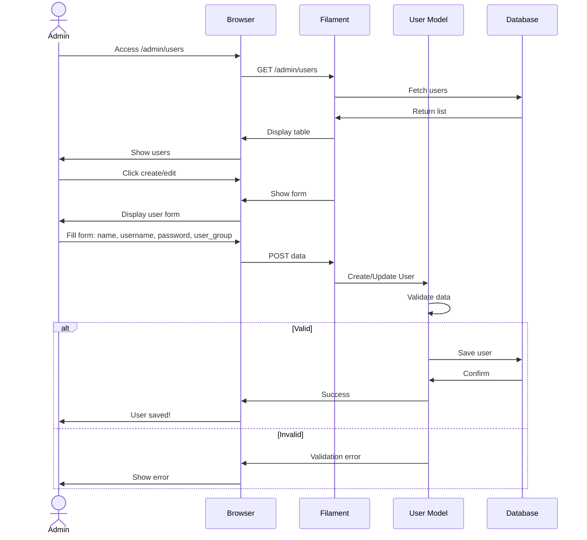
```mermaid
sequenceDiagram
    actor Admin
    participant Browser
    participant Filament
    participant Model as User Model
    participant DB as Database

    Admin->>Browser: Access /admin/users
    Browser->>Filament: GET /admin/users
    Filament->>DB: Fetch users
    DB->>Filament: Return list
    Filament->>Browser: Display table
    Browser->>Admin: Show users

    Admin->>Browser: Click create/edit
    Filament->>Browser: Show form
    Browser->>Admin: Display user form

    Admin->>Browser: Fill form: name, username, password, user_group
    Browser->>Filament: POST data
    Filament->>Model: Create/Update User
    
    Model->>Model: Validate data
    alt Valid
        Model->>DB: Save user
        DB->>Model: Confirm
        Model->>Browser: Success
        Browser->>Admin: User saved!
    else Invalid
        Model->>Browser: Validation error
        Browser->>Admin: Show error
    end
```

---

## UC-MASTER-USER-002: Admin Delete User

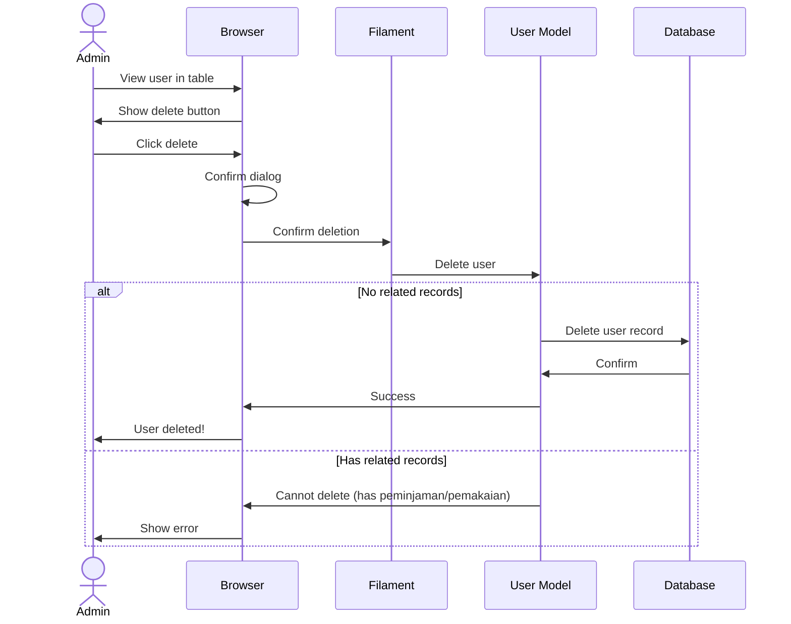
```mermaid
sequenceDiagram
    actor Admin
    participant Browser
    participant Filament
    participant Model as User Model
    participant DB as Database

    Admin->>Browser: View user in table
    Browser->>Admin: Show delete button
    Admin->>Browser: Click delete
    Browser->>Browser: Confirm dialog
    Browser->>Filament: Confirm deletion

    Filament->>Model: Delete user
    alt No related records
        Model->>DB: Delete user record
        DB->>Model: Confirm
        Model->>Browser: Success
        Browser->>Admin: User deleted!
    else Has related records
        Model->>Browser: Cannot delete (has peminjaman/pemakaian)
        Browser->>Admin: Show error
    end
```

---

## UC-MASTER-COA-001: Admin Create/Edit COA

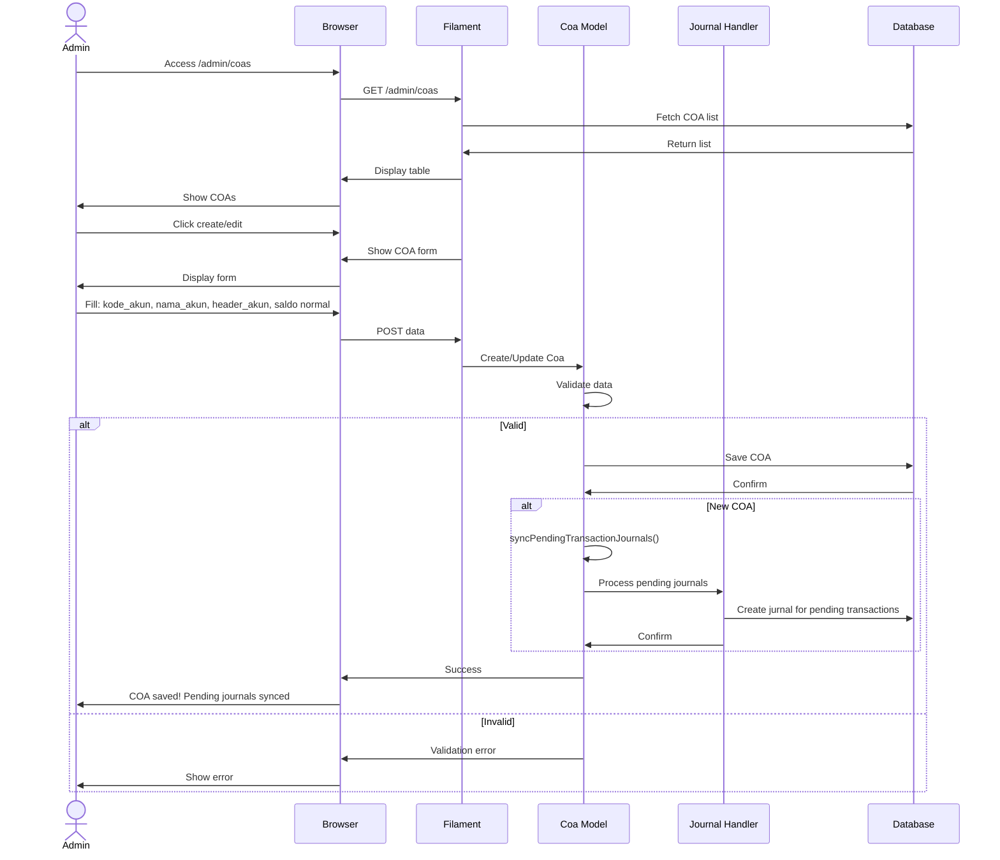
```mermaid
sequenceDiagram
    actor Admin
    participant Browser
    participant Filament
    participant Model as Coa Model
    participant Journal as Journal Handler
    participant DB as Database

    Admin->>Browser: Access /admin/coas
    Browser->>Filament: GET /admin/coas
    Filament->>DB: Fetch COA list
    DB->>Filament: Return list
    Filament->>Browser: Display table
    Browser->>Admin: Show COAs

    Admin->>Browser: Click create/edit
    Filament->>Browser: Show COA form
    Browser->>Admin: Display form

    Admin->>Browser: Fill: kode_akun, nama_akun, header_akun, saldo normal
    Browser->>Filament: POST data
    Filament->>Model: Create/Update Coa
    
    Model->>Model: Validate data
    alt Valid
        Model->>DB: Save COA
        DB->>Model: Confirm
        
        alt New COA
            Model->>Model: syncPendingTransactionJournals()
            Model->>Journal: Process pending journals
            Journal->>DB: Create jurnal for pending transactions
            Journal->>Model: Confirm
        end
        
        Model->>Browser: Success
        Browser->>Admin: COA saved! Pending journals synced
    else Invalid
        Model->>Browser: Validation error
        Browser->>Admin: Show error
    end
```

---

## UC-MASTER-COA-002: Admin Delete COA

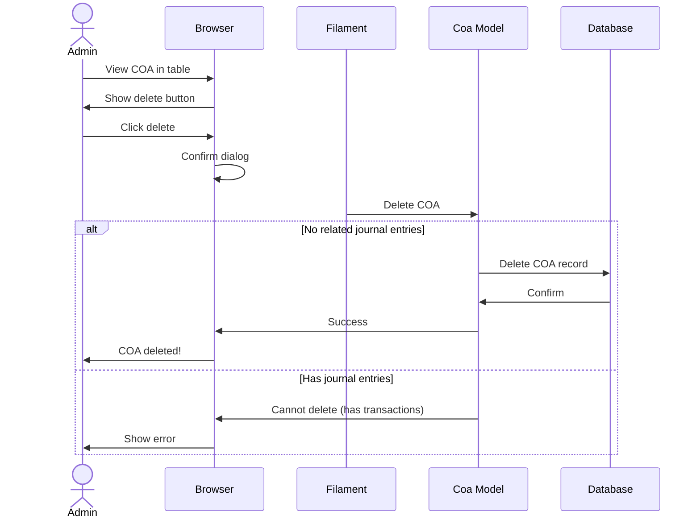
```mermaid
sequenceDiagram
    actor Admin
    participant Browser
    participant Filament
    participant Model as Coa Model
    participant DB as Database

    Admin->>Browser: View COA in table
    Browser->>Admin: Show delete button
    Admin->>Browser: Click delete
    Browser->>Browser: Confirm dialog

    Filament->>Model: Delete COA
    alt No related journal entries
        Model->>DB: Delete COA record
        DB->>Model: Confirm
        Model->>Browser: Success
        Browser->>Admin: COA deleted!
    else Has journal entries
        Model->>Browser: Cannot delete (has transactions)
        Browser->>Admin: Show error
    end
```

---

## UC-MASTER-KATEGORI-001: Admin Manage Kategori Aset

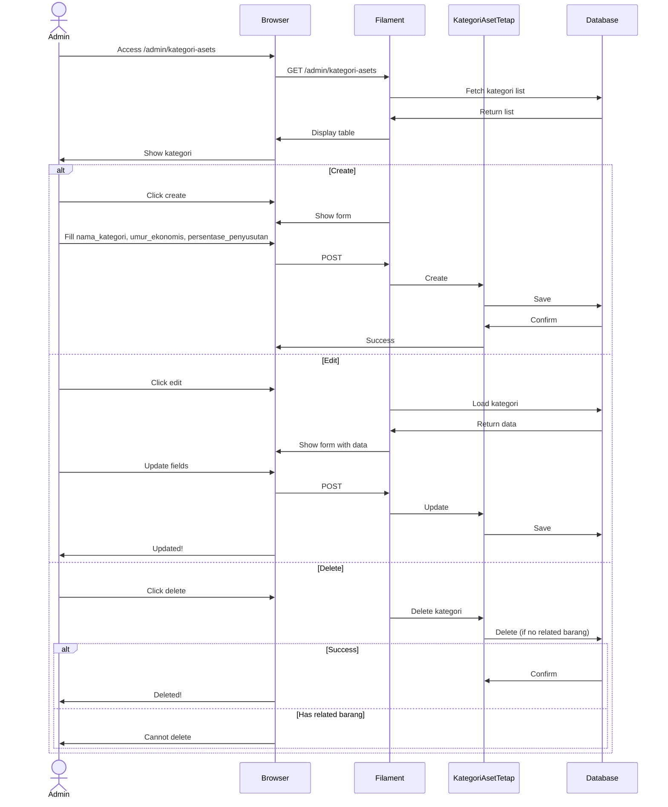
```mermaid
sequenceDiagram
    actor Admin
    participant Browser
    participant Filament
    participant Model as KategoriAsetTetap
    participant DB as Database

    Admin->>Browser: Access /admin/kategori-asets
    Browser->>Filament: GET /admin/kategori-asets
    Filament->>DB: Fetch kategori list
    DB->>Filament: Return list
    Filament->>Browser: Display table
    Browser->>Admin: Show kategori

    alt Create
        Admin->>Browser: Click create
        Filament->>Browser: Show form
        Admin->>Browser: Fill nama_kategori, umur_ekonomis, persentase_penyusutan
        Browser->>Filament: POST
        Filament->>Model: Create
        Model->>DB: Save
        DB->>Model: Confirm
        Model->>Browser: Success
    else Edit
        Admin->>Browser: Click edit
        Filament->>DB: Load kategori
        DB->>Filament: Return data
        Filament->>Browser: Show form with data
        Admin->>Browser: Update fields
        Browser->>Filament: POST
        Filament->>Model: Update
        Model->>DB: Save
        Browser->>Admin: Updated!
    else Delete
        Admin->>Browser: Click delete
        Filament->>Model: Delete kategori
        Model->>DB: Delete (if no related barang)
        alt Success
            DB->>Model: Confirm
            Browser->>Admin: Deleted!
        else Has related barang
            Browser->>Admin: Cannot delete
        end
    end
```

---

## UC-MASTER-BARANG-001: Admin Create/Edit Barang Kantor

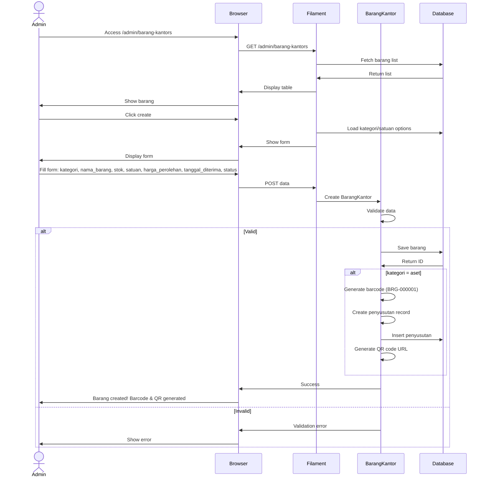
```mermaid
sequenceDiagram
    actor Admin
    participant Browser
    participant Filament
    participant Model as BarangKantor
    participant DB as Database

    Admin->>Browser: Access /admin/barang-kantors
    Browser->>Filament: GET /admin/barang-kantors
    Filament->>DB: Fetch barang list
    DB->>Filament: Return list
    Filament->>Browser: Display table
    Browser->>Admin: Show barang

    Admin->>Browser: Click create
    Filament->>DB: Load kategori/satuan options
    Filament->>Browser: Show form
    Browser->>Admin: Display form

    Admin->>Browser: Fill form: kategori, nama_barang, stok, satuan, harga_perolehan, tanggal_diterima, status
    Browser->>Filament: POST data
    Filament->>Model: Create BarangKantor
    
    Model->>Model: Validate data
    alt Valid
        Model->>DB: Save barang
        DB->>Model: Return ID
        
        alt kategori = aset
            Model->>Model: Generate barcode (BRG-000001)
            Model->>Model: Create penyusutan record
            Model->>DB: Insert penyusutan
            Model->>Model: Generate QR code URL
        end
        
        Model->>Browser: Success
        Browser->>Admin: Barang created! Barcode & QR generated
    else Invalid
        Model->>Browser: Validation error
        Browser->>Admin: Show error
    end
```

---

## UC-MASTER-BARANG-002: Admin Scan Barang Kantor

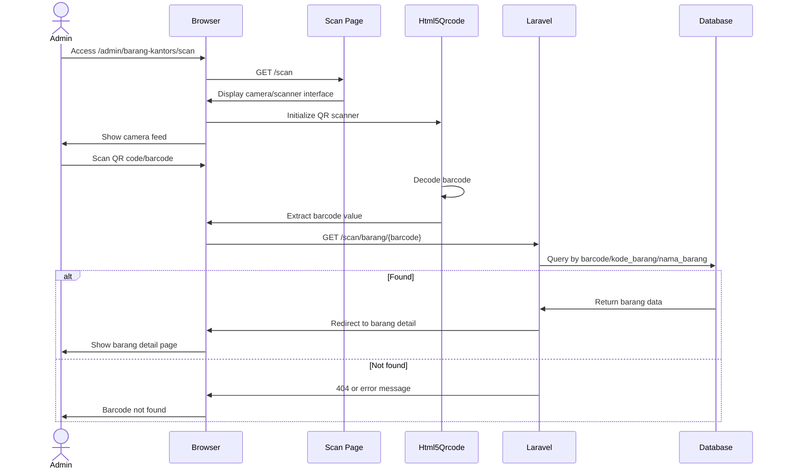
```mermaid
sequenceDiagram
    actor Admin
    participant Browser
    participant Filament as Scan Page
    participant JS as Html5Qrcode
    participant Laravel
    participant DB as Database

    Admin->>Browser: Access /admin/barang-kantors/scan
    Browser->>Filament: GET /scan
    Filament->>Browser: Display camera/scanner interface
    Browser->>JS: Initialize QR scanner
    Browser->>Admin: Show camera feed

    Admin->>Browser: Scan QR code/barcode
    JS->>JS: Decode barcode
    JS->>Browser: Extract barcode value
    
    Browser->>Laravel: GET /scan/barang/{barcode}
    Laravel->>DB: Query by barcode/kode_barang/nama_barang
    alt Found
        DB->>Laravel: Return barang data
        Laravel->>Browser: Redirect to barang detail
        Browser->>Admin: Show barang detail page
    else Not found
        Laravel->>Browser: 404 or error message
        Browser->>Admin: Barcode not found
    end
```

---

## UC-MASTER-BARANG-003: Public View Barang Detail

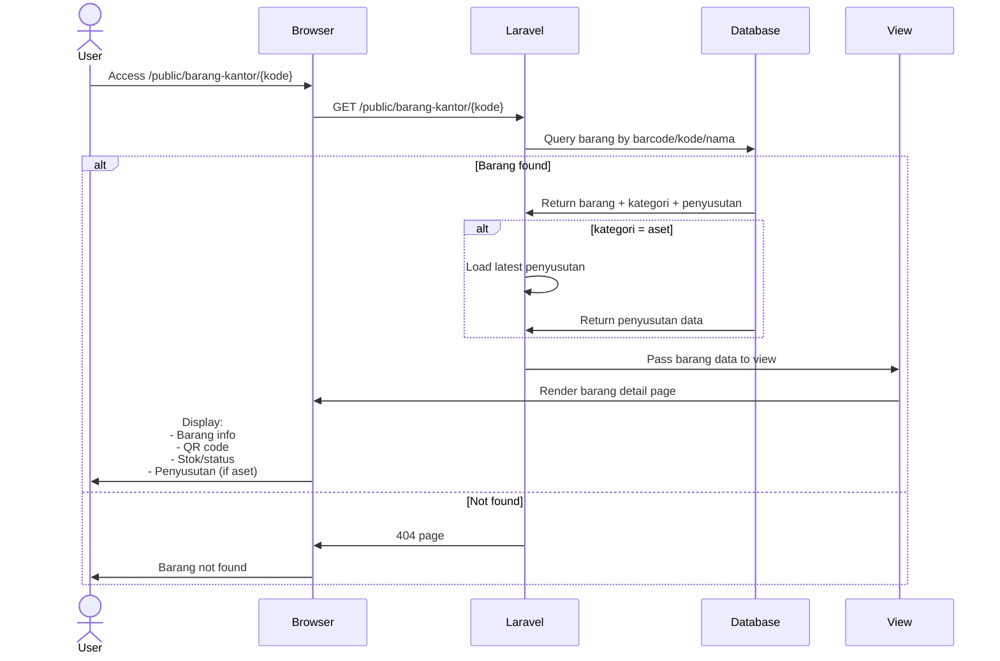
```mermaid
sequenceDiagram
    actor User
    participant Browser
    participant Laravel
    participant DB as Database
    participant View

    User->>Browser: Access /public/barang-kantor/{kode}
    Browser->>Laravel: GET /public/barang-kantor/{kode}
    Laravel->>DB: Query barang by barcode/kode/nama
    
    alt Barang found
        DB->>Laravel: Return barang + kategori + penyusutan
        
        alt kategori = aset
            Laravel->>Laravel: Load latest penyusutan
            DB->>Laravel: Return penyusutan data
        end
        
        Laravel->>View: Pass barang data to view
        View->>Browser: Render barang detail page
        Browser->>User: Display:<br/>- Barang info<br/>- QR code<br/>- Stok/status<br/>- Penyusutan (if aset)
    else Not found
        Laravel->>Browser: 404 page
        Browser->>User: Barang not found
    end
```

---

## UC-TRANS-HIBAH-001: Admin Create Pendapatan Hibah

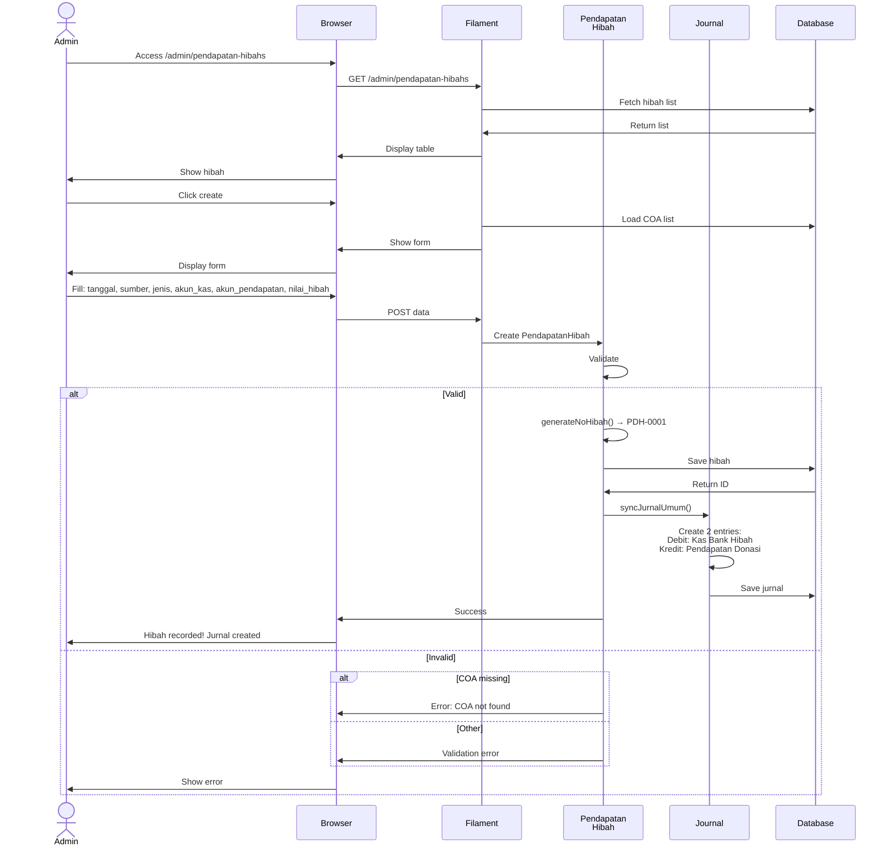
```mermaid
sequenceDiagram
    actor Admin
    participant Browser
    participant Filament
    participant Model as Pendapatan<br/>Hibah
    participant Journal as Journal
    participant DB as Database

    Admin->>Browser: Access /admin/pendapatan-hibahs
    Browser->>Filament: GET /admin/pendapatan-hibahs
    Filament->>DB: Fetch hibah list
    DB->>Filament: Return list
    Filament->>Browser: Display table
    Browser->>Admin: Show hibah

    Admin->>Browser: Click create
    Filament->>DB: Load COA list
    Filament->>Browser: Show form
    Browser->>Admin: Display form

    Admin->>Browser: Fill: tanggal, sumber, jenis, akun_kas, akun_pendapatan, nilai_hibah
    Browser->>Filament: POST data
    Filament->>Model: Create PendapatanHibah
    
    Model->>Model: Validate
    alt Valid
        Model->>Model: generateNoHibah() → PDH-0001
        Model->>DB: Save hibah
        DB->>Model: Return ID
        
        Model->>Journal: syncJurnalUmum()
        Journal->>Journal: Create 2 entries:<br/>Debit: Kas Bank Hibah<br/>Kredit: Pendapatan Donasi
        Journal->>DB: Save jurnal
        
        Model->>Browser: Success
        Browser->>Admin: Hibah recorded! Jurnal created
    else Invalid
        alt COA missing
            Model->>Browser: Error: COA not found
        else Other
            Model->>Browser: Validation error
        end
        Browser->>Admin: Show error
    end
```

---

## UC-TRANS-HIBAH-002: Admin Edit/Delete Pendapatan Hibah

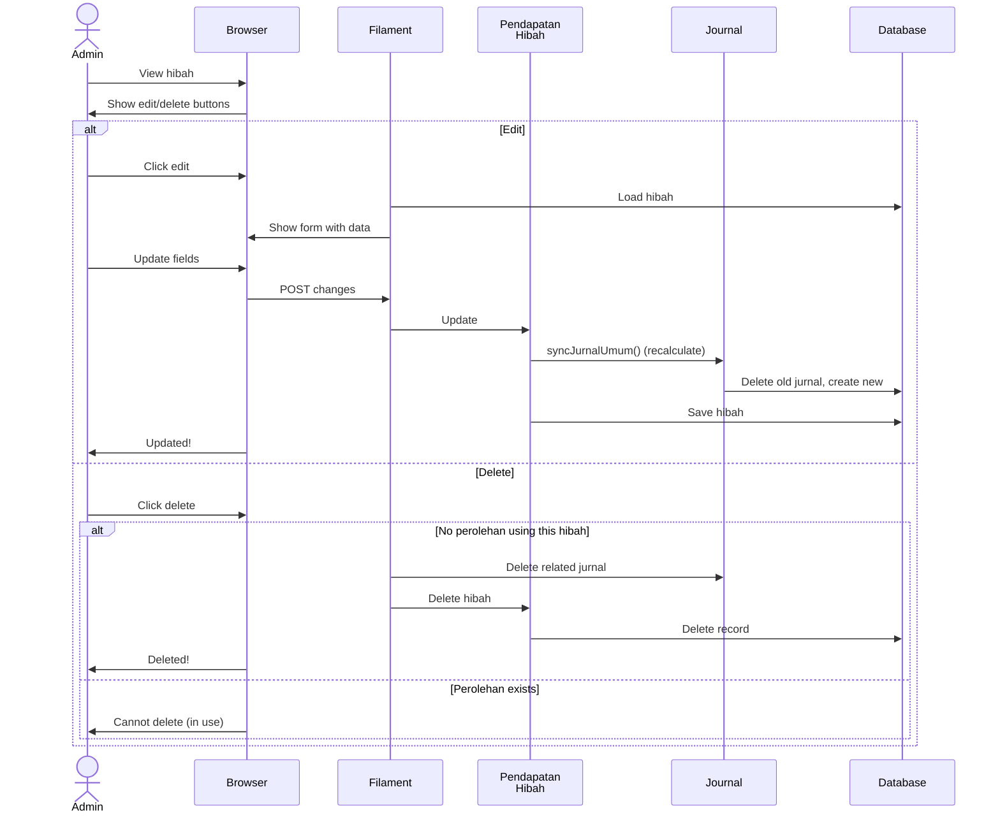
```mermaid
sequenceDiagram
    actor Admin
    participant Browser
    participant Filament
    participant Model as Pendapatan<br/>Hibah
    participant Journal
    participant DB as Database

    Admin->>Browser: View hibah
    Browser->>Admin: Show edit/delete buttons

    alt Edit
        Admin->>Browser: Click edit
        Filament->>DB: Load hibah
        Filament->>Browser: Show form with data
        Admin->>Browser: Update fields
        Browser->>Filament: POST changes
        Filament->>Model: Update
        Model->>Journal: syncJurnalUmum() (recalculate)
        Journal->>DB: Delete old jurnal, create new
        Model->>DB: Save hibah
        Browser->>Admin: Updated!
    else Delete
        Admin->>Browser: Click delete
        alt No perolehan using this hibah
            Filament->>Journal: Delete related jurnal
            Filament->>Model: Delete hibah
            Model->>DB: Delete record
            Browser->>Admin: Deleted!
        else Perolehan exists
            Browser->>Admin: Cannot delete (in use)
        end
    end
```

---

## UC-TRANS-KAS-001: Admin Create Pengisian Kas Kecil

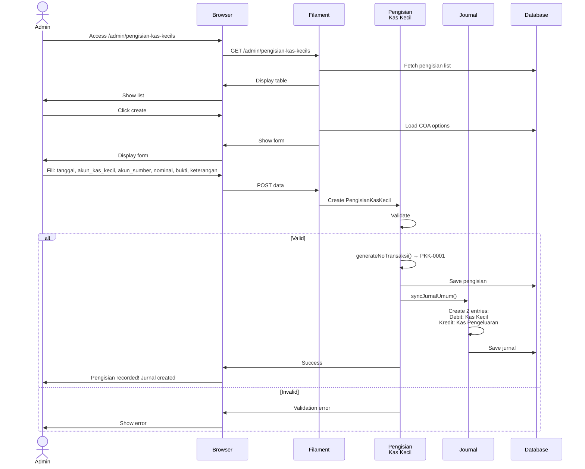
```mermaid
sequenceDiagram
    actor Admin
    participant Browser
    participant Filament
    participant Model as Pengisian<br/>Kas Kecil
    participant Journal
    participant DB as Database

    Admin->>Browser: Access /admin/pengisian-kas-kecils
    Browser->>Filament: GET /admin/pengisian-kas-kecils
    Filament->>DB: Fetch pengisian list
    Filament->>Browser: Display table
    Browser->>Admin: Show list

    Admin->>Browser: Click create
    Filament->>DB: Load COA options
    Filament->>Browser: Show form
    Browser->>Admin: Display form

    Admin->>Browser: Fill: tanggal, akun_kas_kecil, akun_sumber, nominal, bukti, keterangan
    Browser->>Filament: POST data
    Filament->>Model: Create PengisianKasKecil
    
    Model->>Model: Validate
    alt Valid
        Model->>Model: generateNoTransaksi() → PKK-0001
        Model->>DB: Save pengisian
        
        Model->>Journal: syncJurnalUmum()
        Journal->>Journal: Create 2 entries:<br/>Debit: Kas Kecil<br/>Kredit: Kas Pengeluaran
        Journal->>DB: Save jurnal
        
        Model->>Browser: Success
        Browser->>Admin: Pengisian recorded! Jurnal created
    else Invalid
        Model->>Browser: Validation error
        Browser->>Admin: Show error
    end
```

---

## UC-TRANS-KAS-002: Admin Edit/Delete Pengisian Kas Kecil

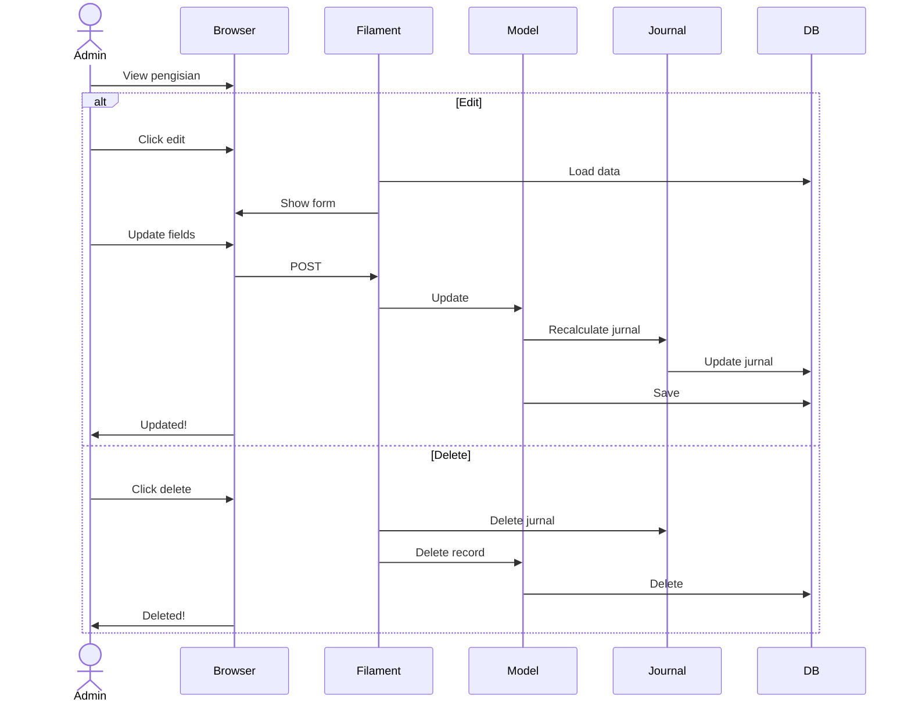
```mermaid
sequenceDiagram
    actor Admin
    participant Browser
    participant Filament
    participant Model
    participant Journal
    participant DB

    Admin->>Browser: View pengisian

    alt Edit
        Admin->>Browser: Click edit
        Filament->>DB: Load data
        Filament->>Browser: Show form
        Admin->>Browser: Update fields
        Browser->>Filament: POST
        Filament->>Model: Update
        Model->>Journal: Recalculate jurnal
        Journal->>DB: Update jurnal
        Model->>DB: Save
        Browser->>Admin: Updated!
    else Delete
        Admin->>Browser: Click delete
        Filament->>Journal: Delete jurnal
        Filament->>Model: Delete record
        Model->>DB: Delete
        Browser->>Admin: Deleted!
    end
```

---

## UC-TRANS-PEROLEHAN-001: Admin Create Perolehan Barang

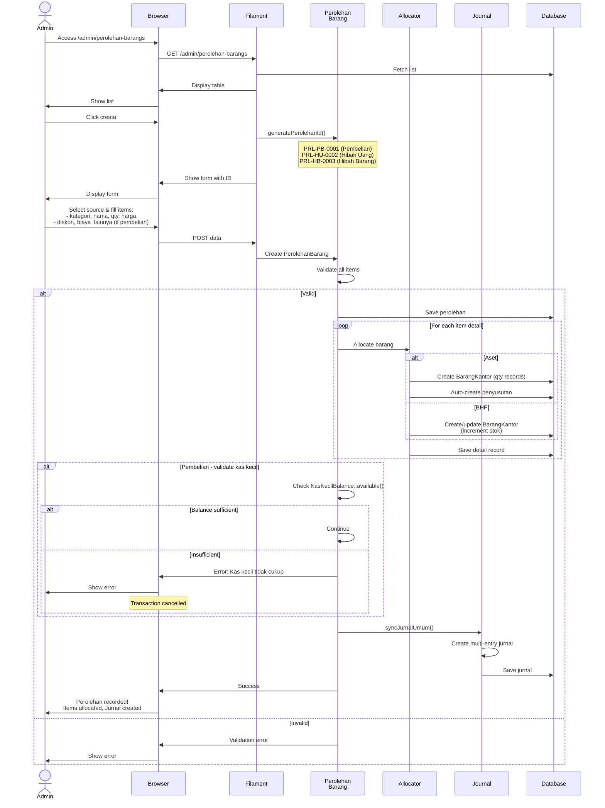
```mermaid
sequenceDiagram
    actor Admin
    participant Browser
    participant Filament
    participant Model as Perolehan<br/>Barang
    participant Allocator
    participant Journal
    participant DB as Database

    Admin->>Browser: Access /admin/perolehan-barangs
    Browser->>Filament: GET /admin/perolehan-barangs
    Filament->>DB: Fetch list
    Filament->>Browser: Display table
    Browser->>Admin: Show list

    Admin->>Browser: Click create
    Filament->>Model: generatePerolehanId()
    Note over Model: PRL-PB-0001 (Pembelian)<br/>PRL-HU-0002 (Hibah Uang)<br/>PRL-HB-0003 (Hibah Barang)
    Filament->>Browser: Show form with ID
    Browser->>Admin: Display form

    Admin->>Browser: Select source & fill items:<br/>- kategori, nama, qty, harga<br/>- diskon, biaya_lainnya (if pembelian)
    Browser->>Filament: POST data
    Filament->>Model: Create PerolehanBarang
    
    Model->>Model: Validate all items
    alt Valid
        Model->>DB: Save perolehan
        
        loop For each item detail
            Model->>Allocator: Allocate barang
            alt Aset
                Allocator->>DB: Create BarangKantor (qty records)
                Allocator->>DB: Auto-create penyusutan
            else BHP
                Allocator->>DB: Create/update BarangKantor<br/>(increment stok)
            end
            Allocator->>DB: Save detail record
        end
        
        alt Pembelian - validate kas kecil
            Model->>Model: Check KasKecilBalance::available()
            alt Balance sufficient
                Model->>Model: Continue
            else Insufficient
                Model->>Browser: Error: Kas kecil tidak cukup
                Browser->>Admin: Show error
                Note over Browser: Transaction cancelled
            end
        end
        
        Model->>Journal: syncJurnalUmum()
        Journal->>Journal: Create multi-entry jurnal
        Journal->>DB: Save jurnal
        
        Model->>Browser: Success
        Browser->>Admin: Perolehan recorded!<br/>Items allocated, Jurnal created
    else Invalid
        Model->>Browser: Validation error
        Browser->>Admin: Show error
    end
```

---

## UC-TRANS-PEROLEHAN-002: Admin Edit/Delete Perolehan Barang

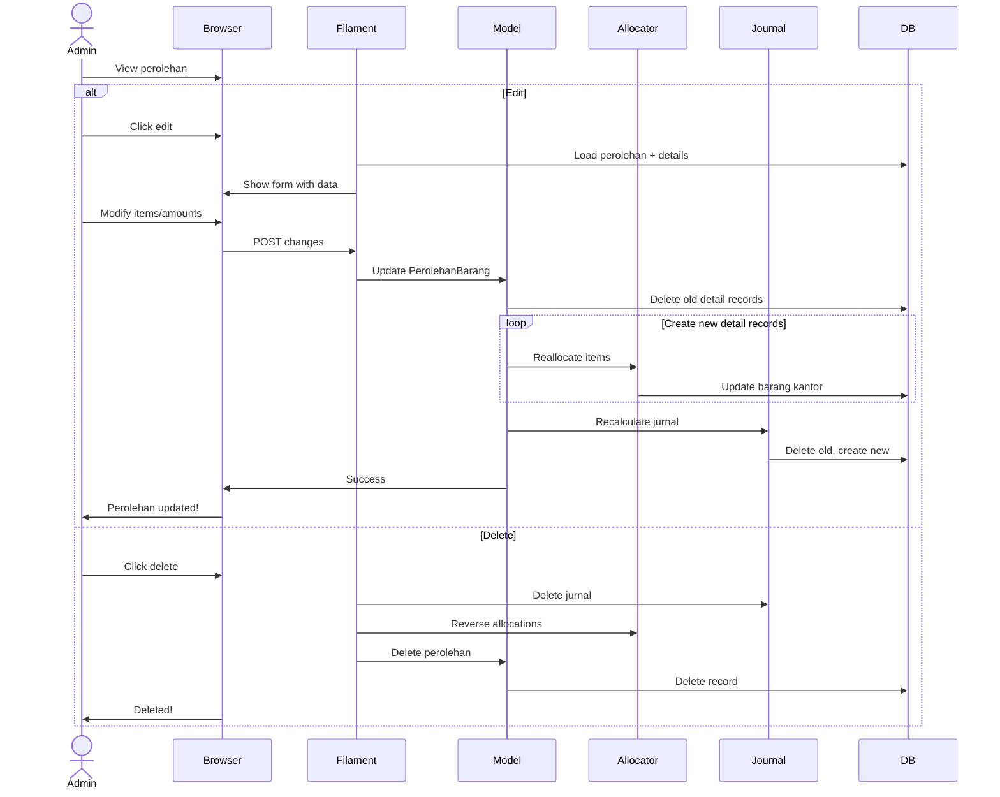
```mermaid
sequenceDiagram
    actor Admin
    participant Browser
    participant Filament
    participant Model
    participant Allocator
    participant Journal
    participant DB

    Admin->>Browser: View perolehan

    alt Edit
        Admin->>Browser: Click edit
        Filament->>DB: Load perolehan + details
        Filament->>Browser: Show form with data
        Admin->>Browser: Modify items/amounts
        Browser->>Filament: POST changes
        
        Filament->>Model: Update PerolehanBarang
        
        Model->>DB: Delete old detail records
        loop Create new detail records
            Model->>Allocator: Reallocate items
            Allocator->>DB: Update barang kantor
        end
        
        Model->>Journal: Recalculate jurnal
        Journal->>DB: Delete old, create new
        
        Model->>Browser: Success
        Browser->>Admin: Perolehan updated!
    else Delete
        Admin->>Browser: Click delete
        Filament->>Journal: Delete jurnal
        Filament->>Allocator: Reverse allocations
        Filament->>Model: Delete perolehan
        Model->>DB: Delete record
        Browser->>Admin: Deleted!
    end
```

---

## UC-TRANS-PENYUSUTAN-001: Admin Process End-of-Period Penyusutan

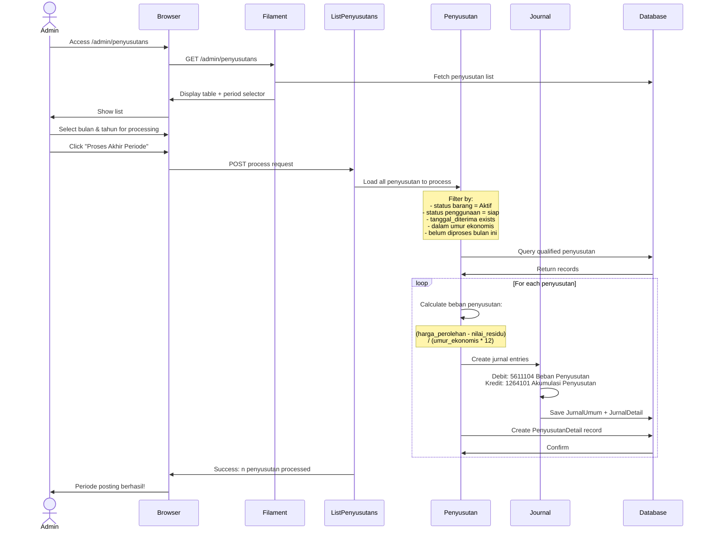
```mermaid
sequenceDiagram
    actor Admin
    participant Browser
    participant Filament
    participant Page as ListPenyusutans
    participant Model as Penyusutan
    participant Journal
    participant DB as Database

    Admin->>Browser: Access /admin/penyusutans
    Browser->>Filament: GET /admin/penyusutans
    Filament->>DB: Fetch penyusutan list
    Filament->>Browser: Display table + period selector
    Browser->>Admin: Show list

    Admin->>Browser: Select bulan & tahun for processing
    Admin->>Browser: Click "Proses Akhir Periode"
    Browser->>Page: POST process request
    
    Page->>Model: Load all penyusutan to process
    Note over Model: Filter by:<br/>- status barang = Aktif<br/>- status penggunaan = siap<br/>- tanggal_diterima exists<br/>- dalam umur ekonomis<br/>- belum diproses bulan ini
    
    Model->>DB: Query qualified penyusutan
    DB->>Model: Return records
    
    loop For each penyusutan
        Model->>Model: Calculate beban penyusutan:
        Note over Model: (harga_perolehan - nilai_residu)<br/>/ (umur_ekonomis * 12)
        
        Model->>Journal: Create jurnal entries
        Journal->>Journal: Debit: 5611104 Beban Penyusutan<br/>Kredit: 1264101 Akumulasi Penyusutan
        Journal->>DB: Save JurnalUmum + JurnalDetail
        
        Model->>DB: Create PenyusutanDetail record
        DB->>Model: Confirm
    end
    
    Page->>Browser: Success: n penyusutan processed
    Browser->>Admin: Periode posting berhasil!
```

---

## UC-TRANS-PENYUSUTAN-002: Admin View Penyusutan Kartu

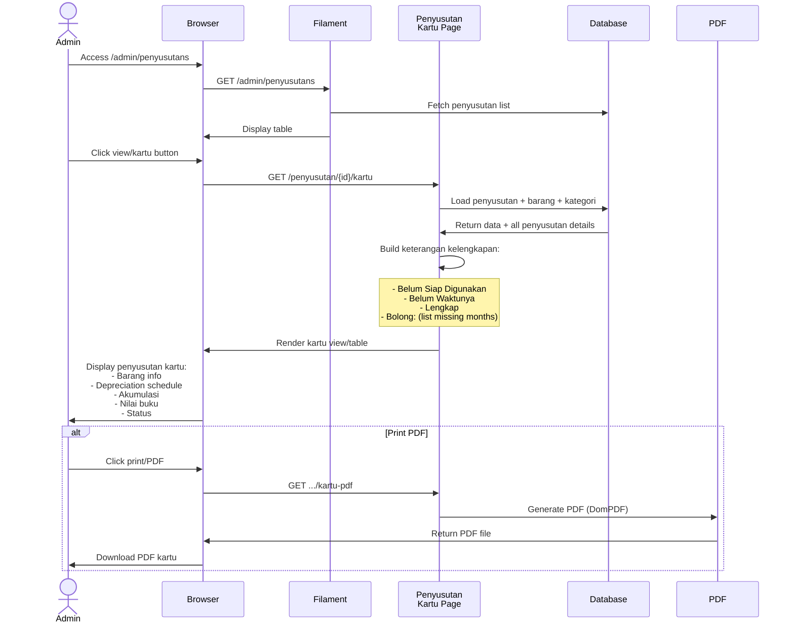
```mermaid
sequenceDiagram
    actor Admin
    participant Browser
    participant Filament
    participant Page as Penyusutan<br/>Kartu Page
    participant DB as Database
    participant PDF

    Admin->>Browser: Access /admin/penyusutans
    Browser->>Filament: GET /admin/penyusutans
    Filament->>DB: Fetch penyusutan list
    Filament->>Browser: Display table

    Admin->>Browser: Click view/kartu button
    Browser->>Page: GET /penyusutan/{id}/kartu
    
    Page->>DB: Load penyusutan + barang + kategori
    DB->>Page: Return data + all penyusutan details
    
    Page->>Page: Build keterangan kelengkapan:
    Note over Page: - Belum Siap Digunakan<br/>- Belum Waktunya<br/>- Lengkap<br/>- Bolong: (list missing months)
    
    Page->>Browser: Render kartu view/table
    Browser->>Admin: Display penyusutan kartu:<br/>- Barang info<br/>- Depreciation schedule<br/>- Akumulasi<br/>- Nilai buku<br/>- Status

    alt Print PDF
        Admin->>Browser: Click print/PDF
        Browser->>Page: GET .../kartu-pdf
        Page->>PDF: Generate PDF (DomPDF)
        PDF->>Browser: Return PDF file
        Browser->>Admin: Download PDF kartu
    end
```

---

## UC-REPORT-001: Admin View Jurnal Umum

```mermaid
sequenceDiagram
    actor Admin
    participant Browser
    participant Filament
    participant Ctrl as Controller
    participant DB as Database
    participant View

    Admin->>Browser: Access /admin/jurnal-umums
    Browser->>Filament: GET /admin/jurnal-umums
    Filament->>Ctrl: Load resource
    
    Ctrl->>Ctrl: Apply default filters
    Ctrl->>DB: Query JurnalUmum with filters
    Note over DB: Join with:<br/>- PendapatanHibah<br/>- PengisianKasKecil<br/>- PerolehanBarang<br/>- PenyusutanAsetTetap<br/>Apply ref_exists scope
    
    DB->>Ctrl: Return filtered journals
    
    Ctrl->>View: Pass data
    View->>Browser: Render journal table
    Browser->>Admin: Display Jurnal Umum:<br/>- Tanggal<br/>- No. Transaksi<br/>- Keterangan<br/>- Type<br/>- Reference

    alt Filter/Search
        Admin->>Browser: Apply filters (date, type)
        Browser->>Filament: Update query
        Filament->>DB: Re-query with filters
        DB->>Browser: Return filtered results
        Browser->>Admin: Update display
    end
```

---

## UC-REPORT-002: Admin View Buku Besar

```mermaid
sequenceDiagram
    actor Admin
    participant Browser
    participant Filament
    participant Ctrl as BukuBesar<br/>Ctrl
    participant DB as Database
    participant View

    Admin->>Browser: Access /admin/buku-besars
    Browser->>Filament: GET /admin/buku-besars
    Filament->>Ctrl: Load report
    
    Ctrl->>Ctrl: Load period filters
    Ctrl->>DB: Fetch COA list
    DB->>Ctrl: Return accounts
    
    loop For each COA
        Ctrl->>DB: Calculate saldo awal from COA.jumlah_saldo
        Ctrl->>DB: Add transactions before period
        Ctrl->>DB: Get jurnal in period
        DB->>Ctrl: Return transactions
        
        Ctrl->>Ctrl: Calculate running balances
        Ctrl->>Ctrl: Group by account
    end
    
    Ctrl->>View: Pass calculated data
    View->>Browser: Render buku besar table
    Browser->>Admin: Display Buku Besar:<br/>- No. Akun<br/>- Nama Akun<br/>- Debit<br/>- Kredit<br/>- Saldo (Debit/Kredit)

    alt Filter period
        Admin->>Browser: Select period awal/akhir
        Browser->>Filament: Update filters
        Filament->>Ctrl: Recalculate with new period
        Ctrl->>Browser: Return filtered data
    end
```

---

## UC-REPORT-003: Admin Print Laporan PDF

```mermaid
sequenceDiagram
    actor Admin
    participant Browser
    participant Filament
    participant Ctrl as Cetakkan
    participant PDF as DomPDF
    participant View

    Admin->>Browser: Access report page
    Browser->>Filament: Display with print button
    Admin->>Browser: Click "Cetak PDF" button

    Browser->>Ctrl: GET /laporan/cetak-pdf
    Ctrl->>Ctrl: Load report data
    Ctrl->>Ctrl: Apply filters (period, etc)
    
    Ctrl->>View: Pass data to PDF template
    View->>PDF: Render template
    PDF->>PDF: Generate PDF layout
    
    PDF->>Browser: Return PDF file
    Browser->>Admin: Download/display PDF

    alt PDF types
        Note over Ctrl: - Buku Besar PDF<br/>- Jurnal Umum PDF<br/>- Penyusutan Kartu PDF<br/>- All with company header
    end
```

---

## UC-REPORT-004: Admin View Dashboard

```mermaid
sequenceDiagram
    actor Admin
    participant Browser
    participant Filament
    participant Ctrl as Dashboard<br/>Ctrl
    participant Widgets
    participant DB as Database

    Admin->>Browser: Access /admin (Dashboard)
    Browser->>Filament: GET /admin
    Filament->>Ctrl: Load dashboard
    
    Ctrl->>Widgets: Collect widget data
    
    par Widget: Jurnal Umum Overview
        Widgets->>DB: Count jurnal entries
        Widgets->>DB: Get recent transactions
        DB->>Widgets: Return data
    and Widget: Asset Summary
        Widgets->>DB: Count barang by category
        Widgets->>DB: Calculate total value
        DB->>Widgets: Return data
    and Widget: Loan Activity
        Widgets->>DB: Get active loans
        Widgets->>DB: Get pending returns
        DB->>Widgets: Return data
    and Widget: Request Activity
        Widgets->>DB: Get pending requests
        Widgets->>DB: Get recent approvals
        DB->>Widgets: Return data
    end
    
    Widgets->>Ctrl: Aggregate all widget data
    Ctrl->>Browser: Render dashboard
    Browser->>Admin: Display:<br/>- Key metrics<br/>- Recent activities<br/>- Pending items<br/>- Quick actions
```

---

## UC-USER-PINJAM-001: Anggota View Ketersediaan Barang

```mermaid
sequenceDiagram
    actor Anggota
    participant Browser
    participant Laravel
    participant Ctrl as Ketersediaan<br/>Ctrl
    participant Model as BarangKantor
    participant DB as Database
    participant View

    Anggota->>Browser: Access /ketersediaan
    Browser->>Laravel: GET /ketersediaan
    Laravel->>Ctrl: index()
    
    Ctrl->>Model: Fetch borrowable barang
    Note over Model: scopeBorrowableForPeminjaman():<br/>- kategori_barang = aset<br/>- status_penggunaan = active<br/>- status_pinjam = available<br/>- isSiapPakai() = true
    
    Model->>DB: Query filtered barang
    DB->>Model: Return results
    
    Ctrl->>Ctrl: Format data for display
    Ctrl->>View: Pass barang data
    View->>Browser: Render ketersediaan list
    Browser->>Anggota: Display available barang:<br/>- Nama<br/>- Kategori<br/>- Stok tersedia<br/>- Kondisi<br/>- Tombol "Pinjam"
```

---

## UC-USER-PINJAM-002: Anggota Request Peminjaman

```mermaid
sequenceDiagram
    actor Anggota
    participant Browser
    participant Laravel
    participant Ctrl as Peminjaman<br/>Ctrl
    participant Model as Peminjaman<br/>Barang
    participant BarangModel as BarangKantor
    participant DB as Database

    Anggota->>Browser: Akses /peminjaman
    Browser->>Laravel: GET /peminjaman
    Laravel->>Ctrl: index()
    Ctrl->>Browser: Load form
    Browser->>Anggota: Show peminjaman form

    Anggota->>Browser: Fill form:<br/>- Pilih barang<br/>- Qty<br/>- Tujuan/riwayat<br/>- Kebutuhan
    
    Anggota->>Browser: Submit
    Browser->>Laravel: POST /peminjaman
    Laravel->>Ctrl: store(request)
    
    Ctrl->>Model: Validate data
    alt Barang valid & stok cukup
        Model->>DB: Save peminjaman record
        DB->>Model: Return ID
        
        Model->>BarangModel: markAsBorrowed(qty)
        Note over BarangModel: - Reduce stok<br/>- Update status_pinjam
        
        BarangModel->>DB: Update barang_kantors
        DB->>BarangModel: Confirm
        
        Model->>Browser: Success
        Browser->>Anggota: Peminjaman berhasil!
    else Stok tidak cukup
        Model->>Browser: Error: Stok not enough
        Browser->>Anggota: Show error
    end
```

---

## UC-USER-PINJAM-003: Anggota View Riwayat Peminjaman

```mermaid
sequenceDiagram
    actor Anggota
    participant Browser
    participant Laravel
    participant Ctrl
    participant Model as Peminjaman<br/>Barang
    participant DB as Database

    Anggota->>Browser: Access /peminjaman/riwayat
    Browser->>Laravel: GET /peminjaman/riwayat
    Laravel->>Ctrl: riwayatSemua()
    
    Ctrl->>Model: Fetch peminjaman history
    Model->>DB: Query where user_id = current_user
    DB->>Model: Return all peminjaman records
    
    Ctrl->>Browser: Pass data to view
    Browser->>Anggota: Display riwayat:<br/>- Barang<br/>- Qty<br/>- Tanggal pinjam<br/>- Status (borrowed/returned)<br/>- Tombol "Kembalikan"
```

---

## UC-USER-PINJAM-004: Anggota Return Peminjaman

```mermaid
sequenceDiagram
    actor Anggota
    participant Browser
    participant Laravel
    participant Ctrl
    participant Model as Peminjaman<br/>Barang
    participant BarangModel as BarangKantor
    participant DB as Database

    Anggota->>Browser: Click "Kembalikan"
    Browser->>Laravel: PATCH /peminjaman/kembalikan/{id}
    Laravel->>Ctrl: kembalikan(id)
    
    Ctrl->>Model: Load peminjaman
    Model->>DB: Fetch peminjaman by ID
    DB->>Model: Return record
    
    alt Peminjaman aktif
        Model->>BarangModel: markAsReturned(qty)
        Note over BarangModel: - Increase stok<br/>- Update status_pinjam to available
        
        BarangModel->>DB: Update barang_kantors
        DB->>BarangModel: Confirm
        
        Model->>DB: Update peminjaman (status = returned)
        DB->>Model: Confirm
        
        Model->>Browser: Success
        Browser->>Anggota: Barang berhasil dikembalikan!
    else Sudah dikembalikan
        Model->>Browser: Error: Already returned
        Browser->>Anggota: Show error
    end
```

---

## UC-USER-PEMAKAIAN-001: Anggota Record Pemakaian BHP

```mermaid
sequenceDiagram
    actor Anggota
    participant Browser
    participant Laravel
    participant Ctrl as Pemakaian<br/>Ctrl
    participant Model as Pemakaian BHP
    participant BarangModel as BarangKantor
    participant DB as Database

    Anggota->>Browser: Access /pemakaian
    Browser->>Laravel: GET /pemakaian
    Laravel->>Ctrl: index()
    
    Ctrl->>BarangModel: Fetch BHP items
    BarangModel->>DB: Query kategori_barang = bhp
    DB->>BarangModel: Return BHP list
    
    Ctrl->>Browser: Pass BHP data
    Browser->>Anggota: Display pemakaian form

    Anggota->>Browser: Fill form:<br/>- Pilih BHP<br/>- Qty pemakaian<br/>- Tanggal<br/>- Tujuan<br/>- Keterangan
    
    Anggota->>Browser: Submit
    Browser->>Laravel: POST /pemakaian
    Laravel->>Ctrl: store(request)
    
    Ctrl->>Model: Validate data
    alt Stok cukup
        Model->>DB: Save pemakaian record
        DB->>Model: Return ID
        
        Model->>BarangModel: Reduce stok
        Note over BarangModel: stok -= qty_pemakaian
        
        BarangModel->>DB: Update barang_kantors
        DB->>BarangModel: Confirm
        
        Model->>Browser: Success
        Browser->>Anggota: Pemakaian BHP dicatat!<br/>Stok berkurang
    else Stok tidak cukup
        Model->>Browser: Error: Not enough stock
        Browser->>Anggota: Show error
    end
```

---

## UC-USER-PEMAKAIAN-002: Anggota View Riwayat Pemakaian

```mermaid
sequenceDiagram
    actor Anggota
    participant Browser
    participant Laravel
    participant Ctrl
    participant Model as Pemakaian BHP
    participant DB as Database

    Anggota->>Browser: Access /pemakaian/riwayat
    Browser->>Laravel: GET /pemakaian/riwayat
    Laravel->>Ctrl: riwayatSemua()
    
    Ctrl->>Model: Fetch pemakaian history
    Model->>DB: Query where user_id = current_user
    DB->>Model: Return all pemakaian records
    
    Ctrl->>Browser: Pass data
    Browser->>Anggota: Display riwayat pemakaian:<br/>- BHP<br/>- Qty<br/>- Tanggal<br/>- Tujuan<br/>- Keterangan
```

---

## UC-USER-PENGAJUAN-001: Anggota Submit & View Pengajuan Pembelian

```mermaid
sequenceDiagram
    actor Anggota
    participant Browser
    participant Laravel
    participant Ctrl as Pembelian<br/>Ctrl
    participant Model as Pengajuan<br/>Pembelian
    participant DB as Database

    Anggota->>Browser: Access /pembelian
    Browser->>Laravel: GET /pembelian
    Laravel->>Ctrl: index()
    Ctrl->>Browser: Load form
    Browser->>Anggota: Display pengajuan form

    alt Submit Pengajuan
        Anggota->>Browser: Fill form:<br/>- Nama barang<br/>- Spesifikasi<br/>- Qty<br/>- Estimasi harga<br/>- Alasan<br/>- Prioritas<br/>- Tanggal diperlukan
        
        Anggota->>Browser: Submit
        Browser->>Laravel: POST /pembelian
        Laravel->>Ctrl: store(request)
        
        Ctrl->>Model: Validate
        alt Valid
            Model->>DB: Save pengajuan record
            Note over DB: status = pending
            DB->>Model: Confirm
            Model->>Browser: Success
            Browser->>Anggota: Pengajuan submitted!<br/>Menunggu persetujuan
        else Invalid
            Model->>Browser: Validation error
            Browser->>Anggota: Show error
        end
    else View Riwayat
        Anggota->>Browser: Access /pembelian/riwayat
        Browser->>Laravel: GET /pembelian/riwayat
        Laravel->>Ctrl: riwayatSemua()
        
        Ctrl->>Model: Fetch user pengajuan
        Model->>DB: Query where user_id = current
        DB->>Model: Return records
        
        Ctrl->>Browser: Pass data
        Browser->>Anggota: Display pengajuan:<br/>- Barang<br/>- Qty<br/>- Status<br/>- Tanggal submit<br/>- Tanggal diperlukan<br/>- Note (if approved/rejected)
    end
```

---

## 📊 Summary Table

| No | UC ID | Nama | Aktor | Kategori |
|----|-------|------|-------|----------|
| 1 | UC-AUTH-001 | User Login | User | Auth |
| 2 | UC-AUTH-002 | User Logout | User | Auth |
| 3 | UC-AUTH-003 | Change Password | Anggota | Auth |
| 4 | UC-AUTH-004 | Multi-tab Session | Browser | Auth |
| 5 | UC-MASTER-USER-001 | Create/Edit User | Admin | Master |
| 6 | UC-MASTER-USER-002 | Delete User | Admin | Master |
| 7 | UC-MASTER-COA-001 | Create/Edit COA | Admin | Master |
| 8 | UC-MASTER-COA-002 | Delete COA | Admin | Master |
| 9 | UC-MASTER-KATEGORI-001 | Manage Kategori | Admin | Master |
| 10 | UC-MASTER-BARANG-001 | Create/Edit Barang | Admin | Master |
| 11 | UC-MASTER-BARANG-002 | Scan Barang | Admin | Master |
| 12 | UC-MASTER-BARANG-003 | View Barang Detail | Public | Master |
| 13 | UC-TRANS-HIBAH-001 | Create Hibah | Admin | Transaksi |
| 14 | UC-TRANS-HIBAH-002 | Edit/Delete Hibah | Admin | Transaksi |
| 15 | UC-TRANS-KAS-001 | Create Pengisian Kas | Admin | Transaksi |
| 16 | UC-TRANS-KAS-002 | Edit/Delete Pengisian | Admin | Transaksi |
| 17 | UC-TRANS-PEROLEHAN-001 | Create Perolehan | Admin | Transaksi |
| 18 | UC-TRANS-PEROLEHAN-002 | Edit/Delete Perolehan | Admin | Transaksi |
| 19 | UC-TRANS-PENYUSUTAN-001 | Process Penyusutan | Admin | Transaksi |
| 20 | UC-TRANS-PENYUSUTAN-002 | View Penyusutan Kartu | Admin | Transaksi |
| 21 | UC-REPORT-001 | View Jurnal Umum | Admin | Report |
| 22 | UC-REPORT-002 | View Buku Besar | Admin | Report |
| 23 | UC-REPORT-003 | Print Laporan PDF | Admin | Report |
| 24 | UC-REPORT-004 | View Dashboard | Admin | Report |
| 25 | UC-USER-PINJAM-001 | View Ketersediaan | Anggota | User |
| 26 | UC-USER-PINJAM-002 | Request Peminjaman | Anggota | User |
| 27 | UC-USER-PINJAM-003 | View Riwayat Pinjam | Anggota | User |
| 28 | UC-USER-PINJAM-004 | Return Peminjaman | Anggota | User |
| 29 | UC-USER-PEMAKAIAN-001 | Record Pemakaian BHP | Anggota | User |
| 30 | UC-USER-PEMAKAIAN-002 | View Riwayat Pemakaian | Anggota | User |
| 31 | UC-USER-PENGAJUAN-001 | Submit Pengajuan | Anggota | User |

