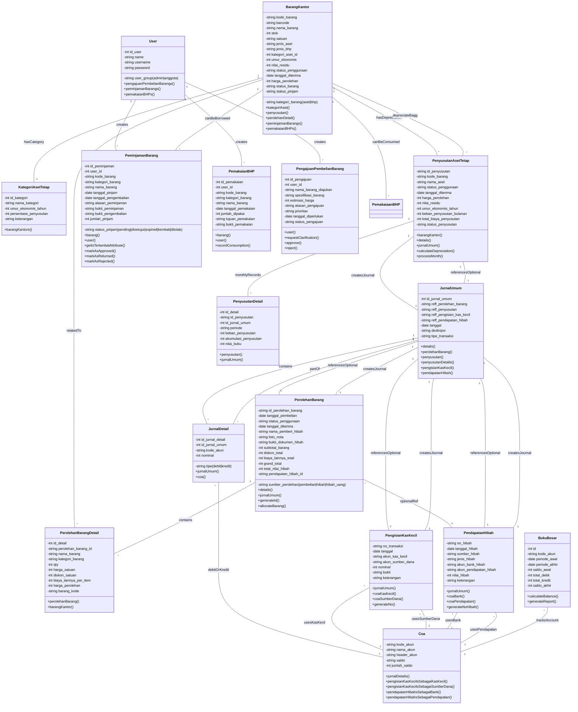

# Class Diagram - Sistem TA2025
## Struktur Models dan Relationships

---

## 📊 Full System Class Diagram



---

## 🔗 Relationship Patterns

### **One-to-Many Relationships**
| Parent | Child | Relasi | Deskripsi |
|--------|-------|--------|-----------|
| User | PeminjamanBarang | `hasMany()` | User bisa pinjam banyak barang |
| User | PemakaianBHP | `hasMany()` | User bisa pakai banyak BHP |
| User | PengajuanPembelianBarang | `hasMany()` | User bisa ajukan banyak pembelian |
| PerolehanBarang | PerolehanBarangDetail | `hasMany()` | 1 perolehan punya banyak detail |
| JurnalUmum | JurnalDetail | `hasMany()` | 1 jurnal punya banyak detail entries |
| PenyusutanAsetTetap | PenyusutanDetail | `hasMany()` | 1 aset punya banyak bulan penyusutan |
| BarangKantor | PeminjamanBarang | `hasMany()` | 1 barang bisa dipinjam berkali-kali |
| BarangKantor | PemakaianBHP | `hasMany()` | 1 BHP bisa dipakai berkali-kali |

### **Many-to-One Relationships**
| Child | Parent | Relasi | Deskripsi |
|-------|--------|--------|-----------|
| BarangKantor | KategoriAsetTetap | `belongsTo()` | Barang punya 1 kategori |
| PeminjamanBarang | BarangKantor | `belongsTo()` | Peminjaman merujuk 1 barang |
| PeminjamanBarang | User | `belongsTo()` | Peminjaman milik 1 user |
| PemakaianBHP | BarangKantor | `belongsTo()` | Pemakaian merujuk 1 barang |
| JurnalDetail | Coa | `belongsTo()` | Detail merujuk 1 akun COA |
| PenyusutanDetail | PenyusutanAsetTetap | `belongsTo()` | Detail merujuk 1 penyusutan |

### **Polymorphic Relationships**
| Referrer | Target | Deskripsi |
|----------|--------|-----------|
| JurnalUmum | PerolehanBarang | Optional ref via `reff_perolehan_barang` |
| JurnalUmum | PenyusutanAsetTetap | Optional ref via `reff_penyusutan` |
| JurnalUmum | PengisianKasKecil | Optional ref via `reff_pengisian_kas_kecil` |
| JurnalUmum | PendapatanHibah | Optional ref via `reff_pendapatan_hibah` |

---

## 🏗️ Core Domain Models

### **Master Data Layer**
- **User**: Authentication, roles, user management
- **Coa**: Chart of Accounts for financial transactions
- **KategoriAsetTetap**: Asset categorization with depreciation rules
- **BarangKantor**: Inventory master data (aset + BHP)

### **Transaction Layer**
- **PerolehanBarang + PerolehanBarangDetail**: Procurement (3 sumber)
- **PengisianKasKecil**: Cash entry to petty cash
- **PendapatanHibah**: Donation/grant income
- **PeminjamanBarang**: Asset borrowing
- **PemakaianBHP**: Consumption of materials

### **Financial Layer**
- **JurnalUmum + JurnalDetail**: General journal entries
- **PenyusutanAsetTetap + PenyusutanDetail**: Depreciation tracking
- **BukuBesar**: General ledger reports

### **Request/Workflow Layer**
- **PengajuanPembelianBarang**: Purchase requests (approval workflow)

---

## 📋 Key Model Attributes

### **BarangKantor Statuses**
```
status_penggunaan:
  - 'belum_siap_digunakan'  (new item, not ready)
  - 'siap_digunakan'        (ready for use)

status_barang:
  - 'Aktif'      (in use)
  - 'Tidak Aktif' (not in use)

status_pinjam:
  - 'Tersedia'              (available)
  - 'Sedang Dipinjam'       (borrowed)
  - 'Telah Didistribusikan' (distributed)
  - 'Tidak untuk Dipinjamkan' (not for loan)

kategori_barang:
  - 'aset'  (fixed asset)
  - 'bhp'   (consumable material)
```

### **PerolehanBarang Sumber**
```
sumber_perolehan:
  - 'pembelian'       (purchase)
  - 'hibah'           (donation - legacy)
  - 'hibah_barang'    (goods donation)
  - 'hibah_uang'      (cash donation)
```

### **PeminjamanBarang Statuses**
```
status_pinjam:
  - 'pending'                    (waiting approval)
  - 'disetujui'                  (approved, borrowed)
  - 'menunggu_verifikasi_pengembalian' (return pending)
  - 'kembali'                    (returned)
  - 'ditolak'                    (rejected)
  - 'expired'                    (overdue)
```

### **JurnalUmum Tipe Transaksi**
```
tipe_transaksi:
  - 'perolehan_barang'      (procurement)
  - 'penyusutan'            (depreciation)
  - 'pengisian_kas_kecil'   (cash entry)
  - 'pendapatan_hibah'      (donation income)
  - 'pembelian_barang'      (purchase - legacy)
```

---

## 🔄 Data Flow

```
User Input
    ↓
Request/Transaction Models
    ├─ PeminjamanBarang → Update BarangKantor.stok
    ├─ PemakaianBHP → Update BarangKantor.stok
    ├─ PengajuanPembelianBarang → Pending request
    ├─ PerolehanBarang → Allocate BarangKantor
    ├─ PengisianKasKecil → Update Coa balance
    └─ PendapatanHibah → Update Coa balance
    ↓
Auto Journal Creation (via Event Listeners)
    ├─ Create JurnalUmum
    ├─ Create JurnalDetail (debit/kredit pairs)
    └─ Reference back to transaction
    ↓
Financial Reporting
    ├─ BukuBesar (per COA account)
    ├─ Depreciation tracking via PenyusutanDetail
    └─ Balance calculations
```

---

## 💡 Design Patterns

### **1. Auto-Journal Creation**
- Every transaction (PerolehanBarang, Penyusutan, Kas Kecil, Hibah) auto-creates JurnalUmum entries
- Ensures double-entry bookkeeping
- JurnalUmum has polymorphic references to transactions

### **2. Event-Driven Updates**
```php
// When PerolehanBarang is created:
// ├─ Generate barcode for aset
// ├─ Create BarangKantor records
// ├─ Create PenyusutanAsetTetap
// └─ Create JurnalUmum entries

// When BarangKantor status changes:
// └─ Update related PenyusutanAsetTetap
```

### **3. Inventory Management**
- BarangKantor.stok tracks availability
- PeminjamanBarang.markAsBorrowed() reduces stok
- PemakaianBHP reduces stok (consumption)
- PerolehanBarang allocation increases stok

### **4. Financial Accuracy**
- Every JurnalUmum must have balanced JurnalDetail (debit = kredit)
- All monetary fields are integers (in cents or rupiah)
- Coa.jumlah_saldo auto-calculated from JurnalDetail

### **5. Cascading Deletes**
```php
// Delete PerolehanBarang → Delete PerolehanBarangDetail
// Delete JurnalUmum → Delete JurnalDetail
// Delete PenyusutanAsetTetap → Delete PenyusutanDetail → Update JurnalUmum
```

---

## 🔐 Key Constraints

| Constraint | Implementation | Purpose |
|-----------|----------------|---------|
| **Barcode Uniqueness** | `barcode` unique index | Prevent duplicate codes |
| **Kode Barang PK** | `kode_barang` PRIMARY KEY | Ensure unique inventory codes |
| **Jurnal Balance** | Debit = Kredit validation | Financial accuracy |
| **Stok Non-Negative** | `stok >= 0` constraint | Prevent over-allocation |
| **COA Existence** | FK to `coa.kode_akun` | Ensure valid accounts |
| **User Role** | `user_group` IN (admin, anggota) | Authorization |
| **Date Consistency** | `tanggal_diterima` <= `tanggal_pinjam` | Logical order |

---

## 📖 Inheritance Hierarchy

TA2025 uses **Eloquent Models** (no explicit inheritance in code), but conceptually:

```
Eloquent\Model (Laravel base)
    ├─ User (Authentication)
    ├─ BarangKantor (Master Data)
    ├─ KategoriAsetTetap (Master Data)
    ├─ Coa (Master Data)
    ├─ PerolehanBarang (Transaction)
    │   └─ PerolehanBarangDetail (Detail)
    ├─ PeminjamanBarang (Transaction)
    ├─ PemakaianBHP (Transaction)
    ├─ PengajuanPembelianBarang (Workflow)
    ├─ PengisianKasKecil (Transaction)
    ├─ PendapatanHibah (Transaction)
    ├─ JurnalUmum (Financial)
    │   └─ JurnalDetail (Detail)
    ├─ PenyusutanAsetTetap (Financial)
    │   └─ PenyusutanDetail (Detail)
    └─ BukuBesar (Reporting)
```

All models follow Eloquent conventions with model-specific primary keys and timestamping.

