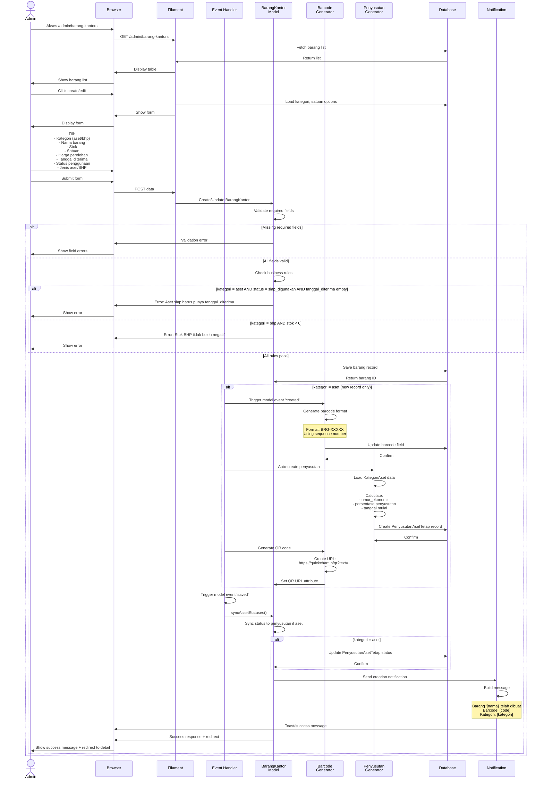
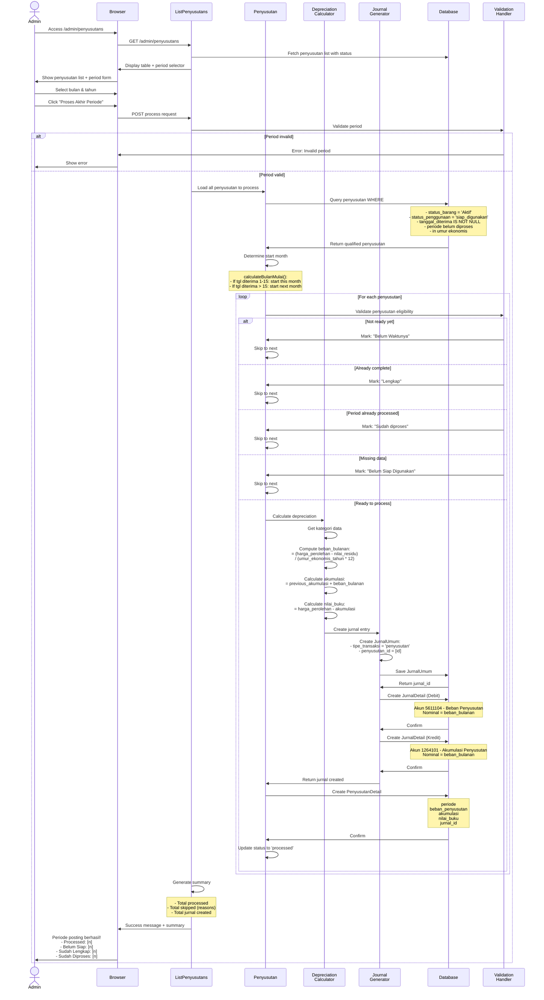
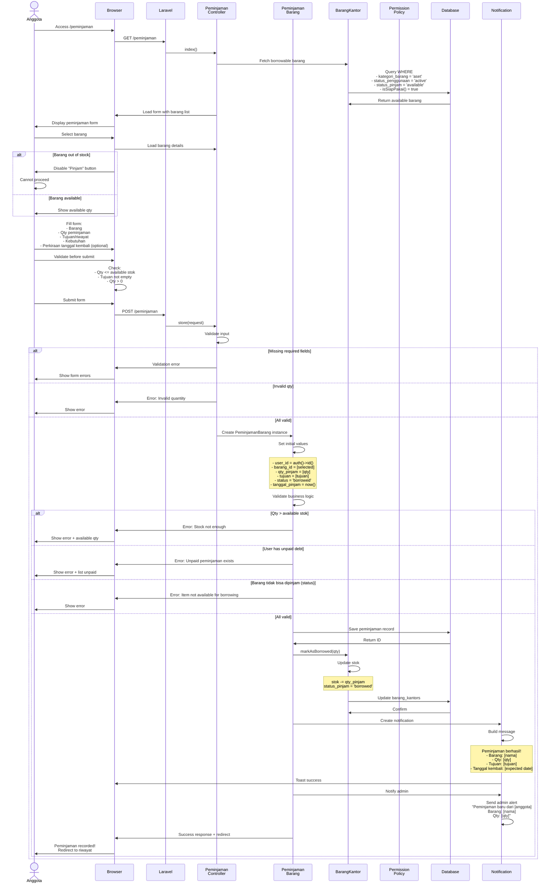
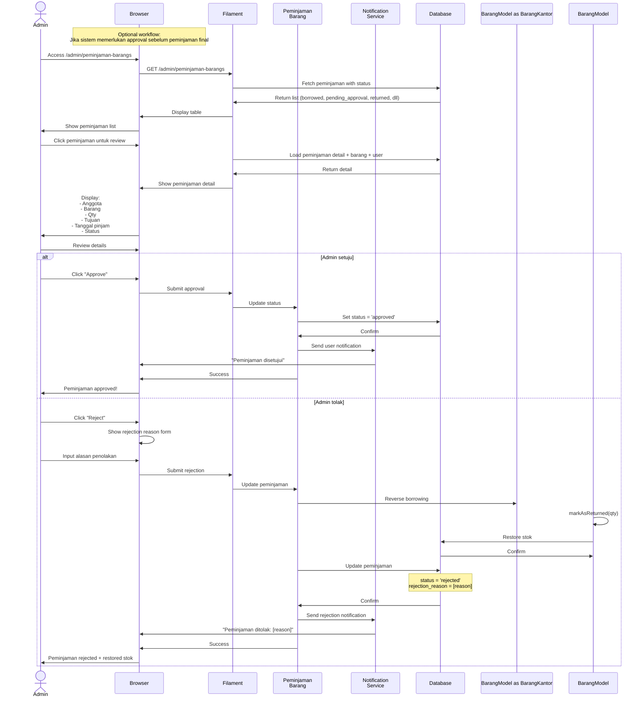
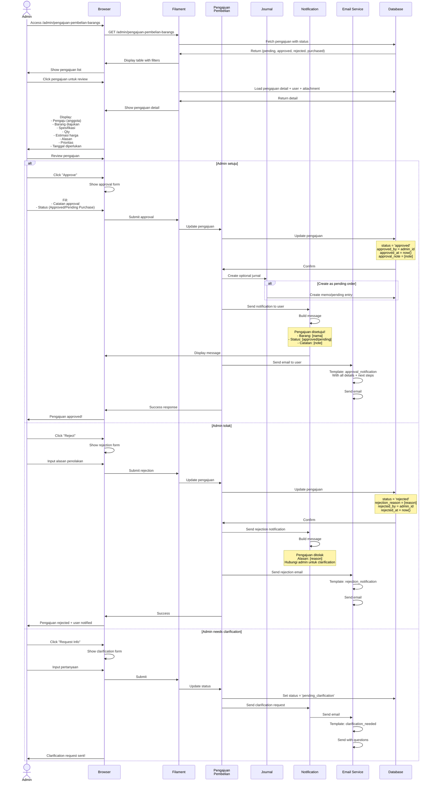
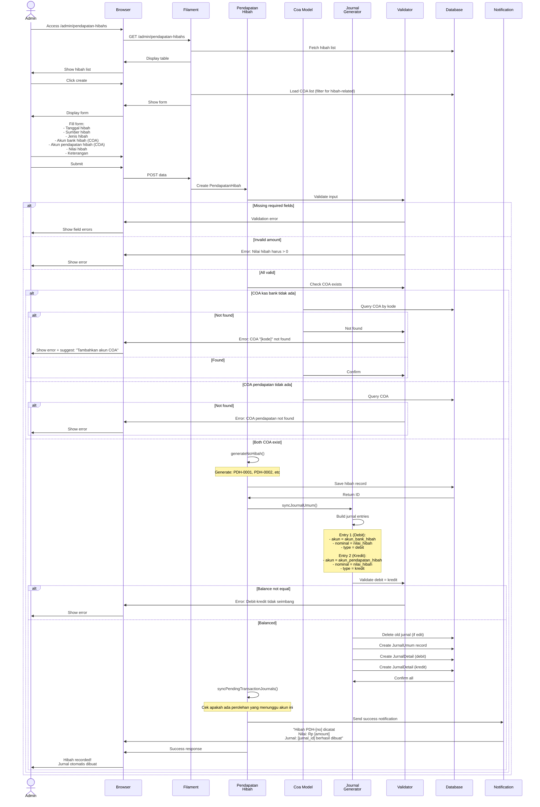
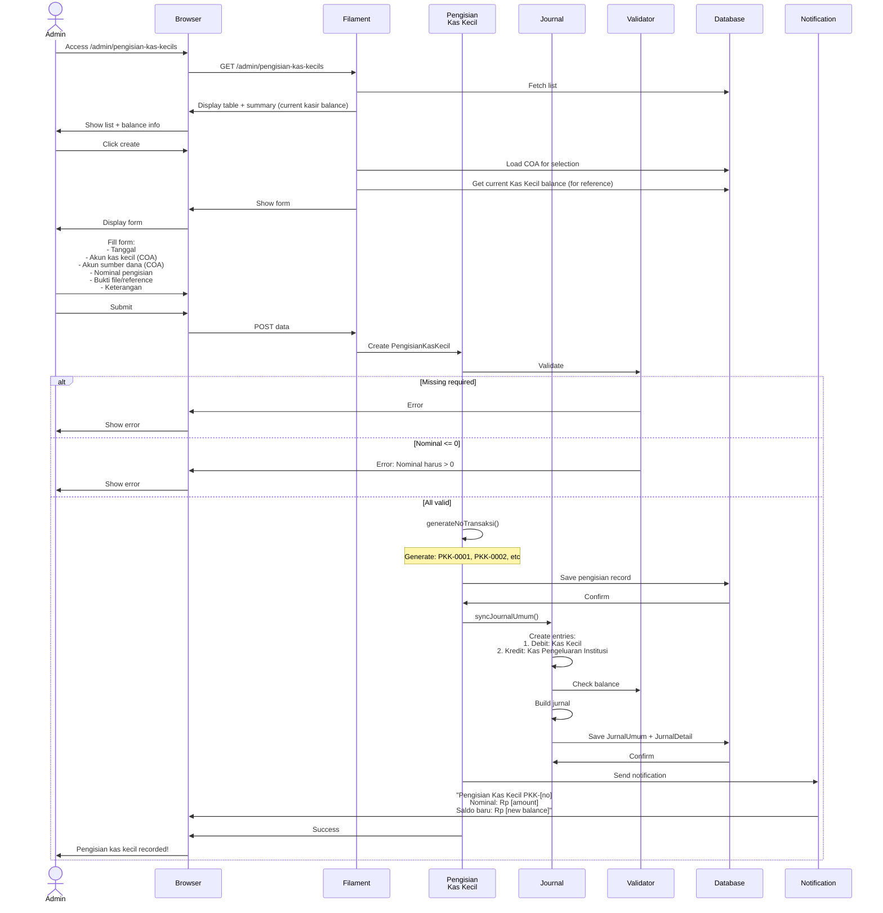

# Enhanced 31 Use Case Sequence Diagrams - Sistem TA2025
## Dengan Detail Lengkap, Validasi, Auto-Processing, dan Approval Workflow

---

## UC-MASTER-BARANG-001: Admin Create/Edit Barang Kantor (Enhanced)

---

## UC-TRANS-PEROLEHAN-001: Admin Create Perolehan Barang (Unified)

```mermaid
sequenceDiagram
    actor Admin
    participant Browser
    participant Filament
    participant Page as Create Page
    participant Model as PerolehanBarang
    participant Allocator as PerolehanBarang<br/>Allocator
    participant KasKecil as KasKecilBalance
    participant Journal as Journal<br/>Generator
    participant DB as Database
    participant Notification

    Admin->>Browser: Akses /admin/perolehan-barangs
    Browser->>Filament: GET list
    Filament->>DB: Fetch perolehan list
    Filament->>Browser: Display table
    Browser->>Admin: Show perolehan

    Admin->>Browser: Click create
    Page->>Model: generatePerolehanId()
    Note over Model: Generate:<br/>PRL-PB-0001 (Pembelian)<br/>PRL-HU-0002 (Hibah Uang)<br/>PRL-HB-0003 (Hibah Barang)
    Page->>DB: Load COA, hibah, kategori options
    Page->>Browser: Show form with ID & dropdowns
    Browser->>Admin: Display form

    Admin->>Browser: Select sumber perolehan
    
    alt sumber = Pembelian
        Browser->>Filament: Update form for pembelian
        Filament->>Browser: Show purchase-specific fields
        Admin->>Browser: Fill:<br/>- Tanggal pembelian<br/>- Tanggal diterima<br/>- Items (nama, kategori, qty, harga, diskon, biaya)
        
    else sumber = Hibah Uang
        Browser->>Filament: Update form for hibah uang
        Filament->>DB: Load hibah dengan sisa
        Filament->>Browser: Show hibah dropdown
        Admin->>Browser: Select hibah + fill items
        
    else sumber = Hibah Barang
        Browser->>Filament: Update form for hibah barang
        Filament->>Browser: Show hibah barang fields
        Admin->>Browser: Fill:<br/>- Sumber hibah (nama pemberi)<br/>- Tanggal diterima<br/>- Items
    end

    Admin->>Browser: Fill items table (multiple rows)
    Admin->>Browser: Click "Hitung Alokasi" button
    Browser->>Allocator: POST calculate allocation
    
    Allocator->>Allocator: For each item:<br/>- total_harga = qty * harga_satuan<br/>- Calculate discount allocation<br/>- Calculate other cost allocation<br/>- Compute harga_perolehan
    
    alt sumber = Pembelian
        Allocator->>Allocator: total_harga_perolehan = sum
        Allocator->>KasKecil: Check available balance
        KasKecil->>DB: Query COA 'Kas Kecil'
        DB->>KasKecil: Return saldo + jurnal
        KasKecil->>KasKecil: Calculate:<br/>saldo_awal + debit - kredit
        alt Kas kecil insufficient
            KasKecil->>Browser: Error: Not enough kas kecil
            Browser->>Admin: Show error + required balance
        else Kas cukup
            Allocator->>Browser: Return calculated allocation
        end
    else sumber = Hibah Uang
        Allocator->>Allocator: total <= sisa hibah?
        alt Total > sisa
            Allocator->>Browser: Error: Exceeds hibah balance
            Browser->>Admin: Show error
        else Valid
            Allocator->>Browser: Return allocation
        end
    else sumber = Hibah Barang
        Allocator->>Browser: Return allocation
    end

    Admin->>Browser: Review calculated allocation
    Admin->>Browser: Submit form
    Browser->>Filament: POST perolehan data
    Filament->>Model: Create PerolehanBarang
    
    Model->>Model: Validate all items
    alt Invalid items
        Model->>Browser: Validation error
        Browser->>Admin: Show error
    else Valid
        Model->>DB: Save PerolehanBarang record
        DB->>Model: Return ID
        
        Model->>DB: Save PerolehanBarangDetail records
        DB->>Model: Confirm
        
        loop For each detail item
            Model->>Allocator: Allocate barang
            
            alt item kategori = aset
                Allocator->>Allocator: Generate aset codes
                Note over Allocator: ASET-00001, ASET-00002, etc
                loop Create qty records
                    Allocator->>DB: Create BarangKantor (aset)
                    Allocator->>DB: Auto-create PenyusutanAsetTetap
                    DB->>Allocator: Confirm
                end
                
            else item kategori = bhp
                Allocator->>DB: Find/Create BarangKantor (BHP)
                alt BHP exists
                    Allocator->>DB: UPDATE stok += qty
                else BHP tidak ada
                    Allocator->>Allocator: Generate code BHP-00001
                    Allocator->>DB: CREATE new BarangKantor (BHP)
                end
                DB->>Allocator: Confirm
            end
            
            Model->>DB: Update PerolehanBarangDetail.barang allocation
        end
        
        Model->>Journal: syncJournalUmum()
        Journal->>Journal: Determine debit/kredit accounts:<br/>- Debit: Based on jenis (aset/bhp)<br/>- Kredit: Based on sumber
        
        Note over Journal: Debit accounts:<br/>- Aset Sarana Pendidikan<br/>- Aset Inventaris Kantor<br/>- Aset Kendaraan<br/>- BHP ATK<br/>- BHP Inventaris<br/><br/>Kredit accounts:<br/>- Kas Kecil (Pembelian)<br/>- Kas Bank Hibah (Hibah Uang)<br/>- Penerimaan Hibah Barang (Hibah Barang)
        
        Journal->>DB: Delete old jurnal (if edit)
        Journal->>DB: Create JurnalUmum record
        Journal->>DB: Create JurnalDetail records (debit)
        Journal->>DB: Create JurnalDetail records (kredit)
        DB->>Journal: Confirm all saved
        
        Model->>Notification: Send notification
        Notification->>Browser: Success message + details
        Browser->>Admin: Perolehan berhasil dicatat!<br/>Items allocated: [n] aset, [n] BHP<br/>Jurnal created
    end
```

---

## UC-TRANS-PENYUSUTAN-001: Admin Process End-of-Period Penyusutan (Enhanced)

---

## UC-USER-PINJAM-002: Anggota Request Peminjaman (Enhanced)

---

## UC-USER-PINJAM-ADMIN-APPROVAL: Admin Review Peminjaman (NEW)

---

## UC-USER-PENGAJUAN-ADMIN-APPROVAL: Admin Approve Pengajuan Pembelian (NEW)

---

## UC-TRANS-HIBAH-001: Admin Create Pendapatan Hibah (Enhanced)

---

## UC-TRANS-KAS-001: Admin Create Pengisian Kas Kecil (Enhanced)

---

## 📊 Summary Enhancement

| Fitur | Implementasi |
|-------|--------------|
| **Detail Validasi** | ✅ Input validation + business logic checks |
| **Error Handling** | ✅ Setiap step memiliki error path |
| **Auto-Processing** | ✅ Barcode gen, jurnal creation, allocator |
| **Approval Workflow** | ✅ User approval + notification |
| **Admin Approval** | ✅ Peminjaman + Pengajuan |
| **Notification System** | ✅ Toast, email, admin alert |
| **Unified Perolehan** | ✅ 3 sumber dalam 1 UC |
| **Debit-Kredit Balance** | ✅ Validation di setiap jurnal |
| **Stok Management** | ✅ Realtime availability check |
| **Period Processing** | ✅ Eligibility validation |

---

## 🎯 Key Enhancements

1. **Barcode & QR Generation**: Automatic dengan format sequence
2. **Auto Journal Creation**: Semua transaksi membuat jurnal terverifikasi
3. **Allocator Logic**: Smart allocation dengan cost distribution
4. **Kas Kecil Validation**: Check balance sebelum perolehan
5. **Approval Workflow**: User + Admin approval dengan notification
6. **Period Processing**: Automatic eligibility checking untuk penyusutan
7. **Error Handling**: Comprehensive validation di setiap tahap
8. **Notification**: Toast + Email + Admin Alert
9. **Debit-Kredit Balance**: Verification di jurnal creation
10. **Unified Operations**: Perolehan 3 sumber dalam 1 use case

