# Use Case Sequence Diagrams - Sistem TA2025 (31 Use Cases)

Dokumen ini berisi sequence diagram detail untuk **31 use case** dalam sistem TA2025.

---

## 📋 Daftar 31 Use Case

### 🔐 Authentication & Authorization (4 Use Cases)
1. [UC-AUTH-001: User Login](#uc-auth-001-user-login)
2. [UC-AUTH-002: User Logout](#uc-auth-002-user-logout)
3. [UC-AUTH-003: Change Password](#uc-auth-003-change-password)
4. [UC-AUTH-004: Multi-tab Session Management](#uc-auth-004-multi-tab-session-management)

### 📊 Master Data - User Management (2 Use Cases)
5. [UC-MASTER-USER-001: Admin Create/Edit User](#uc-master-user-001-admin-createedit-user)
6. [UC-MASTER-USER-002: Admin Delete User](#uc-master-user-002-admin-delete-user)

### 📊 Master Data - COA (Chart of Accounts) (2 Use Cases)
7. [UC-MASTER-COA-001: Admin Create/Edit COA](#uc-master-coa-001-admin-createedit-coa)
8. [UC-MASTER-COA-002: Admin Delete COA](#uc-master-coa-002-admin-delete-coa)

### 📊 Master Data - Kategori Aset (1 Use Case)
9. [UC-MASTER-KATEGORI-001: Admin Manage Kategori Aset](#uc-master-kategori-001-admin-manage-kategori-aset)

### 📊 Master Data - Barang Kantor (3 Use Cases)
10. [UC-MASTER-BARANG-001: Admin Create/Edit Barang Kantor](#uc-master-barang-001-admin-createedit-barang-kantor)
11. [UC-MASTER-BARANG-002: Admin Scan Barang Kantor](#uc-master-barang-002-admin-scan-barang-kantor)
12. [UC-MASTER-BARANG-003: Public View Barang Detail](#uc-master-barang-003-public-view-barang-detail)

### 💰 Transaksi - Pendapatan Hibah (2 Use Cases)
13. [UC-TRANS-HIBAH-001: Admin Create Pendapatan Hibah](#uc-trans-hibah-001-admin-create-pendapatan-hibah)
14. [UC-TRANS-HIBAH-002: Admin Edit/Delete Pendapatan Hibah](#uc-trans-hibah-002-admin-editdelete-pendapatan-hibah)

### 💰 Transaksi - Pengisian Kas Kecil (2 Use Cases)
15. [UC-TRANS-KAS-001: Admin Create Pengisian Kas Kecil](#uc-trans-kas-001-admin-create-pengisian-kas-kecil)
16. [UC-TRANS-KAS-002: Admin Edit/Delete Pengisian Kas Kecil](#uc-trans-kas-002-admin-editdelete-pengisian-kas-kecil)

### 💰 Transaksi - Perolehan Barang (2 Use Cases)
17. [UC-TRANS-PEROLEHAN-001: Admin Create Perolehan Barang](#uc-trans-perolehan-001-admin-create-perolehan-barang)
18. [UC-TRANS-PEROLEHAN-002: Admin Edit/Delete Perolehan Barang](#uc-trans-perolehan-002-admin-editdelete-perolehan-barang)

### 💰 Transaksi - Penyusutan Aset (2 Use Cases)
19. [UC-TRANS-PENYUSUTAN-001: Admin Process End-of-Period Penyusutan](#uc-trans-penyusutan-001-admin-process-end-of-period-penyusutan)
20. [UC-TRANS-PENYUSUTAN-002: Admin View Penyusutan Kartu](#uc-trans-penyusutan-002-admin-view-penyusutan-kartu)

### 📈 Laporan & Analytics (4 Use Cases)
21. [UC-REPORT-001: Admin View Jurnal Umum](#uc-report-001-admin-view-jurnal-umum)
22. [UC-REPORT-002: Admin View Buku Besar](#uc-report-002-admin-view-buku-besar)
23. [UC-REPORT-003: Admin Print Laporan PDF](#uc-report-003-admin-print-laporan-pdf)
24. [UC-REPORT-004: Admin View Dashboard](#uc-report-004-admin-view-dashboard)

### 👤 User - Peminjaman Barang (4 Use Cases)
25. [UC-USER-PINJAM-001: Anggota View Ketersediaan Barang](#uc-user-pinjam-001-anggota-view-ketersediaan-barang)
26. [UC-USER-PINJAM-002: Anggota Request Peminjaman](#uc-user-pinjam-002-anggota-request-peminjaman)
27. [UC-USER-PINJAM-003: Anggota View Riwayat Peminjaman](#uc-user-pinjam-003-anggota-view-riwayat-peminjaman)
28. [UC-USER-PINJAM-004: Anggota Return Peminjaman](#uc-user-pinjam-004-anggota-return-peminjaman)

### 👤 User - Pemakaian BHP (2 Use Cases)
29. [UC-USER-PEMAKAIAN-001: Anggota Record Pemakaian BHP](#uc-user-pemakaian-001-anggota-record-pemakaian-bhp)
30. [UC-USER-PEMAKAIAN-002: Anggota View Riwayat Pemakaian](#uc-user-pemakaian-002-anggota-view-riwayat-pemakaian)

### 👤 User - Pengajuan Pembelian (1 Use Case)
31. [UC-USER-PENGAJUAN-001: Anggota Submit & View Pengajuan Pembelian](#uc-user-pengajuan-001-anggota-submit--view-pengajuan-pembelian)

---

## UC-AUTH-001: User Login

**Aktor**: User (Admin atau Anggota)  
**Tujuan**: User melakukan login ke sistem  
**Precondition**: User belum terotentikasi  
**Postcondition**: User berhasil login dan diarahkan ke dashboard sesuai role

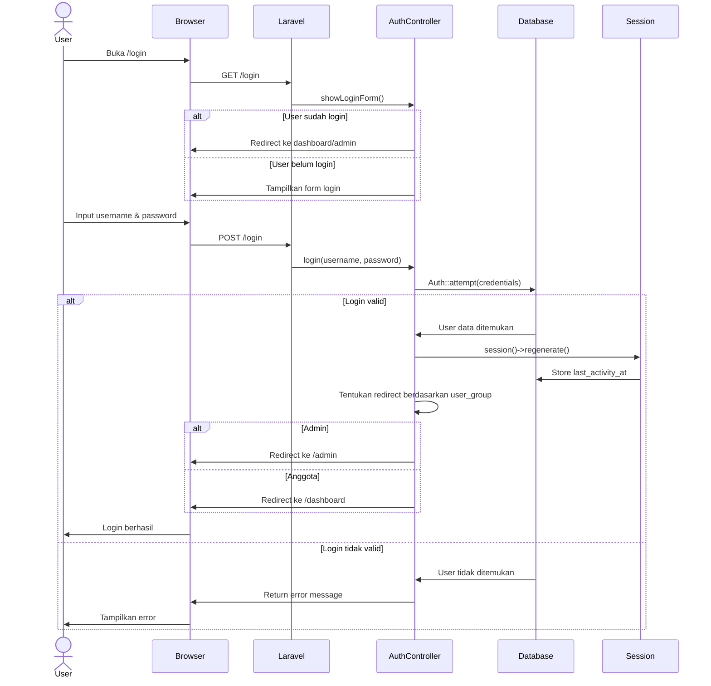
```mermaid
sequenceDiagram
    actor User
    participant Browser
    participant Laravel
    participant AuthCtrl as AuthController
    participant DB as Database
    participant Session

    User->>Browser: Buka /login
    Browser->>Laravel: GET /login
    Laravel->>AuthCtrl: showLoginForm()
    alt User sudah login
        AuthCtrl->>Browser: Redirect ke dashboard/admin
    else User belum login
        AuthCtrl->>Browser: Tampilkan form login
    end

    User->>Browser: Input username & password
    Browser->>Laravel: POST /login
    Laravel->>AuthCtrl: login(username, password)
    
    AuthCtrl->>DB: Auth::attempt(credentials)
    alt Login valid
        DB->>AuthCtrl: User data ditemukan
        AuthCtrl->>Session: session()->regenerate()
        Session->>DB: Store last_activity_at
        
        AuthCtrl->>AuthCtrl: Tentukan redirect berdasarkan user_group
        alt Admin
            AuthCtrl->>Browser: Redirect ke /admin
        else Anggota
            AuthCtrl->>Browser: Redirect ke /dashboard
        end
        Browser->>User: Login berhasil
    else Login tidak valid
        DB->>AuthCtrl: User tidak ditemukan
        AuthCtrl->>Browser: Return error message
        Browser->>User: Tampilkan error
    end
```

---

## UC-MASTER-001: Admin Create Barang Kantor

**Aktor**: Admin  
**Tujuan**: Admin membuat data master barang kantor baru  
**Precondition**: Admin sudah login dan akses Filament Admin  
**Postcondition**: Barang kantor tersimpan dengan barcode & penyusutan otomatis (jika aset)

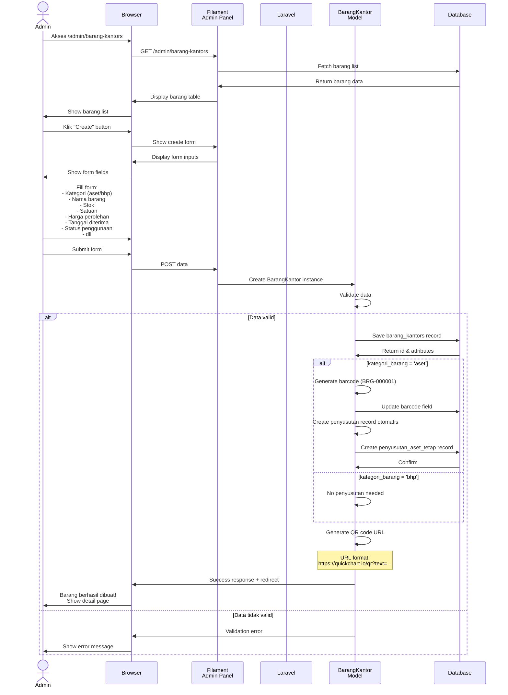
```mermaid
sequenceDiagram
    actor Admin
    participant Browser
    participant Filament as Filament<br/>Admin Panel
    participant Laravel
    participant Model as BarangKantor<br/>Model
    participant DB as Database

    Admin->>Browser: Akses /admin/barang-kantors
    Browser->>Filament: GET /admin/barang-kantors
    Filament->>DB: Fetch barang list
    DB->>Filament: Return barang data
    Filament->>Browser: Display barang table
    Browser->>Admin: Show barang list

    Admin->>Browser: Klik "Create" button
    Browser->>Filament: Show create form
    Filament->>Browser: Display form inputs
    Browser->>Admin: Show form fields

    Admin->>Browser: Fill form:<br/>- Kategori (aset/bhp)<br/>- Nama barang<br/>- Stok<br/>- Satuan<br/>- Harga perolehan<br/>- Tanggal diterima<br/>- Status penggunaan<br/>- dll
    
    Admin->>Browser: Submit form
    Browser->>Filament: POST data
    Filament->>Model: Create BarangKantor instance
    
    Model->>Model: Validate data
    alt Data valid
        Model->>DB: Save barang_kantors record
        DB->>Model: Return id & attributes
        
        alt kategori_barang = 'aset'
            Model->>Model: Generate barcode (BRG-000001)
            Model->>DB: Update barcode field
            
            Model->>Model: Create penyusutan record otomatis
            Model->>DB: Create penyusutan_aset_tetap record
            DB->>Model: Confirm
        else kategori_barang = 'bhp'
            Model->>Model: No penyusutan needed
        end
        
        Model->>Model: Generate QR code URL
        Note over Model: URL format:<br/>https://quickchart.io/qr?text=...
        
        Model->>Browser: Success response + redirect
        Browser->>Admin: Barang berhasil dibuat!<br/>Show detail page
    else Data tidak valid
        Model->>Browser: Validation error
        Browser->>Admin: Show error message
    end
```

---

## UC-MASTER-002: Admin Create/Edit COA

**Aktor**: Admin  
**Tujuan**: Admin membuat atau mengubah Chart of Accounts  
**Precondition**: Admin sudah login  
**Postcondition**: COA tersimpan, pending journals disinkronisasi

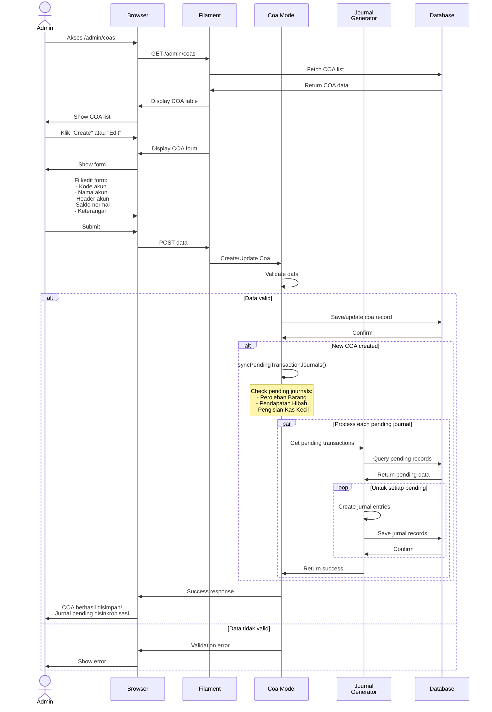
```mermaid
sequenceDiagram
    actor Admin
    participant Browser
    participant Filament
    participant Model as Coa Model
    participant Journal as Journal<br/>Generator
    participant DB as Database

    Admin->>Browser: Akses /admin/coas
    Browser->>Filament: GET /admin/coas
    Filament->>DB: Fetch COA list
    DB->>Filament: Return COA data
    Filament->>Browser: Display COA table
    Browser->>Admin: Show COA list

    Admin->>Browser: Klik "Create" atau "Edit"
    Filament->>Browser: Display COA form
    Browser->>Admin: Show form

    Admin->>Browser: Fill/edit form:<br/>- Kode akun<br/>- Nama akun<br/>- Header akun<br/>- Saldo normal<br/>- Keterangan
    
    Admin->>Browser: Submit
    Browser->>Filament: POST data
    Filament->>Model: Create/Update Coa
    
    Model->>Model: Validate data
    alt Data valid
        Model->>DB: Save/update coa record
        DB->>Model: Confirm
        
        alt New COA created
            Model->>Model: syncPendingTransactionJournals()
            Note over Model: Check pending journals:<br/>- Perolehan Barang<br/>- Pendapatan Hibah<br/>- Pengisian Kas Kecil
            
            par Process each pending journal
                Model->>Journal: Get pending transactions
                Journal->>DB: Query pending records
                DB->>Journal: Return pending data
                
                loop Untuk setiap pending
                    Journal->>Journal: Create jurnal entries
                    Journal->>DB: Save jurnal records
                    DB->>Journal: Confirm
                end
                Journal->>Model: Return success
            end
        end
        
        Model->>Browser: Success response
        Browser->>Admin: COA berhasil disimpan!<br/>Jurnal pending disinkronisasi
    else Data tidak valid
        Model->>Browser: Validation error
        Browser->>Admin: Show error
    end
```

---

## UC-MASTER-003: Admin Create Kategori Aset

**Aktor**: Admin  
**Tujuan**: Admin membuat kategori aset tetap baru  
**Precondition**: Admin sudah login  
**Postcondition**: Kategori aset tersimpan

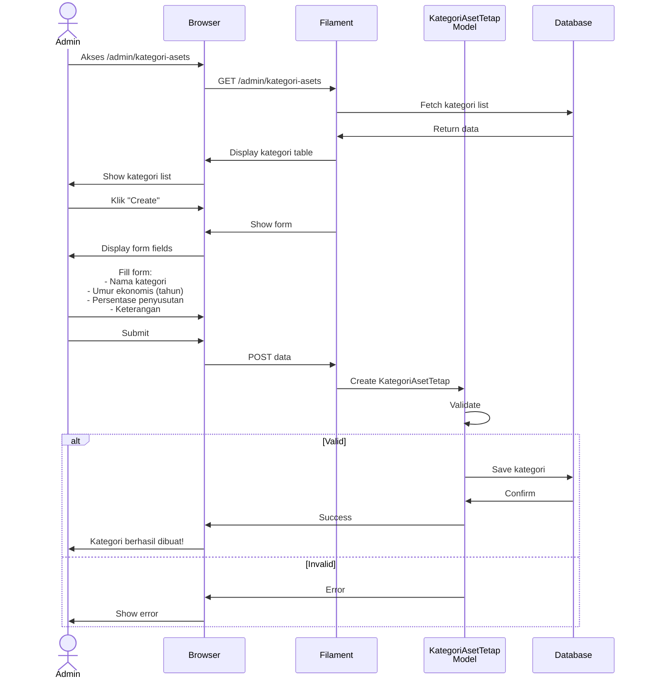
```mermaid
sequenceDiagram
    actor Admin
    participant Browser
    participant Filament
    participant Model as KategoriAsetTetap<br/>Model
    participant DB as Database

    Admin->>Browser: Akses /admin/kategori-asets
    Browser->>Filament: GET /admin/kategori-asets
    Filament->>DB: Fetch kategori list
    DB->>Filament: Return data
    Filament->>Browser: Display kategori table
    Browser->>Admin: Show kategori list

    Admin->>Browser: Klik "Create"
    Filament->>Browser: Show form
    Browser->>Admin: Display form fields

    Admin->>Browser: Fill form:<br/>- Nama kategori<br/>- Umur ekonomis (tahun)<br/>- Persentase penyusutan<br/>- Keterangan
    
    Admin->>Browser: Submit
    Browser->>Filament: POST data
    Filament->>Model: Create KategoriAsetTetap
    
    Model->>Model: Validate
    alt Valid
        Model->>DB: Save kategori
        DB->>Model: Confirm
        Model->>Browser: Success
        Browser->>Admin: Kategori berhasil dibuat!
    else Invalid
        Model->>Browser: Error
        Browser->>Admin: Show error
    end
```

---

## UC-TRANS-001: Admin Record Pendapatan Hibah

**Aktor**: Admin  
**Tujuan**: Admin mencatat penerimaan hibah uang  
**Precondition**: COA "Kas Bank Hibah" dan "Pendapatan Donasi Hibah" sudah ada  
**Postcondition**: Hibah tersimpan + jurnal otomatis dibuat

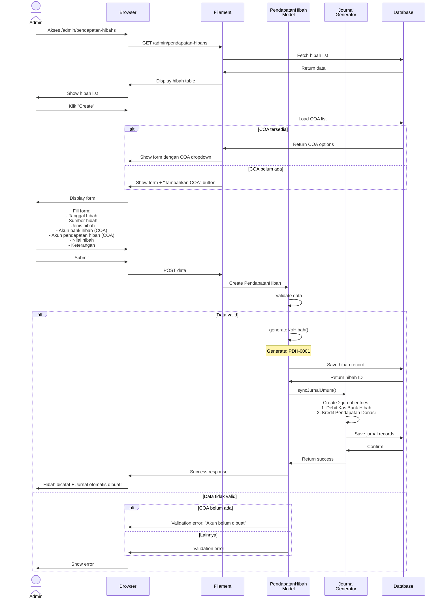
```mermaid
sequenceDiagram
    actor Admin
    participant Browser
    participant Filament
    participant Model as PendapatanHibah<br/>Model
    participant Journal as Journal<br/>Generator
    participant DB as Database

    Admin->>Browser: Akses /admin/pendapatan-hibahs
    Browser->>Filament: GET /admin/pendapatan-hibahs
    Filament->>DB: Fetch hibah list
    DB->>Filament: Return data
    Filament->>Browser: Display hibah table
    Browser->>Admin: Show hibah list

    Admin->>Browser: Klik "Create"
    Filament->>DB: Load COA list
    alt COA tersedia
        DB->>Filament: Return COA options
        Filament->>Browser: Show form dengan COA dropdown
    else COA belum ada
        Filament->>Browser: Show form + "Tambahkan COA" button
    end
    Browser->>Admin: Display form

    Admin->>Browser: Fill form:<br/>- Tanggal hibah<br/>- Sumber hibah<br/>- Jenis hibah<br/>- Akun bank hibah (COA)<br/>- Akun pendapatan hibah (COA)<br/>- Nilai hibah<br/>- Keterangan
    
    Admin->>Browser: Submit
    Browser->>Filament: POST data
    Filament->>Model: Create PendapatanHibah
    
    Model->>Model: Validate data
    alt Data valid
        Model->>Model: generateNoHibah()
        Note over Model: Generate: PDH-0001
        
        Model->>DB: Save hibah record
        DB->>Model: Return hibah ID
        
        Model->>Journal: syncJurnalUmum()
        Journal->>Journal: Create 2 jurnal entries:<br/>1. Debit Kas Bank Hibah<br/>2. Kredit Pendapatan Donasi
        
        Journal->>DB: Save jurnal records
        DB->>Journal: Confirm
        
        Journal->>Model: Return success
        Model->>Browser: Success response
        Browser->>Admin: Hibah dicatat + Jurnal otomatis dibuat!
    else Data tidak valid
        alt COA belum ada
            Model->>Browser: Validation error: "Akun belum dibuat"
        else Lainnya
            Model->>Browser: Validation error
        end
        Browser->>Admin: Show error
    end
```

---

## UC-TRANS-002: Admin Record Pengisian Kas Kecil

**Aktor**: Admin  
**Tujuan**: Admin mencatat pengisian saldo kas kecil  
**Precondition**: COA "Kas Kecil" dan "Kas Pengeluaran Institusi" sudah ada  
**Postcondition**: Pengisian kas kecil tersimpan + jurnal otomatis

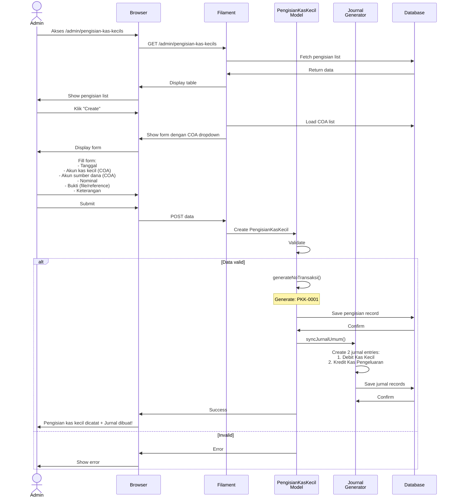
```mermaid
sequenceDiagram
    actor Admin
    participant Browser
    participant Filament
    participant Model as PengisianKasKecil<br/>Model
    participant Journal as Journal<br/>Generator
    participant DB as Database

    Admin->>Browser: Akses /admin/pengisian-kas-kecils
    Browser->>Filament: GET /admin/pengisian-kas-kecils
    Filament->>DB: Fetch pengisian list
    DB->>Filament: Return data
    Filament->>Browser: Display table
    Browser->>Admin: Show pengisian list

    Admin->>Browser: Klik "Create"
    Filament->>DB: Load COA list
    Filament->>Browser: Show form dengan COA dropdown
    Browser->>Admin: Display form

    Admin->>Browser: Fill form:<br/>- Tanggal<br/>- Akun kas kecil (COA)<br/>- Akun sumber dana (COA)<br/>- Nominal<br/>- Bukti (file/reference)<br/>- Keterangan
    
    Admin->>Browser: Submit
    Browser->>Filament: POST data
    Filament->>Model: Create PengisianKasKecil
    
    Model->>Model: Validate
    alt Data valid
        Model->>Model: generateNoTransaksi()
        Note over Model: Generate: PKK-0001
        
        Model->>DB: Save pengisian record
        DB->>Model: Confirm
        
        Model->>Journal: syncJurnalUmum()
        Journal->>Journal: Create 2 jurnal entries:<br/>1. Debit Kas Kecil<br/>2. Kredit Kas Pengeluaran
        
        Journal->>DB: Save jurnal records
        DB->>Journal: Confirm
        
        Model->>Browser: Success
        Browser->>Admin: Pengisian kas kecil dicatat + Jurnal dibuat!
    else Invalid
        Model->>Browser: Error
        Browser->>Admin: Show error
    end
```

---

## UC-TRANS-003: Admin Create Perolehan Barang (Pembelian)

**Aktor**: Admin  
**Tujuan**: Admin mencatat perolehan barang dari pembelian  
**Precondition**: COA untuk Aset/BHP dan Kas sudah ada  
**Postcondition**: Perolehan barang tersimpan, barang dialokasikan, jurnal dibuat

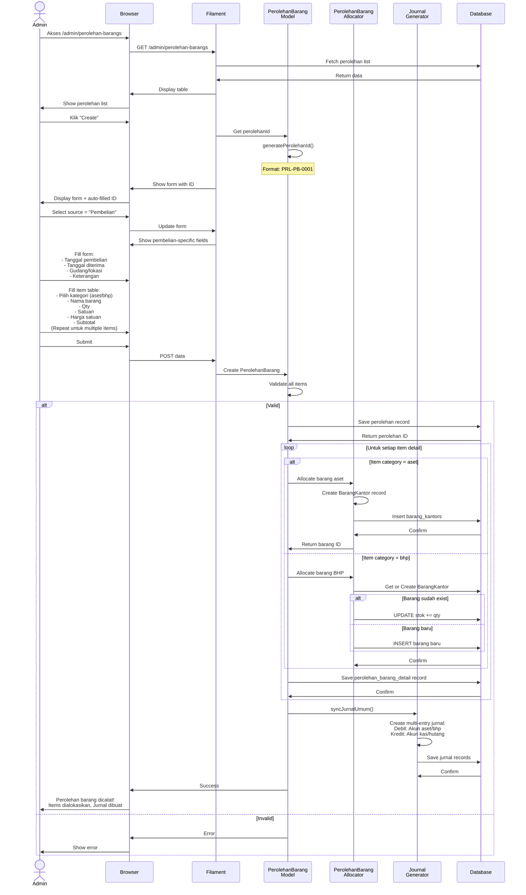
```mermaid
sequenceDiagram
    actor Admin
    participant Browser
    participant Filament
    participant Model as PerolehanBarang<br/>Model
    participant Allocator as PerolehanBarang<br/>Allocator
    participant Journal as Journal<br/>Generator
    participant DB as Database

    Admin->>Browser: Akses /admin/perolehan-barangs
    Browser->>Filament: GET /admin/perolehan-barangs
    Filament->>DB: Fetch perolehan list
    DB->>Filament: Return data
    Filament->>Browser: Display table
    Browser->>Admin: Show perolehan list

    Admin->>Browser: Klik "Create"
    Filament->>Model: Get perolehanId
    Model->>Model: generatePerolehanId()
    Note over Model: Format: PRL-PB-0001
    Filament->>Browser: Show form with ID
    Browser->>Admin: Display form + auto-filled ID

    Admin->>Browser: Select source = "Pembelian"
    Browser->>Filament: Update form
    Filament->>Browser: Show pembelian-specific fields
    
    Admin->>Browser: Fill form:<br/>- Tanggal pembelian<br/>- Tanggal diterima<br/>- Gudang/lokasi<br/>- Keterangan
    
    Admin->>Browser: Fill item table:<br/>- Pilih kategori (aset/bhp)<br/>- Nama barang<br/>- Qty<br/>- Satuan<br/>- Harga satuan<br/>- Subtotal<br/>(Repeat untuk multiple items)
    
    Admin->>Browser: Submit
    Browser->>Filament: POST data
    Filament->>Model: Create PerolehanBarang
    
    Model->>Model: Validate all items
    alt Valid
        Model->>DB: Save perolehan record
        DB->>Model: Return perolehan ID
        
        loop Untuk setiap item detail
            alt Item category = aset
                Model->>Allocator: Allocate barang aset
                Allocator->>Allocator: Create BarangKantor record
                Allocator->>DB: Insert barang_kantors
                DB->>Allocator: Confirm
                Allocator->>Model: Return barang ID
            else Item category = bhp
                Model->>Allocator: Allocate barang BHP
                Allocator->>DB: Get or Create BarangKantor
                alt Barang sudah exist
                    Allocator->>DB: UPDATE stok += qty
                else Barang baru
                    Allocator->>DB: INSERT barang baru
                end
                DB->>Allocator: Confirm
            end
            
            Model->>DB: Save perolehan_barang_detail record
            DB->>Model: Confirm
        end
        
        Model->>Journal: syncJurnalUmum()
        Journal->>Journal: Create multi-entry jurnal:<br/>Debit: Akun aset/bhp<br/>Kredit: Akun kas/hutang
        
        Journal->>DB: Save jurnal records
        DB->>Journal: Confirm
        
        Model->>Browser: Success
        Browser->>Admin: Perolehan barang dicatat!<br/>Items dialokasikan, Jurnal dibuat
    else Invalid
        Model->>Browser: Error
        Browser->>Admin: Show error
    end
```

---

## UC-TRANS-004: Admin Create Perolehan Barang (Hibah Uang)

**Aktor**: Admin  
**Tujuan**: Admin mencatat perolehan barang dari hibah uang  
**Precondition**: Pendapatan Hibah sudah ada, COA aset/BHP ada  
**Postcondition**: Perolehan barang tersimpan, barang dialokasikan, jurnal dibuat

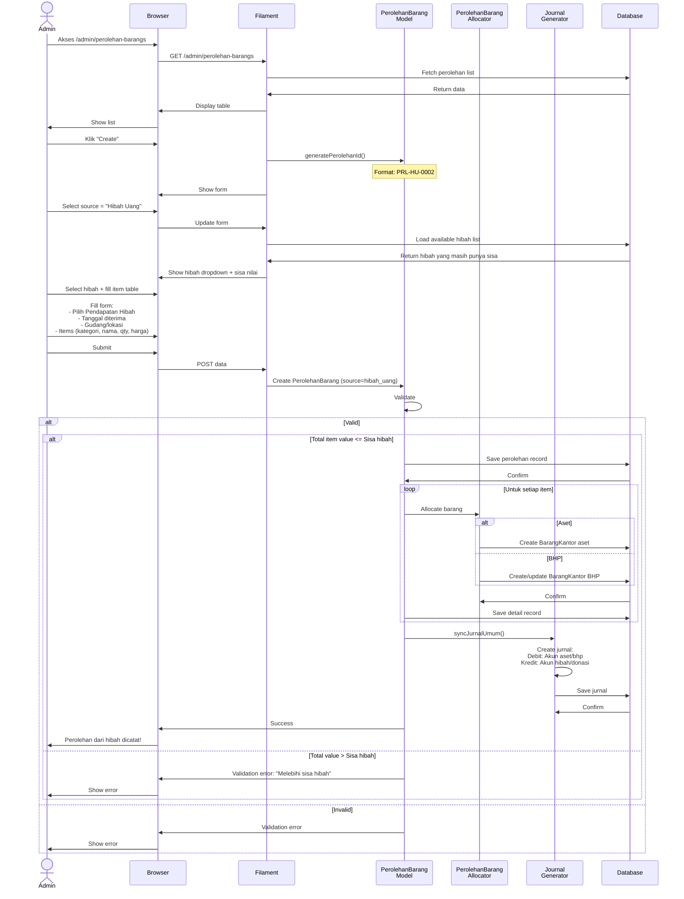
```mermaid
sequenceDiagram
    actor Admin
    participant Browser
    participant Filament
    participant Model as PerolehanBarang<br/>Model
    participant Allocator as PerolehanBarang<br/>Allocator
    participant Journal as Journal<br/>Generator
    participant DB as Database

    Admin->>Browser: Akses /admin/perolehan-barangs
    Browser->>Filament: GET /admin/perolehan-barangs
    Filament->>DB: Fetch perolehan list
    DB->>Filament: Return data
    Filament->>Browser: Display table
    Browser->>Admin: Show list

    Admin->>Browser: Klik "Create"
    Filament->>Model: generatePerolehanId()
    Note over Model: Format: PRL-HU-0002
    Filament->>Browser: Show form

    Admin->>Browser: Select source = "Hibah Uang"
    Browser->>Filament: Update form
    Filament->>DB: Load available hibah list
    DB->>Filament: Return hibah yang masih punya sisa
    Filament->>Browser: Show hibah dropdown + sisa nilai
    
    Admin->>Browser: Select hibah + fill item table
    
    Admin->>Browser: Fill form:<br/>- Pilih Pendapatan Hibah<br/>- Tanggal diterima<br/>- Gudang/lokasi<br/>- Items (kategori, nama, qty, harga)
    
    Admin->>Browser: Submit
    Browser->>Filament: POST data
    Filament->>Model: Create PerolehanBarang (source=hibah_uang)
    
    Model->>Model: Validate
    alt Valid
        alt Total item value <= Sisa hibah
            Model->>DB: Save perolehan record
            DB->>Model: Confirm
            
            loop Untuk setiap item
                Model->>Allocator: Allocate barang
                alt Aset
                    Allocator->>DB: Create BarangKantor aset
                else BHP
                    Allocator->>DB: Create/update BarangKantor BHP
                end
                DB->>Allocator: Confirm
                
                Model->>DB: Save detail record
            end
            
            Model->>Journal: syncJurnalUmum()
            Journal->>Journal: Create jurnal:<br/>Debit: Akun aset/bhp<br/>Kredit: Akun hibah/donasi
            
            Journal->>DB: Save jurnal
            DB->>Journal: Confirm
            
            Model->>Browser: Success
            Browser->>Admin: Perolehan dari hibah dicatat!
        else Total value > Sisa hibah
            Model->>Browser: Validation error: "Melebihi sisa hibah"
            Browser->>Admin: Show error
        end
    else Invalid
        Model->>Browser: Validation error
        Browser->>Admin: Show error
    end
```

---

## UC-TRANS-005: Admin Create Perolehan Barang (Hibah Barang)

**Aktor**: Admin  
**Tujuan**: Admin mencatat perolehan barang dari hibah barang (non-uang)  
**Precondition**: COA aset/BHP ada  
**Postcondition**: Perolehan barang tersimpan, barang dialokasikan, jurnal dibuat

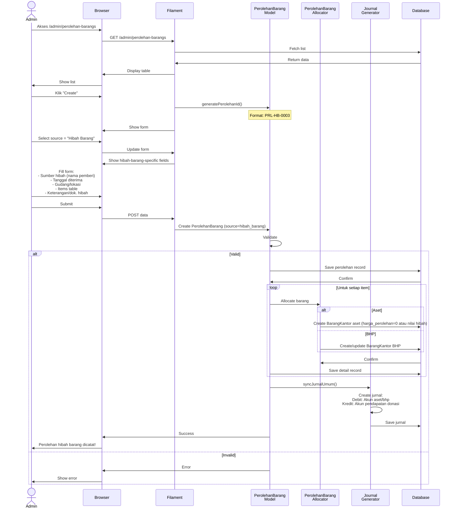
```mermaid
sequenceDiagram
    actor Admin
    participant Browser
    participant Filament
    participant Model as PerolehanBarang<br/>Model
    participant Allocator as PerolehanBarang<br/>Allocator
    participant Journal as Journal<br/>Generator
    participant DB as Database

    Admin->>Browser: Akses /admin/perolehan-barangs
    Browser->>Filament: GET /admin/perolehan-barangs
    Filament->>DB: Fetch list
    DB->>Filament: Return data
    Filament->>Browser: Display table
    Browser->>Admin: Show list

    Admin->>Browser: Klik "Create"
    Filament->>Model: generatePerolehanId()
    Note over Model: Format: PRL-HB-0003
    Filament->>Browser: Show form

    Admin->>Browser: Select source = "Hibah Barang"
    Browser->>Filament: Update form
    Filament->>Browser: Show hibah-barang-specific fields
    
    Admin->>Browser: Fill form:<br/>- Sumber hibah (nama pemberi)<br/>- Tanggal diterima<br/>- Gudang/lokasi<br/>- Items table<br/>- Keterangan/dok. hibah
    
    Admin->>Browser: Submit
    Browser->>Filament: POST data
    Filament->>Model: Create PerolehanBarang (source=hibah_barang)
    
    Model->>Model: Validate
    alt Valid
        Model->>DB: Save perolehan record
        DB->>Model: Confirm
        
        loop Untuk setiap item
            Model->>Allocator: Allocate barang
            alt Aset
                Allocator->>DB: Create BarangKantor aset (harga_perolehan=0 atau nilai hibah)
            else BHP
                Allocator->>DB: Create/update BarangKantor BHP
            end
            DB->>Allocator: Confirm
            
            Model->>DB: Save detail record
        end
        
        Model->>Journal: syncJurnalUmum()
        Journal->>Journal: Create jurnal:<br/>Debit: Akun aset/bhp<br/>Kredit: Akun pendapatan donasi
        
        Journal->>DB: Save jurnal
        
        Model->>Browser: Success
        Browser->>Admin: Perolehan hibah barang dicatat!
    else Invalid
        Model->>Browser: Error
        Browser->>Admin: Show error
    end
```

---

## UC-USER-001: Anggota View Ketersediaan Barang

**Aktor**: Anggota/User  
**Tujuan**: Anggota melihat daftar barang yang tersedia  
**Precondition**: Anggota sudah login  
**Postcondition**: Anggota melihat list barang yang bisa dipinjam/dipakai

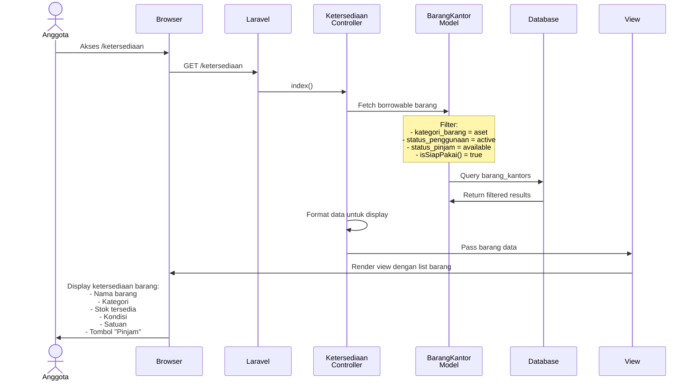
```mermaid
sequenceDiagram
    actor Anggota
    participant Browser
    participant Laravel
    participant Ctrl as Ketersediaan<br/>Controller
    participant Model as BarangKantor<br/>Model
    participant DB as Database
    participant View

    Anggota->>Browser: Akses /ketersediaan
    Browser->>Laravel: GET /ketersediaan
    Laravel->>Ctrl: index()
    
    Ctrl->>Model: Fetch borrowable barang
    Note over Model: Filter:<br/>- kategori_barang = aset<br/>- status_penggunaan = active<br/>- status_pinjam = available<br/>- isSiapPakai() = true
    
    Model->>DB: Query barang_kantors
    DB->>Model: Return filtered results
    
    Ctrl->>Ctrl: Format data untuk display
    Ctrl->>View: Pass barang data
    View->>Browser: Render view dengan list barang
    
    Browser->>Anggota: Display ketersediaan barang:<br/>- Nama barang<br/>- Kategori<br/>- Stok tersedia<br/>- Kondisi<br/>- Satuan<br/>- Tombol "Pinjam"
```

---

## UC-USER-002: Anggota Request Peminjaman Barang

**Aktor**: Anggota/User  
**Tujuan**: Anggota mengajukan peminjaman barang  
**Precondition**: Anggota sudah login, barang tersedia  
**Postcondition**: Peminjaman tersimpan, stok barang berkurang

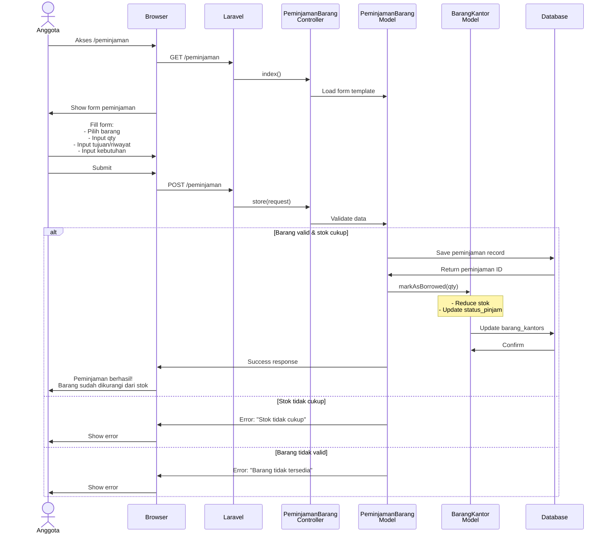
```mermaid
sequenceDiagram
    actor Anggota
    participant Browser
    participant Laravel
    participant Ctrl as PeminjamanBarang<br/>Controller
    participant Model as PeminjamanBarang<br/>Model
    participant BarangModel as BarangKantor<br/>Model
    participant DB as Database

    Anggota->>Browser: Akses /peminjaman
    Browser->>Laravel: GET /peminjaman
    Laravel->>Ctrl: index()
    Ctrl->>Model: Load form template
    Browser->>Anggota: Show form peminjaman

    Anggota->>Browser: Fill form:<br/>- Pilih barang<br/>- Input qty<br/>- Input tujuan/riwayat<br/>- Input kebutuhan
    
    Anggota->>Browser: Submit
    Browser->>Laravel: POST /peminjaman
    Laravel->>Ctrl: store(request)
    
    Ctrl->>Model: Validate data
    alt Barang valid & stok cukup
        Model->>DB: Save peminjaman record
        DB->>Model: Return peminjaman ID
        
        Model->>BarangModel: markAsBorrowed(qty)
        Note over BarangModel: - Reduce stok<br/>- Update status_pinjam
        
        BarangModel->>DB: Update barang_kantors
        DB->>BarangModel: Confirm
        
        Model->>Browser: Success response
        Browser->>Anggota: Peminjaman berhasil!<br/>Barang sudah dikurangi dari stok
    else Stok tidak cukup
        Model->>Browser: Error: "Stok tidak cukup"
        Browser->>Anggota: Show error
    else Barang tidak valid
        Model->>Browser: Error: "Barang tidak tersedia"
        Browser->>Anggota: Show error
    end
```

---

## UC-USER-003: Anggota Kembalikan Barang Pinjaman

**Aktor**: Anggota/User  
**Tujuan**: Anggota mengembalikan barang pinjaman  
**Precondition**: Anggota memiliki peminjaman aktif  
**Postcondition**: Peminjaman ditandai sebagai dikembalikan, stok barang bertambah

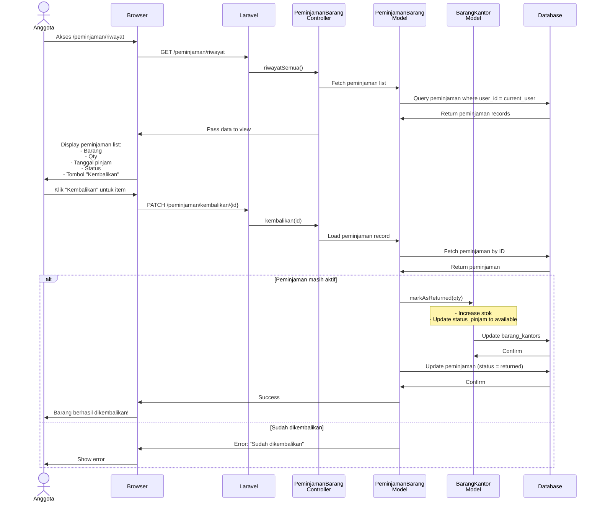
```mermaid
sequenceDiagram
    actor Anggota
    participant Browser
    participant Laravel
    participant Ctrl as PeminjamanBarang<br/>Controller
    participant Model as PeminjamanBarang<br/>Model
    participant BarangModel as BarangKantor<br/>Model
    participant DB as Database

    Anggota->>Browser: Akses /peminjaman/riwayat
    Browser->>Laravel: GET /peminjaman/riwayat
    Laravel->>Ctrl: riwayatSemua()
    
    Ctrl->>Model: Fetch peminjaman list
    Model->>DB: Query peminjaman where user_id = current_user
    DB->>Model: Return peminjaman records
    
    Ctrl->>Browser: Pass data to view
    Browser->>Anggota: Display peminjaman list:<br/>- Barang<br/>- Qty<br/>- Tanggal pinjam<br/>- Status<br/>- Tombol "Kembalikan"

    Anggota->>Browser: Klik "Kembalikan" untuk item
    Browser->>Laravel: PATCH /peminjaman/kembalikan/{id}
    Laravel->>Ctrl: kembalikan(id)
    
    Ctrl->>Model: Load peminjaman record
    Model->>DB: Fetch peminjaman by ID
    DB->>Model: Return peminjaman
    
    alt Peminjaman masih aktif
        Model->>BarangModel: markAsReturned(qty)
        Note over BarangModel: - Increase stok<br/>- Update status_pinjam to available
        
        BarangModel->>DB: Update barang_kantors
        DB->>BarangModel: Confirm
        
        Model->>DB: Update peminjaman (status = returned)
        DB->>Model: Confirm
        
        Model->>Browser: Success
        Browser->>Anggota: Barang berhasil dikembalikan!
    else Sudah dikembalikan
        Model->>Browser: Error: "Sudah dikembalikan"
        Browser->>Anggota: Show error
    end
```

---

## UC-USER-004: Anggota Record Pemakaian BHP

**Aktor**: Anggota/User  
**Tujuan**: Anggota mencatat pemakaian barang habis pakai  
**Precondition**: Anggota sudah login, BHP tersedia  
**Postcondition**: Pemakaian tersimpan, stok BHP berkurang

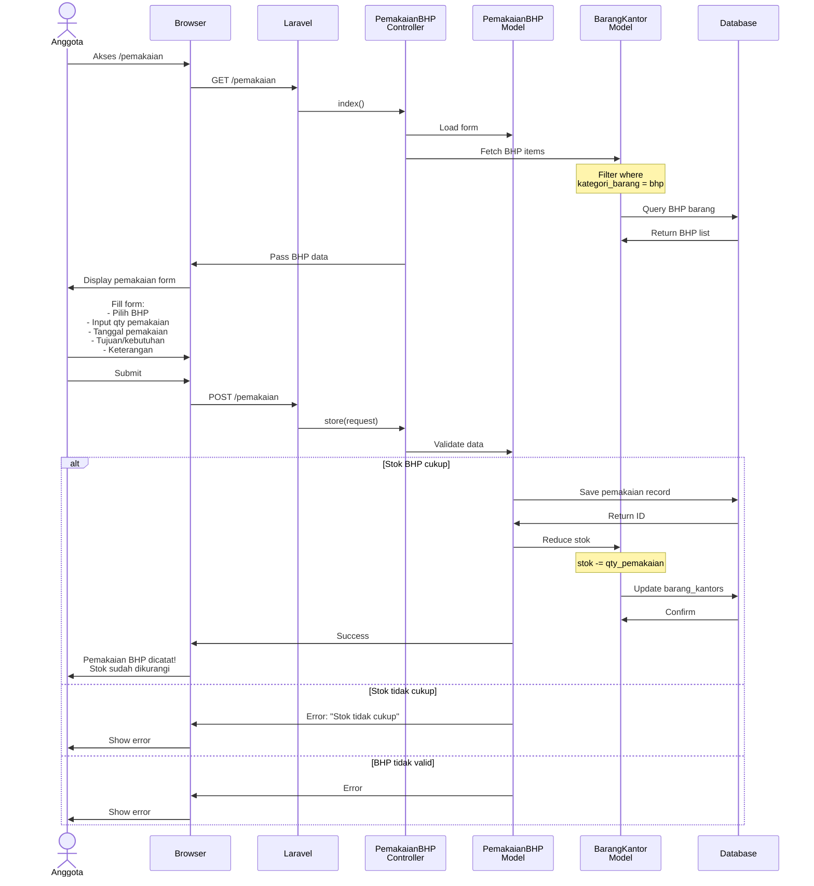
```mermaid
sequenceDiagram
    actor Anggota
    participant Browser
    participant Laravel
    participant Ctrl as PemakaianBHP<br/>Controller
    participant Model as PemakaianBHP<br/>Model
    participant BarangModel as BarangKantor<br/>Model
    participant DB as Database

    Anggota->>Browser: Akses /pemakaian
    Browser->>Laravel: GET /pemakaian
    Laravel->>Ctrl: index()
    
    Ctrl->>Model: Load form
    Ctrl->>BarangModel: Fetch BHP items
    Note over BarangModel: Filter where<br/>kategori_barang = bhp
    
    BarangModel->>DB: Query BHP barang
    DB->>BarangModel: Return BHP list
    
    Ctrl->>Browser: Pass BHP data
    Browser->>Anggota: Display pemakaian form

    Anggota->>Browser: Fill form:<br/>- Pilih BHP<br/>- Input qty pemakaian<br/>- Tanggal pemakaian<br/>- Tujuan/kebutuhan<br/>- Keterangan
    
    Anggota->>Browser: Submit
    Browser->>Laravel: POST /pemakaian
    Laravel->>Ctrl: store(request)
    
    Ctrl->>Model: Validate data
    alt Stok BHP cukup
        Model->>DB: Save pemakaian record
        DB->>Model: Return ID
        
        Model->>BarangModel: Reduce stok
        Note over BarangModel: stok -= qty_pemakaian
        
        BarangModel->>DB: Update barang_kantors
        DB->>BarangModel: Confirm
        
        Model->>Browser: Success
        Browser->>Anggota: Pemakaian BHP dicatat!<br/>Stok sudah dikurangi
    else Stok tidak cukup
        Model->>Browser: Error: "Stok tidak cukup"
        Browser->>Anggota: Show error
    else BHP tidak valid
        Model->>Browser: Error
        Browser->>Anggota: Show error
    end
```

---

## UC-USER-005: Anggota Submit Pengajuan Pembelian

**Aktor**: Anggota/User  
**Tujuan**: Anggota mengajukan usulan pembelian barang baru  
**Precondition**: Anggota sudah login  
**Postcondition**: Pengajuan tersimpan dengan status pending review

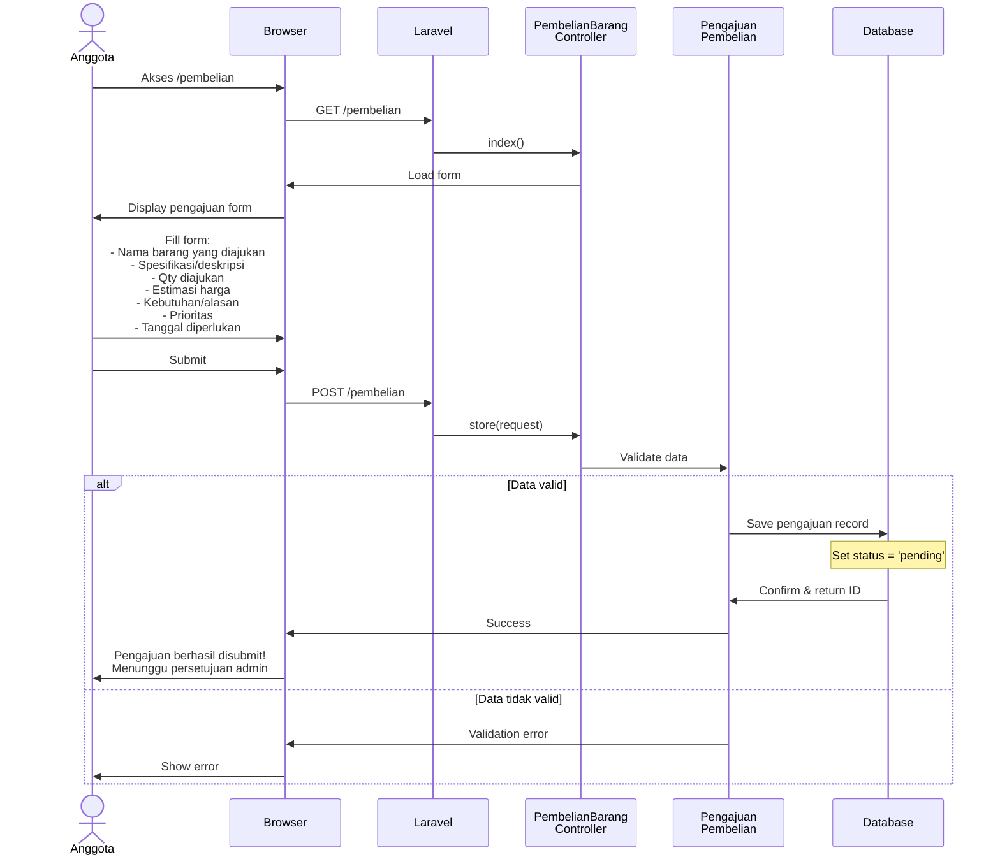
```mermaid
sequenceDiagram
    actor Anggota
    participant Browser
    participant Laravel
    participant Ctrl as PembelianBarang<br/>Controller
    participant Model as Pengajuan<br/>Pembelian
    participant DB as Database

    Anggota->>Browser: Akses /pembelian
    Browser->>Laravel: GET /pembelian
    Laravel->>Ctrl: index()
    Ctrl->>Browser: Load form
    Browser->>Anggota: Display pengajuan form

    Anggota->>Browser: Fill form:<br/>- Nama barang yang diajukan<br/>- Spesifikasi/deskripsi<br/>- Qty diajukan<br/>- Estimasi harga<br/>- Kebutuhan/alasan<br/>- Prioritas<br/>- Tanggal diperlukan
    
    Anggota->>Browser: Submit
    Browser->>Laravel: POST /pembelian
    Laravel->>Ctrl: store(request)
    
    Ctrl->>Model: Validate data
    alt Data valid
        Model->>DB: Save pengajuan record
        Note over DB: Set status = 'pending'
        DB->>Model: Confirm & return ID
        
        Model->>Browser: Success
        Browser->>Anggota: Pengajuan berhasil disubmit!<br/>Menunggu persetujuan admin
    else Data tidak valid
        Model->>Browser: Validation error
        Browser->>Anggota: Show error
    end
```

---

## UC-APPROVAL-001: Admin Approve/Reject Pengajuan Pembelian

**Aktor**: Admin  
**Tujuan**: Admin mereview dan menyetujui/menolak pengajuan pembelian  
**Precondition**: Ada pengajuan dengan status pending  
**Postcondition**: Pengajuan disetujui/ditolak, jika disetujui bisa lanjut ke perolehan barang

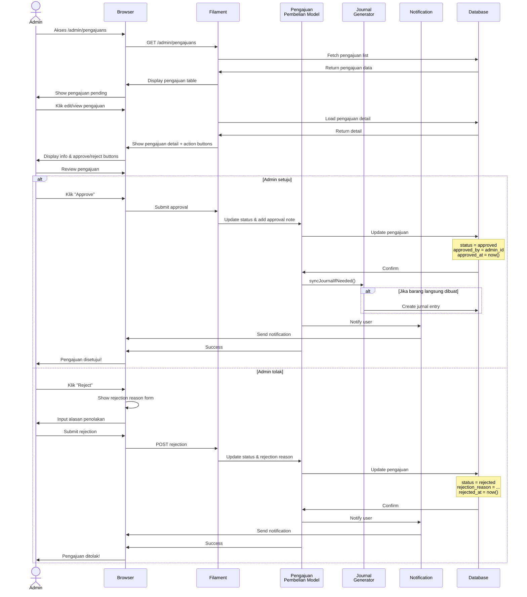
```mermaid
sequenceDiagram
    actor Admin
    participant Browser
    participant Filament
    participant Model as Pengajuan<br/>Pembelian Model
    participant Journal as Journal<br/>Generator
    participant Notification
    participant DB as Database

    Admin->>Browser: Akses /admin/pengajuans
    Browser->>Filament: GET /admin/pengajuans
    Filament->>DB: Fetch pengajuan list
    DB->>Filament: Return pengajuan data
    Filament->>Browser: Display pengajuan table
    Browser->>Admin: Show pengajuan pending

    Admin->>Browser: Klik edit/view pengajuan
    Filament->>DB: Load pengajuan detail
    DB->>Filament: Return detail
    Filament->>Browser: Show pengajuan detail + action buttons
    Browser->>Admin: Display info & approve/reject buttons

    Admin->>Browser: Review pengajuan
    
    alt Admin setuju
        Admin->>Browser: Klik "Approve"
        Browser->>Filament: Submit approval
        Filament->>Model: Update status & add approval note
        
        Model->>DB: Update pengajuan
        Note over DB: status = approved<br/>approved_by = admin_id<br/>approved_at = now()
        DB->>Model: Confirm
        
        Model->>Journal: syncJournalIfNeeded()
        alt Jika barang langsung dibuat
            Journal->>DB: Create jurnal entry
        end
        
        Model->>Notification: Notify user
        Notification->>Browser: Send notification
        
        Model->>Browser: Success
        Browser->>Admin: Pengajuan disetujui!
        
    else Admin tolak
        Admin->>Browser: Klik "Reject"
        Browser->>Browser: Show rejection reason form
        Browser->>Admin: Input alasan penolakan
        
        Admin->>Browser: Submit rejection
        Browser->>Filament: POST rejection
        Filament->>Model: Update status & rejection reason
        
        Model->>DB: Update pengajuan
        Note over DB: status = rejected<br/>rejection_reason = ...<br/>rejected_at = now()
        DB->>Model: Confirm
        
        Model->>Notification: Notify user
        Notification->>Browser: Send notification
        
        Model->>Browser: Success
        Browser->>Admin: Pengajuan ditolak!
    end
```

---

## UC-REPORT-001: Admin View Buku Besar

**Aktor**: Admin  
**Tujuan**: Admin melihat laporan Buku Besar (General Ledger)  
**Precondition**: Admin sudah login  
**Postcondition**: Laporan Buku Besar ditampilkan dengan saldo per akun

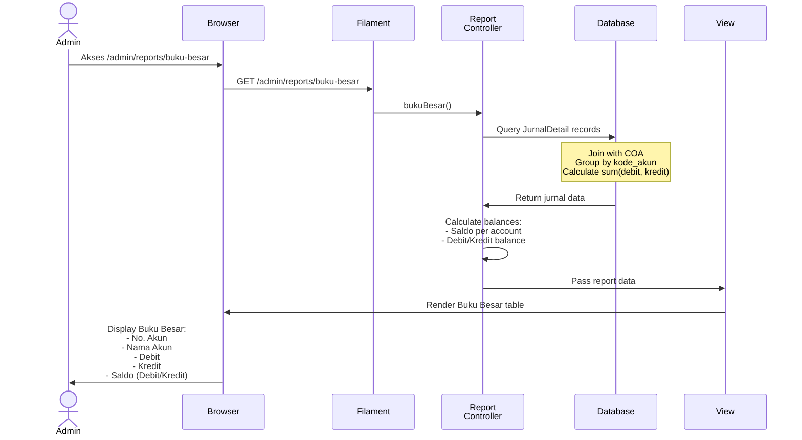
```mermaid
sequenceDiagram
    actor Admin
    participant Browser
    participant Filament
    participant Ctrl as Report<br/>Controller
    participant DB as Database
    participant View

    Admin->>Browser: Akses /admin/reports/buku-besar
    Browser->>Filament: GET /admin/reports/buku-besar
    Filament->>Ctrl: bukuBesar()
    
    Ctrl->>DB: Query JurnalDetail records
    Note over DB: Join with COA<br/>Group by kode_akun<br/>Calculate sum(debit, kredit)
    
    DB->>Ctrl: Return jurnal data
    Ctrl->>Ctrl: Calculate balances:<br/>- Saldo per account<br/>- Debit/Kredit balance
    
    Ctrl->>View: Pass report data
    View->>Browser: Render Buku Besar table
    
    Browser->>Admin: Display Buku Besar:<br/>- No. Akun<br/>- Nama Akun<br/>- Debit<br/>- Kredit<br/>- Saldo (Debit/Kredit)
```

---

## UC-REPORT-002: Admin View Jurnal Umum

**Aktor**: Admin  
**Tujuan**: Admin melihat laporan Jurnal Umum (General Journal)  
**Precondition**: Admin sudah login  
**Postcondition**: Laporan Jurnal Umum ditampilkan

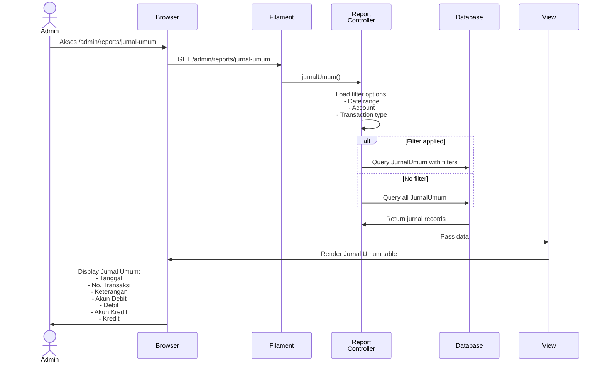
```mermaid
sequenceDiagram
    actor Admin
    participant Browser
    participant Filament
    participant Ctrl as Report<br/>Controller
    participant DB as Database
    participant View

    Admin->>Browser: Akses /admin/reports/jurnal-umum
    Browser->>Filament: GET /admin/reports/jurnal-umum
    Filament->>Ctrl: jurnalUmum()
    
    Ctrl->>Ctrl: Load filter options:<br/>- Date range<br/>- Account<br/>- Transaction type
    
    alt Filter applied
        Ctrl->>DB: Query JurnalUmum with filters
    else No filter
        Ctrl->>DB: Query all JurnalUmum
    end
    
    DB->>Ctrl: Return jurnal records
    Ctrl->>View: Pass data
    View->>Browser: Render Jurnal Umum table
    
    Browser->>Admin: Display Jurnal Umum:<br/>- Tanggal<br/>- No. Transaksi<br/>- Keterangan<br/>- Akun Debit<br/>- Debit<br/>- Akun Kredit<br/>- Kredit
```

---

## UC-REPORT-003: Admin View Penyusutan Aset

**Aktor**: Admin  
**Tujuan**: Admin melihat laporan penyusutan aset tetap  
**Precondition**: Admin sudah login  
**Postcondition**: Laporan penyusutan aset ditampilkan

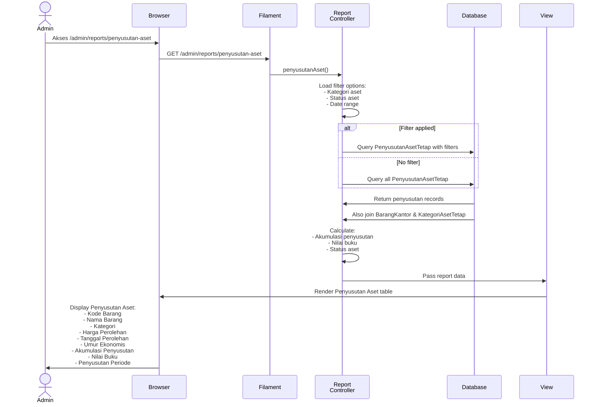
```mermaid
sequenceDiagram
    actor Admin
    participant Browser
    participant Filament
    participant Ctrl as Report<br/>Controller
    participant DB as Database
    participant View

    Admin->>Browser: Akses /admin/reports/penyusutan-aset
    Browser->>Filament: GET /admin/reports/penyusutan-aset
    Filament->>Ctrl: penyusutanAset()
    
    Ctrl->>Ctrl: Load filter options:<br/>- Kategori aset<br/>- Status aset<br/>- Date range
    
    alt Filter applied
        Ctrl->>DB: Query PenyusutanAsetTetap with filters
    else No filter
        Ctrl->>DB: Query all PenyusutanAsetTetap
    end
    
    DB->>Ctrl: Return penyusutan records
    DB->>Ctrl: Also join BarangKantor & KategoriAsetTetap
    
    Ctrl->>Ctrl: Calculate:<br/>- Akumulasi penyusutan<br/>- Nilai buku<br/>- Status aset
    
    Ctrl->>View: Pass report data
    View->>Browser: Render Penyusutan Aset table
    
    Browser->>Admin: Display Penyusutan Aset:<br/>- Kode Barang<br/>- Nama Barang<br/>- Kategori<br/>- Harga Perolehan<br/>- Tanggal Perolehan<br/>- Umur Ekonomis<br/>- Akumulasi Penyusutan<br/>- Nilai Buku<br/>- Penyusutan Periode
```

---

## 📊 Ringkasan Use Case

| No | Use Case ID | Nama | Aktor | Kategori |
|----|------------|------|-------|----------|
| 1 | UC-AUTH-001 | User Login | User | Auth |
| 2 | UC-MASTER-001 | Create Barang Kantor | Admin | Master Data |
| 3 | UC-MASTER-002 | Create/Edit COA | Admin | Master Data |
| 4 | UC-MASTER-003 | Create Kategori Aset | Admin | Master Data |
| 5 | UC-TRANS-001 | Record Pendapatan Hibah | Admin | Transaksi |
| 6 | UC-TRANS-002 | Record Pengisian Kas Kecil | Admin | Transaksi |
| 7 | UC-TRANS-003 | Create Perolehan Barang (Pembelian) | Admin | Transaksi |
| 8 | UC-TRANS-004 | Create Perolehan Barang (Hibah Uang) | Admin | Transaksi |
| 9 | UC-TRANS-005 | Create Perolehan Barang (Hibah Barang) | Admin | Transaksi |
| 10 | UC-USER-001 | View Ketersediaan Barang | Anggota | User Operations |
| 11 | UC-USER-002 | Request Peminjaman Barang | Anggota | User Operations |
| 12 | UC-USER-003 | Kembalikan Barang Pinjaman | Anggota | User Operations |
| 13 | UC-USER-004 | Record Pemakaian BHP | Anggota | User Operations |
| 14 | UC-USER-005 | Submit Pengajuan Pembelian | Anggota | User Operations |
| 15 | UC-APPROVAL-001 | Approve/Reject Pengajuan Pembelian | Admin | Approval |
| 16 | UC-REPORT-001 | View Buku Besar | Admin | Reporting |
| 17 | UC-REPORT-002 | View Jurnal Umum | Admin | Reporting |
| 18 | UC-REPORT-003 | View Penyusutan Aset | Admin | Reporting |

---

## 🔍 Key Interactions

### Data Validation Flow
- **Filament Form** → **Model Validation** → **Database Save**
- Jika invalid, form menampilkan error message

### Automatic Processing
- **Create Barang Kantor** → Auto barcode + penyusutan (aset)
- **Create/Edit COA** → Auto sync pending journals
- **Create Transaksi** → Auto create jurnal entries

### Stok Management
- **Peminjaman** → stok berkurang, status = borrowed
- **Pengembalian** → stok bertambah, status = available
- **Pemakaian BHP** → stok berkurang, tercatat dalam pemakaian log

### Reporting
- **Buku Besar** ← JurnalDetail (grouped by account)
- **Jurnal Umum** ← JurnalUmum (all transactions)
- **Penyusutan Aset** ← PenyusutanAsetTetap (linked to BarangKantor)

---

## 📝 Catatan Tambahan

1. **Session Timeout**: Semua use case anggota/admin protected oleh middleware auth + idle timeout 45 menit
2. **Notification**: Pada UC-APPROVAL-001, notifikasi dikirim ke user tentang approval status
3. **Audit Log**: Semua perubahan data di-track via Laravel audit system
4. **Multi-user**: Sistem support concurrent users dengan different roles (Admin/Anggota)
5. **Error Handling**: Setiap use case memiliki error handling untuk validasi, duplicate entry, stok insufficient, dll

