# ERD Aplikasi Pengelolaan Aset dan Barang Habis Pakai

Dokumen ini menjelaskan entitas yang digunakan pada aplikasi, atribut pentingnya, primary key, foreign key, relasi, dan kardinalitas antar tabel. Penjelasan ini mengikuti struktur database dan relasi model yang digunakan pada aplikasi.

## Ringkasan Entitas Utama

| No | Entitas | Nama Tabel | Fungsi Utama |
| --- | --- | --- | --- |
| 1 | User | `users` | Menyimpan akun pengguna aplikasi. |
| 2 | COA | `coa` | Menyimpan daftar akun akuntansi yang dipakai jurnal dan buku besar. |
| 3 | Kategori Aset Tetap | `kategori_aset_tetap` | Menyimpan kelompok aset, umur ekonomis, dan tarif penyusutan. |
| 4 | Barang Kantor | `barang_kantors` | Master data aset tetap dan barang habis pakai. |
| 5 | Pendapatan Hibah | `pendapatan_hibah` | Transaksi penerimaan hibah uang/barang. |
| 6 | Pengisian Kas Kecil | `pengisian_kas_kecil` | Transaksi pengisian kas kecil. |
| 7 | Perolehan Barang | `perolehan_barang` | Header transaksi perolehan barang dari pembelian, hibah uang, atau hibah barang. |
| 8 | Detail Perolehan Barang | `perolehan_barang_detail` | Rincian barang pada transaksi perolehan sekaligus penghubung relasi N : N untuk perolehan dengan kategori/barang. |
| 9 | Penyusutan Aset Tetap | `penyusutan_aset_tetap` | Header data penyusutan setiap aset tetap. |
| 10 | Detail Penyusutan | `penyusutan_details` | Tabel penghubung relasi N : N antara penyusutan aset tetap dan jurnal umum, sekaligus menyimpan periode penyusutan bulanan. |
| 11 | Jurnal Umum | `jurnals` | Header jurnal transaksi. |
| 12 | Detail Jurnal | `jurnal_detail` | Baris debit dan kredit jurnal sekaligus penghubung relasi N : N antara jurnal umum dan COA. |
| 13 | Peminjaman Barang | `peminjaman_barangs` | Pengajuan dan pencatatan peminjaman aset. |
| 14 | Pemakaian BHP | `pemakaian_bhp` | Pengajuan dan pencatatan pemakaian barang habis pakai. |
| 15 | Pengajuan Pembelian Barang | `pembelian_barangs` | Pengajuan pembelian barang oleh user. |

## Detail Entitas dan Atribut

### 1. User

Tabel: `users`

| Atribut | Tipe | Keterangan |
| --- | --- | --- |
| `id` | bigint | Primary key. |
| `name` | varchar | Nama user. |
| `username` | varchar | Username login, unique. |
| `password` | varchar | Password user. |
| `user_group` | varchar | Hak akses user, default `admin`. |
| `remember_token` | varchar | Token remember me Laravel. |
| `created_at`, `updated_at` | timestamp | Waktu data dibuat dan diperbarui. |

Relasi:

| Relasi | Kardinalitas | Keterangan |
| --- | --- | --- |
| `users` ke `peminjaman_barangs` | 1 : N | Satu user dapat membuat banyak pengajuan peminjaman. |
| `users` ke `pemakaian_bhp` | 1 : N | Satu user dapat membuat banyak pengajuan pemakaian BHP. |
| `users` ke `pembelian_barangs` | 1 : N | Satu user dapat membuat banyak pengajuan pembelian. |

### 2. COA

Tabel: `coa`

| Atribut | Tipe | Keterangan |
| --- | --- | --- |
| `id` | bigint | Primary key. |
| `kode_akun` | varchar | Kode akun, unique, dipakai sebagai referensi jurnal. |
| `nama_akun` | varchar | Nama akun. |
| `header_akun` | varchar | Kelompok akun, contoh Aset, Pendapatan, Beban. |
| `saldo` | enum | Saldo normal akun, `debit` atau `kredit`. |
| `jumlah_saldo` | int | Saldo awal akun. |
| `created_at`, `updated_at` | timestamp | Waktu data dibuat dan diperbarui. |

Relasi:

| Relasi | Kardinalitas | Keterangan |
| --- | --- | --- |
| `jurnals` ke `coa` | N : N | Relasi terjadi melalui `jurnal_detail`, karena satu jurnal umum dapat memiliki banyak akun dan satu akun COA dapat muncul pada banyak jurnal umum. |
| `jurnal_detail` ke `coa` | N : 1 | Setiap detail jurnal mengacu ke satu akun COA. |
| `coa` ke `pendapatan_hibah` melalui `akun_bank_hibah` | 1 : N | Satu akun bank hibah dapat dipakai banyak transaksi hibah. |
| `coa` ke `pendapatan_hibah` melalui `akun_pendapatan_hibah` | 1 : N | Satu akun pendapatan dapat dipakai banyak transaksi hibah. |
| `coa` ke `pengisian_kas_kecil` melalui `akun_kas_kecil` | 1 : N | Satu akun kas kecil dapat dipakai banyak pengisian kas kecil. |
| `coa` ke `pengisian_kas_kecil` melalui `akun_sumber_dana` | 1 : N | Satu akun sumber dana dapat dipakai banyak pengisian kas kecil. |

### 3. Kategori Aset Tetap      

Tabel: `kategori_aset_tetap`

| Atribut | Tipe | Keterangan |
| --- | --- | --- |
| `id_kategori_aset` | varchar | Primary key. |
| `nama_kategori_aset` | varchar | Nama kategori aset tetap. |
| `umur_ekonomis` | int | Umur ekonomis aset dalam tahun. |
| `tarif_penyusutan` | decimal | Tarif penyusutan. |
| `keterangan` | text | Keterangan kategori aset. |
| `created_at`, `updated_at` | timestamp | Waktu data dibuat dan diperbarui. |

Relasi:

| Relasi | Kardinalitas | Keterangan |
| --- | --- | --- |
| `kategori_aset_tetap` ke `barang_kantors` | 1 : N | Satu kategori aset dapat digunakan oleh banyak barang aset. |
| `perolehan_barang` ke `kategori_aset_tetap` | N : N | Relasi terjadi melalui `perolehan_barang_detail`, karena satu transaksi perolehan dapat memiliki banyak kategori aset dan satu kategori aset dapat muncul pada banyak transaksi perolehan. |

### 4. Barang Kantor

Tabel: `barang_kantors`

| Atribut | Tipe | Keterangan |
| --- | --- | --- |
| `id` | bigint | Primary key. |
| `kategori_barang` | enum | Jenis barang: aset atau BHP. |
| `jenis_aset` | enum | Jenis aset, contoh Sarana Pendidikan Laboratorium, Inventaris Kantor, Kendaraan. |
| `jenis_bhp` | enum | Jenis BHP, contoh ATK Operasional Kantor atau BPP Inventaris Kantor. |
| `kode_barang` | varchar | Kode barang, unique. |
| `barcode` | varchar | Kode barcode, unique. |
| `nama_barang` | varchar | Nama barang. |
| `foto` | varchar | File foto barang. |
| `stok` | int | Stok barang, terutama untuk BHP. |
| `satuan` | enum | Satuan utama barang, contoh Pcs, Unit, Pack, Kotak, Rim. |
| `kategori_aset_id` | varchar | Foreign key ke `kategori_aset_tetap.id_kategori_aset`. |
| `umur_ekonomis` | int | Umur ekonomis barang aset. |
| `nilai_residu` | int | Nilai residu aset. |
| `status_penggunaan` | varchar | Status penggunaan, contoh belum siap digunakan atau siap digunakan. |
| `tanggal_diterima` | date | Tanggal barang diterima/siap dasar penyusutan. |
| `harga_perolehan` | int | Harga perolehan per unit barang. |
| `keterangan` | text | Keterangan barang. |
| `status_barang` | enum | Status aktif/tidak aktif. |
| `status_pinjam` | enum | Status ketersediaan peminjaman. |
| `perolehan_barang_detail_id` | bigint | Foreign key ke `perolehan_barang_detail.id`. |
| `created_at`, `updated_at` | timestamp | Waktu data dibuat dan diperbarui. |

Relasi:

| Relasi | Kardinalitas | Keterangan |
| --- | --- | --- |
| `kategori_aset_tetap` ke `barang_kantors` | 1 : N | Banyak barang dapat memiliki satu kategori aset. |
| `perolehan_barang_detail` ke `barang_kantors` | 1 : N | Satu detail perolehan aset dapat menghasilkan banyak barang aset, sesuai jumlah perolehan. |
| `perolehan_barang` ke `barang_kantors` | N : N | Relasi terjadi melalui `perolehan_barang_detail`, karena satu transaksi perolehan dapat memiliki banyak barang dan satu barang BHP dapat diperoleh berkali-kali dari banyak transaksi perolehan. |
| `barang_kantors` ke `penyusutan_aset_tetap` | 1 : N | Satu barang aset dapat memiliki data penyusutan. Secara proses biasanya satu aset punya satu data penyusutan. |
| `barang_kantors` ke `peminjaman_barangs` | 1 : N | Satu barang aset dapat memiliki banyak riwayat peminjaman. |
| `barang_kantors` ke `pemakaian_bhp` | 1 : N | Satu barang BHP dapat memiliki banyak riwayat pemakaian. |

### 5. Pendapatan Hibah

Tabel: `pendapatan_hibah`

| Atribut | Tipe | Keterangan |
| --- | --- | --- |
| `no_hibah` | varchar | Primary key. |
| `tanggal_hibah` | date | Tanggal penerimaan hibah. |
| `sumber_hibah` | varchar | Nama pemberi/sumber hibah. |
| `jenis_hibah` | varchar | Jenis hibah, default `hibah_uang`. |
| `akun_bank_hibah` | varchar | Foreign key ke `coa.kode_akun`. |
| `akun_pendapatan_hibah` | varchar | Foreign key ke `coa.kode_akun`. |
| `nilai_hibah` | int | Total nilai hibah. |
| `keterangan` | text | Keterangan hibah. |
| `created_at`, `updated_at` | timestamp | Waktu data dibuat dan diperbarui. |

Relasi:

| Relasi | Kardinalitas | Keterangan |
| --- | --- | --- |
| `coa` ke `pendapatan_hibah` | 1 : N | Akun COA digunakan sebagai akun bank dan akun pendapatan hibah. |
| `pendapatan_hibah` ke `perolehan_barang` | 1 : N | Satu pendapatan hibah uang dapat digunakan oleh banyak transaksi perolehan hibah uang, selama saldo masih tersedia. |
| `pendapatan_hibah` ke `jurnals` | 1 : 0..1 | Satu transaksi hibah dapat menghasilkan satu jurnal umum. |

### 6. Pengisian Kas Kecil

Tabel: `pengisian_kas_kecil`

| Atribut | Tipe | Keterangan |
| --- | --- | --- |
| `id` | bigint | Primary key. |
| `no_transaksi` | varchar | Nomor transaksi, unique. |
| `tanggal` | date | Tanggal pengisian kas kecil. |
| `akun_kas_kecil` | varchar | Foreign key ke `coa.kode_akun`. |
| `akun_sumber_dana` | varchar | Foreign key ke `coa.kode_akun`. |
| `nominal` | int | Nominal pengisian kas kecil. |
| `keterangan` | text | Keterangan transaksi. |
| `bukti` | varchar | File bukti transaksi. |
| `created_at`, `updated_at` | timestamp | Waktu data dibuat dan diperbarui. |

Relasi:

| Relasi | Kardinalitas | Keterangan |
| --- | --- | --- |
| `coa` ke `pengisian_kas_kecil` | 1 : N | Akun COA digunakan sebagai kas kecil dan sumber dana. |
| `pengisian_kas_kecil` ke `jurnals` | 1 : 0..1 | Satu pengisian kas kecil dapat menghasilkan satu jurnal umum. |

### 7. Perolehan Barang

Tabel: `perolehan_barang`

| Atribut | Tipe | Keterangan |
| --- | --- | --- |
| `id_perolehan_barang` | varchar | Primary key. |
| `sumber_perolehan` | varchar | Sumber perolehan: pembelian, hibah uang, atau hibah barang. |
| `tanggal_pembelian` | date | Tanggal pembelian/perolehan. |
| `status_penggunaan` | varchar | Status penggunaan aset pada saat perolehan. |
| `tanggal_diterima` | date | Tanggal diterima/siap digunakan. |
| `nama_pemberi_hibah` | varchar | Nama pemberi hibah untuk hibah barang. |
| `foto_nota` | varchar | File nota pembelian. |
| `bukti_dokumen_hibah` | varchar | File bukti dokumen hibah. |
| `keterangan` | text | Keterangan perolehan. |
| `subtotal_barang` | int | Total harga sebelum diskon dan biaya lainnya. |
| `diskon_total` | int | Diskon total transaksi. |
| `biaya_lainnya_total` | int | Biaya tambahan total transaksi. |
| `grand_total` | int | Total akhir perolehan. |
| `total_nilai_hibah` | int | Total nilai hibah barang. |
| `nilai_pengakuan_pendapatan_hibah_uang` | int | Nilai pendapatan hibah uang yang digunakan. |
| `pendapatan_hibah_id` | varchar | Foreign key ke `pendapatan_hibah.no_hibah`. |
| `created_at`, `updated_at` | timestamp | Waktu data dibuat dan diperbarui. |

Relasi:

| Relasi | Kardinalitas | Keterangan |
| --- | --- | --- |
| `pendapatan_hibah` ke `perolehan_barang` | 1 : N | Perolehan hibah uang dapat mengambil sumber dari pendapatan hibah. |
| `perolehan_barang` ke `perolehan_barang_detail` | 1 : N | Satu transaksi perolehan memiliki banyak rincian barang. |
| `perolehan_barang` ke `jurnals` | 1 : N | Satu perolehan dapat menjadi referensi jurnal umum. Secara proses biasanya satu transaksi menghasilkan satu jurnal. |
| `perolehan_barang` ke `kategori_aset_tetap` | N : N | Relasi terjadi melalui `perolehan_barang_detail`, karena satu transaksi perolehan dapat memiliki banyak kategori aset dan satu kategori aset dapat muncul pada banyak transaksi perolehan. |
| `perolehan_barang` ke `barang_kantors` | N : N | Relasi terjadi melalui `perolehan_barang_detail`, karena satu transaksi perolehan dapat memiliki banyak barang dan satu barang BHP dapat diperoleh berkali-kali dari banyak transaksi perolehan. |

### 8. Detail Perolehan Barang

Tabel: `perolehan_barang_detail`

| Atribut | Tipe | Keterangan |
| --- | --- | --- |
| `id` | bigint | Primary key. |
| `perolehan_barang_id` | varchar | Foreign key ke `perolehan_barang.id_perolehan_barang`. |
| `nama_barang` | varchar | Nama barang pada detail perolehan. |
| `kategori_barang` | varchar | Kategori barang: aset atau BHP. |
| `jenis_aset` | varchar | Jenis aset. |
| `jenis_bhp` | varchar | Jenis BHP. |
| `kategori_aset_id` | varchar | Foreign key ke `kategori_aset_tetap.id_kategori_aset`. |
| `umur_ekonomis` | int | Umur ekonomis dari kategori aset. |
| `nilai_residu` | int | Nilai residu aset. |
| `jumlah_perolehan` | int | Jumlah barang diperoleh. |
| `harga_satuan` | int | Harga satuan sebelum alokasi. |
| `total_harga` | int | Jumlah dikali harga satuan. |
| `persentase_subtotal` | decimal | Persentase item terhadap subtotal. |
| `alokasi_diskon` | int | Alokasi diskon untuk item. |
| `alokasi_biaya_lainnya` | int | Alokasi biaya lainnya untuk item. |
| `satuan_perolehan` | varchar | Satuan perolehan. |
| `harga_perolehan` | int | Harga perolehan final per unit. |
| `total_harga_perolehan` | int | Harga perolehan final total item. |
| `barang_kantor_id` | bigint | Foreign key ke `barang_kantors.id`, terutama untuk BHP yang memakai master barang existing. |
| `created_at`, `updated_at` | timestamp | Waktu data dibuat dan diperbarui. |

Relasi:

| Relasi | Kardinalitas | Keterangan |
| --- | --- | --- |
| `perolehan_barang` ke `kategori_aset_tetap` | N : N | Relasi terjadi melalui `perolehan_barang_detail`, karena satu transaksi perolehan dapat memiliki banyak kategori aset dan satu kategori aset dapat muncul pada banyak transaksi perolehan. |
| `perolehan_barang` ke `barang_kantors` | N : N | Relasi terjadi melalui `perolehan_barang_detail`, karena satu transaksi perolehan dapat memiliki banyak barang dan satu barang BHP dapat diperoleh berkali-kali dari banyak transaksi perolehan. |
| `perolehan_barang_detail` ke `perolehan_barang` | N : 1 | Setiap detail perolehan mengacu ke satu transaksi perolehan barang. |
| `perolehan_barang_detail` ke `kategori_aset_tetap` | N : 1 | Setiap detail perolehan aset dapat mengacu ke satu kategori aset tetap. |
| `perolehan_barang_detail` ke `barang_kantors` | N : 1 | Setiap detail perolehan BHP dapat mengacu ke satu master barang kantor. |
| `perolehan_barang_detail` ke `barang_kantors` | 1 : N | Untuk aset tetap, satu detail perolehan dapat menghasilkan banyak data barang kantor sesuai jumlah perolehan. |

### 9. Penyusutan Aset Tetap

Tabel: `penyusutan_aset_tetap`

| Atribut | Tipe | Keterangan |
| --- | --- | --- |
| `id_penyusutan` | varchar | Primary key. |
| `barang_kantor_id` | bigint | Foreign key ke `barang_kantors.id`. |
| `kode_barang` | varchar | Kode barang aset. |
| `nama_aset` | varchar | Nama aset. |
| `status_penggunaan` | varchar | Status penggunaan aset. |
| `tanggal_diterima` | date | Tanggal diterima/siap digunakan aset. |
| `harga_perolehan` | int | Harga perolehan aset. |
| `nilai_residu` | int | Nilai residu aset. |
| `umur_ekonomis_tahun` | int | Umur ekonomis dalam tahun. |
| `beban_penyusutan_bulanan` | int | Nilai penyusutan per bulan. |
| `total_biaya_penyusutan` | int | Akumulasi penyusutan. |
| `status_penyusutan` | varchar | Status penyusutan aset. |
| `keterangan_kelengkapan` | varchar | Keterangan lengkap atau bolong periode penyusutan. |
| `created_at`, `updated_at` | timestamp | Waktu data dibuat dan diperbarui. |

Relasi:

| Relasi | Kardinalitas | Keterangan |
| --- | --- | --- |
| `barang_kantors` ke `penyusutan_aset_tetap` | 1 : N | Satu barang aset menjadi sumber data penyusutan. |
| `penyusutan_aset_tetap` ke `jurnals` | N : N | Relasi terjadi melalui `penyusutan_details`, karena satu data penyusutan aset tetap dapat memiliki banyak jurnal penyusutan dan jurnal tersebut dicatat melalui detail penyusutan. |
| `penyusutan_details` ke `penyusutan_aset_tetap` | N : 1 | Setiap detail penyusutan mengacu ke satu data penyusutan aset tetap. |
| `penyusutan_details` ke `jurnals` | N : 1 | Setiap detail penyusutan dapat mengacu ke satu jurnal umum. |

### 10. Detail Penyusutan

Tabel: `penyusutan_details`

| Atribut | Tipe | Keterangan |
| --- | --- | --- |
| `id` | bigint | Primary key. |
| `penyusutan_id` | varchar | Foreign key ke `penyusutan_aset_tetap.id_penyusutan`. |
| `periode` | date | Periode penyusutan. Kombinasi `penyusutan_id` dan `periode` bersifat unique. |
| `beban_penyusutan_bulanan` | int | Beban penyusutan pada periode tersebut. |
| `akumulasi` | int | Total akumulasi penyusutan sampai periode tersebut. |
| `nilai_buku` | int | Nilai buku aset setelah penyusutan. |
| `jurnal_umum_id` | bigint | Foreign key ke `jurnals.id_jurnal_umum`. |
| `created_at`, `updated_at` | timestamp | Waktu data dibuat dan diperbarui. |

Relasi:

| Relasi | Kardinalitas | Keterangan |
| --- | --- | --- |
| `penyusutan_aset_tetap` ke `jurnals` | N : N | Relasi terjadi melalui `penyusutan_details`, karena satu data penyusutan aset dapat menghasilkan banyak jurnal periode penyusutan dan satu jurnal dapat direferensikan pada detail penyusutan. |
| `penyusutan_details` ke `penyusutan_aset_tetap` | N : 1 | Setiap detail penyusutan mengacu ke satu data penyusutan aset tetap. |
| `penyusutan_details` ke `jurnals` | N : 1 | Setiap detail penyusutan dapat mengacu ke satu jurnal umum. |

### 11. Jurnal Umum

Tabel: `jurnals`

| Atribut | Tipe | Keterangan |
| --- | --- | --- |
| `id_jurnal_umum` | bigint | Primary key. |
| `tanggal` | date | Tanggal jurnal. |
| `deskripsi` | varchar | Deskripsi jurnal. |
| `tipe_transaksi` | varchar | Jenis transaksi, contoh perolehan barang, pendapatan hibah, pengisian kas kecil, penyusutan. |
| `reff_perolehan_barang` | varchar | Foreign key ke `perolehan_barang.id_perolehan_barang`. |
| `reff_penyusutan` | varchar | Foreign key ke `penyusutan_aset_tetap.id_penyusutan`. |
| `reff_pengisian_kas_kecil` | varchar | Foreign key ke `pengisian_kas_kecil.no_transaksi`. |
| `reff_pendapatan_hibah` | varchar | Foreign key ke `pendapatan_hibah.no_hibah`. |
| `created_at`, `updated_at` | timestamp | Waktu data dibuat dan diperbarui. |

Relasi:

| Relasi | Kardinalitas | Keterangan |
| --- | --- | --- |
| `jurnals` ke `coa` | N : N | Relasi terjadi melalui `jurnal_detail`, karena satu jurnal umum dapat memiliki banyak akun dan satu akun COA dapat muncul pada banyak jurnal umum. |
| `jurnal_detail` ke `jurnals` | N : 1 | Setiap detail jurnal mengacu ke satu jurnal umum. |
| `perolehan_barang` ke `jurnals` | 1 : N | Jurnal dapat berasal dari transaksi perolehan barang. |
| `penyusutan_aset_tetap` ke `jurnals` | 1 : N | Jurnal dapat berasal dari proses penyusutan. |
| `pengisian_kas_kecil` ke `jurnals` | 1 : 0..1 | Jurnal dapat berasal dari pengisian kas kecil. |
| `pendapatan_hibah` ke `jurnals` | 1 : 0..1 | Jurnal dapat berasal dari pendapatan hibah. |

### 12. Detail Jurnal

Tabel: `jurnal_detail`

| Atribut | Tipe | Keterangan |
| --- | --- | --- |
| `id_jurnal_detail` | bigint | Primary key. |
| `id_jurnal_umum` | bigint | Foreign key ke `jurnals.id_jurnal_umum`. |
| `kode_akun` | varchar | Foreign key ke `coa.kode_akun`. |
| `keterangan` | varchar | Keterangan akun pada jurnal. |
| `nominal_debit` | int | Nominal debit. |
| `nominal_kredit` | int | Nominal kredit. |
| `created_at`, `updated_at` | timestamp | Waktu data dibuat dan diperbarui. |

Relasi:

| Relasi | Kardinalitas | Keterangan |
| --- | --- | --- |
| `jurnals` ke `coa` | N : N | Relasi terjadi melalui `jurnal_detail`, karena satu jurnal umum dapat memiliki banyak akun dan satu akun COA dapat muncul pada banyak jurnal umum. |
| `jurnal_detail` ke `jurnals` | N : 1 | Setiap detail jurnal mengacu ke satu jurnal umum. |
| `jurnal_detail` ke `coa` | N : 1 | Setiap detail jurnal mengacu ke satu akun COA. |

### 13. Peminjaman Barang

Tabel: `peminjaman_barangs`

| Atribut | Tipe | Keterangan |
| --- | --- | --- |
| `id_peminjaman` | bigint | Primary key. |
| `user_id` | bigint | Foreign key ke `users.id`. |
| `kategori_barang` | varchar | Kategori barang yang dipinjam. |
| `kode_barang` | varchar | Foreign key ke `barang_kantors.kode_barang`. |
| `nama_barang` | varchar | Nama barang yang dipinjam. |
| `tanggal_pinjam` | date | Tanggal peminjaman. |
| `tanggal_pengembalian` | date | Tanggal pengembalian. |
| `alasan_peminjaman` | text | Alasan peminjaman. |
| `bukti_peminjaman` | varchar | File bukti peminjaman. |
| `bukti_pengembalian` | varchar | File bukti pengembalian. |
| `jumlah_pinjam` | int | Jumlah barang dipinjam. |
| `status_pinjam` | varchar | Status pengajuan/peminjaman. |
| `created_at`, `updated_at` | timestamp | Waktu data dibuat dan diperbarui. |

Relasi:

| Relasi | Kardinalitas | Keterangan |
| --- | --- | --- |
| `users` ke `peminjaman_barangs` | 1 : N | Satu user dapat membuat banyak peminjaman. |
| `barang_kantors` ke `peminjaman_barangs` | 1 : N | Satu barang dapat memiliki banyak riwayat peminjaman. |

### 14. Pemakaian BHP

Tabel: `pemakaian_bhp`

| Atribut | Tipe | Keterangan |
| --- | --- | --- |
| `id_pemakaian` | bigint | Primary key. |
| `user_id` | bigint | Foreign key ke `users.id`. |
| `kode_barang` | varchar | Foreign key ke `barang_kantors.kode_barang`. |
| `nama_barang` | varchar | Nama BHP yang dipakai. |
| `tanggal_pemakaian` | date | Tanggal pemakaian BHP. |
| `jumlah` | int | Jumlah BHP yang dipakai. |
| `alasan_kebutuhan` | text | Alasan kebutuhan BHP. |
| `bukti_pendukung` | varchar | File bukti pendukung. |
| `status` | varchar | Status pengajuan pemakaian. |
| `created_at`, `updated_at` | timestamp | Waktu data dibuat dan diperbarui. |

Relasi:

| Relasi | Kardinalitas | Keterangan |
| --- | --- | --- |
| `users` ke `pemakaian_bhp` | 1 : N | Satu user dapat membuat banyak pemakaian BHP. |
| `barang_kantors` ke `pemakaian_bhp` | 1 : N | Satu BHP dapat memiliki banyak riwayat pemakaian. |

### 15. Pengajuan Pembelian Barang

Tabel: `pembelian_barangs`

| Atribut | Tipe | Keterangan |
| --- | --- | --- |
| `id_pembelian_barang_kantor` | bigint | Primary key. |
| `user_id` | bigint | Foreign key ke `users.id`. |
| `tanggal_pengajuan` | date | Tanggal pengajuan pembelian. |
| `nama_barang` | varchar | Nama barang yang diajukan. |
| `kategori_barang` | varchar | Kategori barang yang diajukan. |
| `perkiraan_harga` | int | Perkiraan harga barang. |
| `jumlah` | int | Jumlah barang diajukan. |
| `sub_total` | int | Perkiraan harga dikali jumlah. |
| `link_barang` | varchar | Link referensi barang. |
| `alasan` | text | Alasan pengajuan. |
| `bukti_pendukung` | varchar | File bukti pendukung. |
| `status` | varchar | Status pengajuan pembelian. |
| `created_at`, `updated_at` | timestamp | Waktu data dibuat dan diperbarui. |

Relasi:

| Relasi | Kardinalitas | Keterangan |
| --- | --- | --- |
| `users` ke `pembelian_barangs` | 1 : N | Satu user dapat membuat banyak pengajuan pembelian barang. |

## Aturan Tabel Detail dan Penghubung

Pada ERD aplikasi ini, tabel detail dibuat sebagai penghubung ketika relasi antar entitas utamanya N : N. Tabel detail juga menyimpan atribut transaksi yang muncul dari hubungan tersebut.

| Tabel Detail | Jenis Relasi | Status di Database | Alasan |
| --- | --- | --- | --- |
| `perolehan_barang_detail` | N : N dan 1 : N | Sesuai ERD | Relasi terjadi melalui `perolehan_barang_detail`, karena satu transaksi perolehan dapat memiliki banyak kategori/barang dan satu kategori/barang dapat muncul pada banyak transaksi perolehan. |
| `jurnal_detail` | N : N | Sesuai ERD | Relasi terjadi melalui `jurnal_detail`, karena satu jurnal umum dapat memiliki banyak akun dan satu akun COA dapat muncul pada banyak jurnal umum. |
| `penyusutan_details` | N : N | Sesuai ERD | Relasi terjadi melalui `penyusutan_details`, karena satu data penyusutan aset tetap dapat memiliki banyak jurnal penyusutan dan jurnal tersebut dicatat melalui detail penyusutan. |

Jadi, tabel detail baru dipakai sebagai penghubung saat relasi antar entitas utamanya N : N. Pada ERD ini, tabel detail yang berfungsi sebagai penghubung adalah `perolehan_barang_detail`, `jurnal_detail`, dan `penyusutan_details`.

## Tabel Teknis Laravel

Tabel berikut digunakan oleh Laravel atau fitur pendukung sistem, bukan entitas bisnis utama:

| Tabel | Fungsi |
| --- | --- |
| `sessions` | Menyimpan session login pengguna. |
| `cache` | Menyimpan cache aplikasi. |
| `cache_locks` | Mengunci proses cache tertentu. |
| `jobs` | Menyimpan queue job. |
| `job_batches` | Menyimpan batch queue job. |
| `failed_jobs` | Menyimpan job yang gagal. |
| `notifications` | Menyimpan notifikasi Laravel. |
| `password_reset_tokens` | Menyimpan token reset password. |

## Kardinalitas Relasi Utama

| No | Entitas A | Entitas B | Kardinalitas | Keterangan |
| --- | --- | --- | --- | --- |
| 1 | User | Peminjaman Barang | 1 : N | Satu user dapat membuat banyak peminjaman. |
| 2 | User | Pemakaian BHP | 1 : N | Satu user dapat membuat banyak pemakaian BHP. |
| 3 | User | Pengajuan Pembelian Barang | 1 : N | Satu user dapat membuat banyak pengajuan pembelian. |
| 4 | Kategori Aset Tetap | Barang Kantor | 1 : N | Satu kategori aset digunakan oleh banyak barang aset. |
| 5 | Perolehan Barang | Kategori Aset Tetap | N : N | Relasi terjadi melalui `perolehan_barang_detail`, karena satu transaksi perolehan dapat memiliki banyak kategori aset dan satu kategori aset dapat muncul pada banyak transaksi perolehan. |
| 6 | Jurnal Umum | COA | N : N | Relasi terjadi melalui `jurnal_detail`, karena satu jurnal umum dapat memiliki banyak akun dan satu akun COA dapat muncul pada banyak jurnal umum. |
| 7 | COA | Pendapatan Hibah | 1 : N | COA digunakan sebagai akun bank hibah dan akun pendapatan hibah. |
| 8 | COA | Pengisian Kas Kecil | 1 : N | COA digunakan sebagai akun kas kecil dan sumber dana. |
| 9 | Pendapatan Hibah | Perolehan Barang | 1 : N | Satu hibah uang dapat digunakan oleh banyak perolehan barang. |
| 10 | Pendapatan Hibah | Jurnal Umum | 1 : 0..1 | Satu pendapatan hibah dapat menghasilkan satu jurnal. |
| 11 | Pengisian Kas Kecil | Jurnal Umum | 1 : 0..1 | Satu pengisian kas kecil dapat menghasilkan satu jurnal. |
| 12 | Perolehan Barang | Detail Perolehan Barang | 1 : N | Satu transaksi perolehan memiliki banyak detail barang. |
| 13 | Perolehan Barang | Jurnal Umum | 1 : N | Satu perolehan dapat menjadi referensi jurnal. |
| 14 | Perolehan Barang | Barang Kantor | N : N | Relasi terjadi melalui `perolehan_barang_detail`, karena satu transaksi perolehan dapat memiliki banyak barang dan satu barang BHP dapat diperoleh berkali-kali dari banyak transaksi perolehan. |
| 15 | Detail Perolehan Barang | Barang Kantor | 1 : N | Untuk aset tetap, satu detail perolehan dapat menghasilkan banyak data barang kantor sesuai jumlah barang yang diperoleh. |
| 16 | Barang Kantor | Penyusutan Aset Tetap | 1 : N | Satu barang aset menjadi sumber data penyusutan. |
| 17 | Penyusutan Aset Tetap | Jurnal Umum | N : N | Relasi terjadi melalui `penyusutan_details`, karena satu penyusutan aset dapat memiliki banyak jurnal periode penyusutan dan jurnal direferensikan melalui detail penyusutan. |
| 18 | Penyusutan Aset Tetap | Detail Penyusutan | 1 : N | Satu aset memiliki banyak detail periode penyusutan sebagai tabel penghubung ke jurnal. |
| 19 | Barang Kantor | Peminjaman Barang | 1 : N | Satu barang dapat memiliki banyak riwayat peminjaman. |
| 20 | Barang Kantor | Pemakaian BHP | 1 : N | Satu BHP dapat memiliki banyak riwayat pemakaian. |

## Diagram ERD

```mermaid
erDiagram
    users {
        bigint id PK
        varchar name
        varchar username UK
        varchar password
        varchar user_group
        varchar remember_token
        timestamp created_at
        timestamp updated_at
    }

    coa {
        bigint id PK
        varchar kode_akun UK
        varchar nama_akun
        varchar header_akun
        enum saldo
        int jumlah_saldo
        timestamp created_at
        timestamp updated_at
    }

    kategori_aset_tetap {
        varchar id_kategori_aset PK
        varchar nama_kategori_aset
        int umur_ekonomis
        decimal tarif_penyusutan
        text keterangan
        timestamp created_at
        timestamp updated_at
    }

    barang_kantors {
        bigint id PK
        enum kategori_barang
        enum jenis_aset
        enum jenis_bhp
        varchar kode_barang UK
        varchar barcode UK
        varchar nama_barang
        varchar foto
        int stok
        enum satuan
        varchar kategori_aset_id FK
        int umur_ekonomis
        int nilai_residu
        varchar status_penggunaan
        date tanggal_diterima
        int harga_perolehan
        text keterangan
        enum status_barang
        enum status_pinjam
        bigint perolehan_barang_detail_id FK
        timestamp created_at
        timestamp updated_at
    }

    pendapatan_hibah {
        varchar no_hibah PK
        date tanggal_hibah
        varchar sumber_hibah
        varchar jenis_hibah
        varchar akun_bank_hibah FK
        varchar akun_pendapatan_hibah FK
        int nilai_hibah
        text keterangan
        timestamp created_at
        timestamp updated_at
    }

    pengisian_kas_kecil {
        bigint id PK
        varchar no_transaksi UK
        date tanggal
        varchar akun_kas_kecil FK
        varchar akun_sumber_dana FK
        int nominal
        text keterangan
        varchar bukti
        timestamp created_at
        timestamp updated_at
    }

    perolehan_barang {
        varchar id_perolehan_barang PK
        varchar sumber_perolehan
        date tanggal_pembelian
        varchar status_penggunaan
        date tanggal_diterima
        varchar nama_pemberi_hibah
        varchar foto_nota
        varchar bukti_dokumen_hibah
        text keterangan
        int subtotal_barang
        int diskon_total
        int biaya_lainnya_total
        int grand_total
        int total_nilai_hibah
        int nilai_pengakuan_pendapatan_hibah_uang
        varchar pendapatan_hibah_id FK
        timestamp created_at
        timestamp updated_at
    }

    perolehan_barang_detail {
        bigint id PK
        varchar perolehan_barang_id FK
        varchar nama_barang
        varchar kategori_barang
        varchar jenis_aset
        varchar jenis_bhp
        varchar kategori_aset_id FK
        int umur_ekonomis
        int nilai_residu
        int jumlah_perolehan
        int harga_satuan
        int total_harga
        decimal persentase_subtotal
        int alokasi_diskon
        int alokasi_biaya_lainnya
        varchar satuan_perolehan
        int harga_perolehan
        int total_harga_perolehan
        bigint barang_kantor_id FK
        timestamp created_at
        timestamp updated_at
    }

    penyusutan_aset_tetap {
        varchar id_penyusutan PK
        bigint barang_kantor_id FK
        varchar kode_barang
        varchar nama_aset
        varchar status_penggunaan
        date tanggal_diterima
        int harga_perolehan
        int nilai_residu
        int umur_ekonomis_tahun
        int beban_penyusutan_bulanan
        int total_biaya_penyusutan
        varchar status_penyusutan
        varchar keterangan_kelengkapan
        timestamp created_at
        timestamp updated_at
    }

    penyusutan_details {
        bigint id PK
        varchar penyusutan_id FK
        date periode
        int beban_penyusutan_bulanan
        int akumulasi
        int nilai_buku
        bigint jurnal_umum_id FK
        timestamp created_at
        timestamp updated_at
    }

    jurnals {
        bigint id_jurnal_umum PK
        date tanggal
        varchar deskripsi
        varchar tipe_transaksi
        varchar reff_perolehan_barang FK
        varchar reff_penyusutan FK
        varchar reff_pengisian_kas_kecil FK
        varchar reff_pendapatan_hibah FK
        timestamp created_at
        timestamp updated_at
    }

    jurnal_detail {
        bigint id_jurnal_detail PK
        bigint id_jurnal_umum FK
        varchar kode_akun FK
        varchar keterangan
        int nominal_debit
        int nominal_kredit
        timestamp created_at
        timestamp updated_at
    }

    peminjaman_barangs {
        bigint id_peminjaman PK
        bigint user_id FK
        varchar kategori_barang
        varchar kode_barang FK
        varchar nama_barang
        date tanggal_pinjam
        date tanggal_pengembalian
        text alasan_peminjaman
        varchar bukti_peminjaman
        varchar bukti_pengembalian
        int jumlah_pinjam
        varchar status_pinjam
        timestamp created_at
        timestamp updated_at
    }

    pemakaian_bhp {
        bigint id_pemakaian PK
        bigint user_id FK
        varchar kode_barang FK
        varchar nama_barang
        date tanggal_pemakaian
        int jumlah
        text alasan_kebutuhan
        varchar bukti_pendukung
        varchar status
        timestamp created_at
        timestamp updated_at
    }

    pembelian_barangs {
        bigint id_pembelian_barang_kantor PK
        bigint user_id FK
        date tanggal_pengajuan
        varchar nama_barang
        varchar kategori_barang
        int perkiraan_harga
        int jumlah
        int sub_total
        varchar link_barang
        text alasan
        varchar bukti_pendukung
        varchar status
        timestamp created_at
        timestamp updated_at
    }

    users ||--o{ peminjaman_barangs : membuat
    users ||--o{ pemakaian_bhp : membuat
    users ||--o{ pembelian_barangs : membuat

    kategori_aset_tetap ||--o{ barang_kantors : mengelompokkan
    kategori_aset_tetap ||--o{ perolehan_barang_detail : dipakai

    jurnals }o--o{ coa : melalui_jurnal_detail
    coa ||--o{ jurnal_detail : digunakan
    coa ||--o{ pendapatan_hibah : akun_bank_hibah
    coa ||--o{ pendapatan_hibah : akun_pendapatan_hibah
    coa ||--o{ pengisian_kas_kecil : akun_kas_kecil
    coa ||--o{ pengisian_kas_kecil : akun_sumber_dana

    pendapatan_hibah ||--o{ perolehan_barang : menjadi_sumber
    pendapatan_hibah ||--o{ jurnals : menghasilkan
    pengisian_kas_kecil ||--o{ jurnals : menghasilkan

    perolehan_barang ||--o{ perolehan_barang_detail : memiliki
    perolehan_barang }o--o{ kategori_aset_tetap : melalui_perolehan_barang_detail
    perolehan_barang }o--o{ barang_kantors : melalui_perolehan_barang_detail
    perolehan_barang ||--o{ jurnals : menghasilkan

    barang_kantors ||--o{ perolehan_barang_detail : referensi_bhp
    perolehan_barang_detail ||--o{ barang_kantors : menghasilkan_barang

    barang_kantors ||--o{ penyusutan_aset_tetap : disusutkan
    penyusutan_aset_tetap }o--o{ jurnals : melalui_penyusutan_details
    penyusutan_aset_tetap ||--o{ penyusutan_details : memiliki
    jurnals ||--o{ penyusutan_details : direferensikan

    jurnals ||--o{ jurnal_detail : memiliki

    barang_kantors ||--o{ peminjaman_barangs : dipinjam
    barang_kantors ||--o{ pemakaian_bhp : dipakai
```

## Catatan Penting ERD

1. Tabel detail yang menjadi penghubung N : N pada database ini adalah `perolehan_barang_detail`, `jurnal_detail`, dan `penyusutan_details`.
   `penyusutan_details` menghubungkan `penyusutan_aset_tetap` dengan `jurnals`, sekaligus menyimpan periode penyusutan bulanan.

2. `perolehan_barang_detail` dan `barang_kantors` memiliki dua arah relasi karena proses aset dan BHP berbeda.
   Untuk aset, detail perolehan menghasilkan data barang kantor baru. Untuk BHP, detail perolehan memilih master BHP yang sudah ada lalu menambah stok.

3. `jurnals` memiliki beberapa kolom referensi transaksi, yaitu `reff_perolehan_barang`, `reff_penyusutan`, `reff_pengisian_kas_kecil`, dan `reff_pendapatan_hibah`.
   Artinya satu jurnal hanya berasal dari salah satu sumber transaksi, sesuai tipe transaksi.

4. `coa.kode_akun` menjadi referensi utama untuk transaksi akuntansi, terutama pada `jurnal_detail`, `pendapatan_hibah`, dan `pengisian_kas_kecil`.

5. `barang_kantors.kode_barang` digunakan oleh transaksi peminjaman dan pemakaian BHP. Barcode barang juga mengarah ke data `barang_kantors`.

6. Penyusutan dimulai dari data `barang_kantors` yang kategori barangnya aset dan status penggunaannya sudah siap digunakan. Data tersebut kemudian masuk ke `penyusutan_aset_tetap`, lalu periode bulanan dicatat di `penyusutan_details`.
